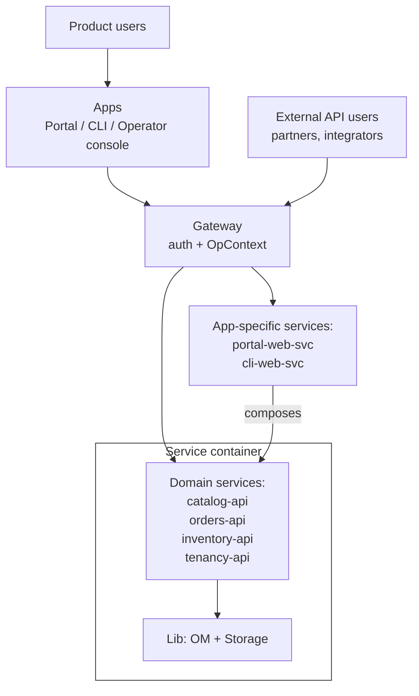
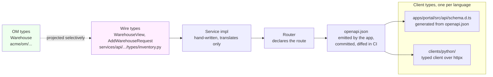
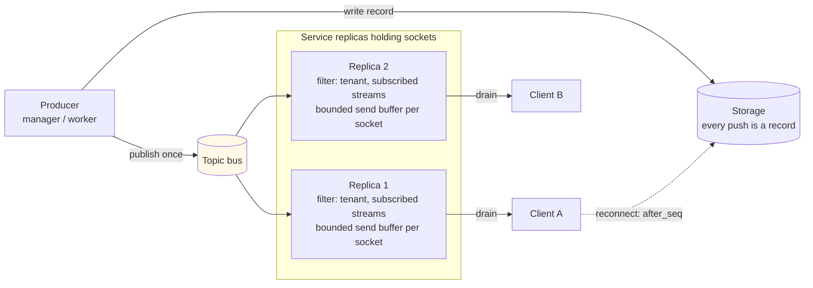
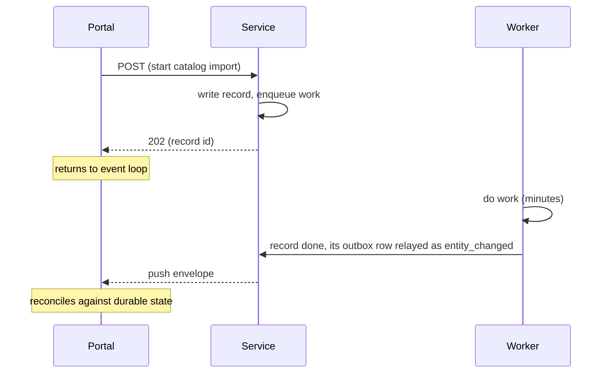
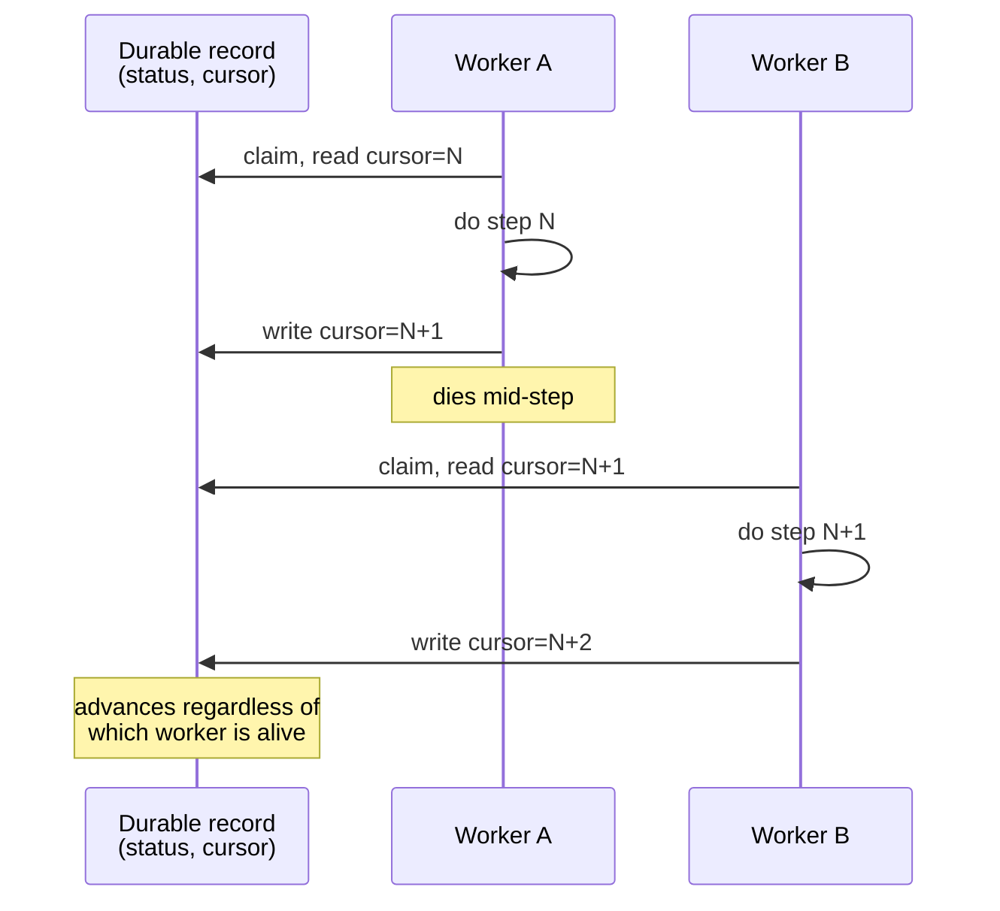
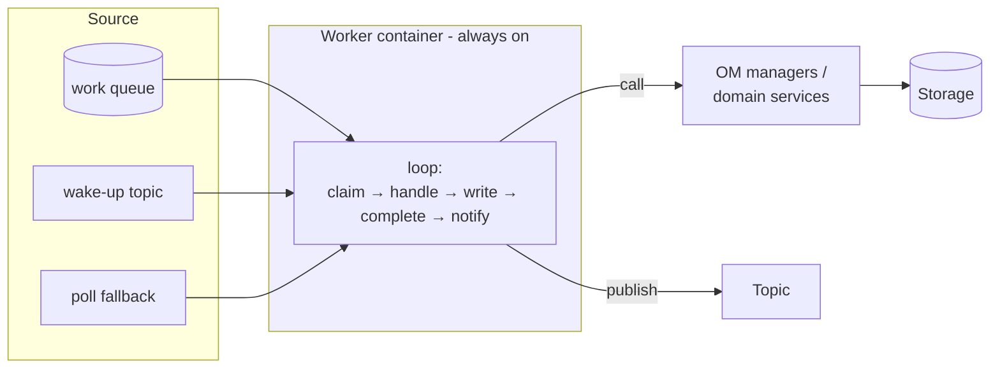
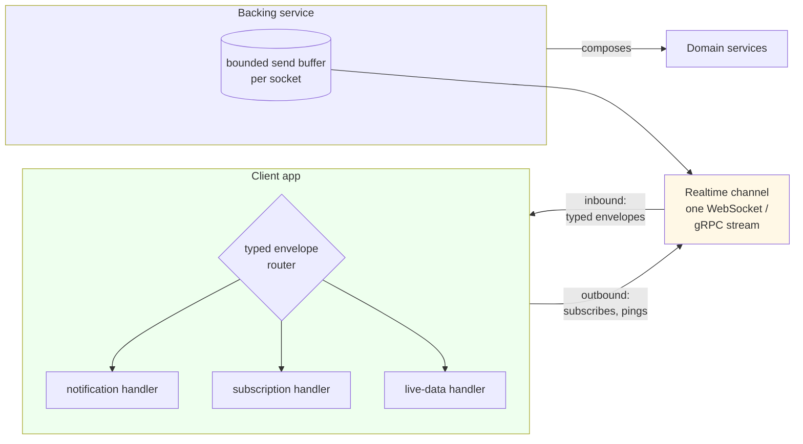

# Software Design and Architecture Guidelines

This document describes how we design and build a multi-tenant,
service-based system in Python. It runs from the object model at the
center to the apps at the edge.

It is opinionated on purpose.

Every rule below is one we apply. Every shape below is one we use.
Where a rule has a cheaper first step, the step is named. Where it has
an exception, the exception is named too.

The running example is a commerce platform with a catalog, orders, and
inventory. The nouns are illustrative. The shapes are not. One small
project applies the whole document end to end, and [Next: An End-to-End
Reference Implementation](#next-an-end-to-end-reference-implementation)
points at it.

The document names technologies as well as shapes: Python and Pydantic,
Postgres and SQLAlchemy, React and Vite, Terraform on AWS. The names
are defaults, chosen for speed and clarity. [Technology Choices and How
to Override Them](#technology-choices-and-how-to-override-them) says
why they are named, and how a project substitutes its own.

It is written for a small team. One process, one database, and no
appetite for a rewrite when the system grows. Most of the rules exist
so that the next step, when load asks for it, is a deployment change
and not a code change. [Scalability by Design](#scalability-by-design)
names the limits of that.

It assumes that an agent writes most of the code and a person reads it.

Several rules are cheap on that assumption and a tax without it. The
clearest one is the second impl of every interface. The reference
implementation pays the price in full: a to-do app carries the whole
shape.

That is the audience. It is stated up front so that nobody discovers
it in the middle.

## Contents

<!-- toc -->
- [The Domain as the Source of Truth](#the-domain-as-the-source-of-truth)
- [Naming Entities](#naming-entities)
  - [Entities, Value Objects, and Read Models](#entities-value-objects-and-read-models)
  - [Immutability](#immutability)
  - [Identifiers](#identifiers)
- [Namespaces as Swimlanes](#namespaces-as-swimlanes)
  - [Pure Rules](#pure-rules)
- [Separation of Layers](#separation-of-layers)
- [Interfaces](#interfaces)
  - [Multiple impls per interface](#multiple-impls-per-interface)
  - [Composition by decoration](#composition-by-decoration)
  - [Injectability](#injectability)
- [OpContext](#opcontext)
  - [Stages](#stages)
  - [Scopes](#scopes)
  - [The Operator Context](#the-operator-context)
- [The Business Layer](#the-business-layer)
  - [Shape of an Operation](#shape-of-an-operation)
  - [Parameters](#parameters)
  - [Cross-Manager Dependencies](#cross-manager-dependencies)
  - [Operations Without a Principal](#operations-without-a-principal)
- [The Storage Layer](#the-storage-layer)
  - [Storage Principles](#storage-principles)
  - [Namespace Shape](#namespace-shape)
  - [Storage Root](#storage-root)
  - [Defining ORM Classes](#defining-orm-classes)
  - [Translation](#translation)
  - [A Storage Impl](#a-storage-impl)
  - [Cross-Storage Dependencies](#cross-storage-dependencies)
  - [Database Roles](#database-roles)
  - [The Second Fence](#the-second-fence)
  - [Migrations](#migrations)
- [Infrastructure](#infrastructure)
  - [Infrastructure Principles](#infrastructure-principles)
  - [InfraInterface Root](#infrainterface-root)
  - [Cache](#cache)
  - [Buckets](#buckets)
  - [Topics](#topics)
  - [Queues](#queues)
  - [Secrets](#secrets)
  - [Idempotency](#idempotency)
- [The Network Layer](#the-network-layer)
  - [How It Starts and Where It Goes](#how-it-starts-and-where-it-goes)
  - [Web Services as Scalability Units](#web-services-as-scalability-units)
  - [Domain Services vs App-Specific Services](#domain-services-vs-app-specific-services)
  - [At a Glance](#at-a-glance)
  - [Stateless vs Stateful Services](#stateless-vs-stateful-services)
  - [Service Interfaces and Impls](#service-interfaces-and-impls)
  - [The Gateway](#the-gateway)
  - [Auth: the Gateway Verifies, the Tenancy Domain Owns](#auth-the-gateway-verifies-the-tenancy-domain-owns)
  - [Intra-Service Communication](#intra-service-communication)
  - [Public Types](#public-types)
  - [From OM to Wire](#from-om-to-wire)
  - [Clients Live in One Place](#clients-live-in-one-place)
  - [Direction of Calls](#direction-of-calls)
  - [Idempotency on the Consumer Side](#idempotency-on-the-consumer-side)
  - [Realtime at the Edge](#realtime-at-the-edge)
  - [Wait-for-Response vs Fire-and-Forget](#wait-for-response-vs-fire-and-forget)
  - [Long-Running Orchestrations](#long-running-orchestrations)
- [Worker Roles](#worker-roles)
  - [Workers, Not Web-Service Side Jobs](#workers-not-web-service-side-jobs)
  - [The Work Queue](#the-work-queue)
  - [Shape of a Worker](#shape-of-a-worker)
  - [Shutdown](#shutdown)
  - [Maintenance Without a Scheduler](#maintenance-without-a-scheduler)
  - [Implementation Options](#implementation-options)
- [Apps](#apps)
  - [Apps as Products](#apps-as-products)
  - [Apps Are Dumb](#apps-are-dumb)
  - [Push-First Apps](#push-first-apps)
- [Client App Architecture](#client-app-architecture)
  - [Stack](#stack)
  - [Client Rendering](#client-rendering)
  - [State and Data](#state-and-data)
  - [Views, View-Models, Models](#views-view-models-models)
  - [API Access](#api-access)
  - [One Tenant at a Time](#one-tenant-at-a-time)
  - [Realtime: One Channel per App](#realtime-one-channel-per-app)
  - [The Operator Console](#the-operator-console)
  - [The CLI Is Different](#the-cli-is-different)
- [Deployment](#deployment)
  - [Cloud: AWS](#cloud-aws)
  - [Infrastructure as Code](#infrastructure-as-code)
  - [Migrating a Deployed Database](#migrating-a-deployed-database)
  - [Local: Docker Compose](#local-docker-compose)
  - [Twins for External Services](#twins-for-external-services)
  - [What a Process Refuses](#what-a-process-refuses)
  - [Security Defaults](#security-defaults)
- [Operations](#operations)
  - [Operator Roles](#operator-roles)
  - [Operator Credentials](#operator-credentials)
  - [Operational Skills](#operational-skills)
  - [Dashboards and Alarms as Code](#dashboards-and-alarms-as-code)
  - [Scale-Out as a Lever](#scale-out-as-a-lever)
  - [Cost Boundaries](#cost-boundaries)
  - [Creating and Destroying an Environment](#creating-and-destroying-an-environment)
  - [Traffic and Stress](#traffic-and-stress)
  - [The Telemetry Round Trip](#the-telemetry-round-trip)
- [Monorepo Folder Structure](#monorepo-folder-structure)
  - [Layout Conventions](#layout-conventions)
- [Documentation as Code](#documentation-as-code)
  - [A README at Every Level](#a-readme-at-every-level)
  - [The Knowledge Map](#the-knowledge-map)
- [Telemetry](#telemetry)
  - [Logs](#logs)
  - [Traces and Metrics](#traces-and-metrics)
  - [Error Tracking](#error-tracking)
  - [Correlation Across a Handoff](#correlation-across-a-handoff)
- [Cross-Cutting Conventions](#cross-cutting-conventions)
  - [Exceptions](#exceptions)
  - [Configuration](#configuration)
  - [The App Container](#the-app-container)
  - [Records of Decisions](#records-of-decisions)
  - [Tests](#tests)
- [Technology Choices and How to Override Them](#technology-choices-and-how-to-override-them)
  - [Versions](#versions)
  - [Overriding a Choice](#overriding-a-choice)
- [Scalability by Design](#scalability-by-design)
- [Resilience by Design](#resilience-by-design)
- [What This Document Does Not Cover](#what-this-document-does-not-cover)
- [Next: An End-to-End Reference Implementation](#next-an-end-to-end-reference-implementation)
<!-- /toc -->

## The Domain as the Source of Truth

Good design starts with a clear domain. A domain is the set of nouns we
use to describe the product, and the relationships between them. For a
commerce platform the nouns are `Product`, `Order`, `Shipment`,
`Warehouse`, and `Invoice`. Every layer of the system refers back to
these nouns. So they are defined in one place, and that place is our
single source of truth.

That place is an object model (OM) of our business domain: handwritten,
pure Python classes based on Pydantic. We ship the model as a standalone
Python library, not a web app, a service, or a CLI. Any application can
depend on it, and every application that does shares the same
vocabulary. The library lives in the monorepo with its consumers, so the
domain evolves with the system instead of drifting in a separate repo.

The OM is the source of truth for entities. The wire format is not, and
neither is the table layout. The network layer projects entities onto
the wire (see [Public Types](#public-types)). The storage layer projects
them onto rows (see [Translation](#translation)). Neither projection
changes the OM to suit itself.

> **Principle:** The domain has one source of truth: a standalone OM
> library. Every layer depends on it; nothing redefines it.

## Naming Entities

Every entity in the domain is named by a class in the object model.

Entities come second. First we define a small set of mixins, each one
capturing a single orthogonal trait. A concrete entity then composes the
mixins it needs through multiple inheritance. The declaration order is
fixed, so a class signature reads as a description of the entity.

The base module holds the root class, the mixins, and the two helpers
every entity constructor needs: an id factory and a clock. `acme` in
every path below stands for the product's root package, one that shadows
no standard-library module (see [Layout
Conventions](#layout-conventions)).

``` python
# acme/om/base.py

def new_id() -> UUID:
    """A time-ordered UUID v7 as a standard-library UUID."""
    ...

def utcnow() -> datetime:
    return datetime.now(UTC)

class Platform(BaseModel):
    """Root of the object model. Holds no fields."""

    model_config = ConfigDict(frozen=True, extra="forbid")

class Identifiable(Platform):
    id: UUID  # uuid_v7, from new_id()

class Named(Platform):
    name: str

class Created(Platform):
    created_at: datetime

class Trackable(Created):
    updated_at: datetime
    created_by: UUID  # id of the user who created it
    updated_by: UUID  # id of the user who last changed it

class SoftDeletable(Platform):
    deleted_at: datetime | None = None
    deleted_by: UUID | None = None

PROVENANCE_FIELDS = frozenset({"created_at", "created_by", "deleted_at", "deleted_by"})  # stay as stored on update

EMPTY_UUID = UUID(int=0)
```

A concrete entity composes the mixins it needs, and only those a manager
operation exercises. `Trackable` goes on where an update exists,
`SoftDeletable` where a delete does:

``` python
class Warehouse(Identifiable, Named, Trackable, SoftDeletable):
    address: str
    timezone: str
```

Not every row has a person behind it. A row the platform writes for its
own bookkeeping composes `Created` and stops there: an outbox row, an
idempotency marker, a socket ticket. There is no author, so there is no
`created_by`. What the platform stamps on such a row later is named for
what happened, `done_at`, `redeemed_at`, the outcome. It is never an
`updated_at`, which says only that something did.

A work item is the row that looks like bookkeeping and is not. It is
`Trackable`, because the person who enqueued it is its attribution (see
[The Work Queue](#the-work-queue)). The platform is the actor of its
claims and completions, and it signs them `EMPTY_UUID`.

Two system rows are touched by every namespace: the outbox row, which
announces a write, and the idempotency marker, which owns a retry. Each
is declared once, in the namespace that owns it, and every manager takes
it from there. Each is shown where it does its work: `OutboxRow` under
[Namespace Shape](#namespace-shape), `IdempotencyMarker` under [The
Gateway](#the-gateway).

Pydantic merges the fields from every base into a single model along the
MRO. The declaration order is house style: identity first, human-facing
label next, lifecycle, then cross-cutting traits. Reading the bases left
to right tells you what the entity promises to be.

Inheritance is used here for abstraction, not code reuse. Each mixin is
one promise:

| Mixin           | What the entity promises                    |
|-----------------|---------------------------------------------|
| `Identifiable`  | it has an identity                          |
| `Named`         | it carries a human-facing label             |
| `Created`       | it has a birth time, and nothing more       |
| `Trackable`     | its lifecycle is recorded, by whom and when |
| `SoftDeletable` | it can be hidden without being purged       |

An entity opts into a trait by adding the mixin. It opts out by leaving
it off.

An append-only record is the clean case. An audit entry or a ledger line
is `Identifiable` and nothing else. It is never updated, so it carries
no `updated_at`. It is never hidden, so it carries no `deleted_at`. Its
birth time is the one in its id, since every id is a `uuid_v7` with the
millisecond in front (see [Identifiers](#identifiers)). The "when" of an
audit entry costs no column.

> **Principle:** Inheritance expresses abstraction, not code reuse. Each
> mixin is a promise about what the entity is.

`extra="forbid"` on the root makes a misspelled field a construction
error instead of a silently ignored key. Every class in the object model
inherits it, value objects and the context types of
[OpContext](#opcontext) included.

### Entities, Value Objects, and Read Models

Three kinds of class live on the OM base chain. The mixins tell them
apart.

An **entity** has an identity and is stored: `Order`, `Product`,
`Warehouse`. It composes `Identifiable` and, where an update exists,
`Trackable`. A system row the platform writes for its own bookkeeping
composes `Created` instead, as above.

A **value object** is a typed piece of an entity with no identity of its
own: an `Address`, a `Money` amount, a `ShippingProfile`. It subclasses
`Platform` directly, is frozen like everything else, and is stored
inline with its owner.

A **read model** is a shape a manager returns that is not an entity: an
`OrderTotals`, a `StockLevel` aggregated across warehouses, a
`ShipmentSummary`. It subclasses `Platform`, carries no mixins, and is
never written back as truth. A persisted copy of one is derived and
rebuildable, whether it is a cache entry, a reporting mirror, or a
projection table. Nothing reads it as the source of truth.

Typed filter and grouping objects (`OrderFilter`, `StockGroupBy`) are
value objects too. They travel through manager and storage interfaces
unchanged. That is what lets an aggregation run in SQL on one storage
impl and in Python on another while the caller writes the same code.

### Immutability

> **Principle:** OM entities are immutable. Updates happen by
> copy-and-write, never by mutation.

Every OM entity is immutable. Pydantic models in the base chain are
frozen, so a `Warehouse` returned from a read is a snapshot, not a live
handle.

Updates happen by copy-and-write. Take the entity, produce a modified
copy, and pass the copy to a write method. Shared references stay safe
across async tasks, and no layer can quietly rewrite an entity after it
was constructed.

> **Python tip:** the copy is one of two calls, and what the update
> carries decides which. When every updated value already has the
> field's type (a timestamp, an id, a status), the copy is
> `entity.model_copy(update={...})`. When the update carries dumped
> data, as the caller's fields do, the entity is rebuilt from a dict:
> `Warehouse.model_validate({**current.model_dump(), **changes})`.
> Pass it that dict, never an instance of the class: given an
> instance, `model_validate` hands it back without validating it. `model_copy` does not validate, so it
> would leave a dumped value object as a plain dict. A manager that
> updates an entity sets `updated_at` and `updated_by` in the same
> copy, so the caller gets back the copy that was written.

Fields are tuples and frozen models, never `list` or `dict`. A mapping
field is a `FrozenMapping`: a `Mapping` annotated with a validator that
wraps the dict pydantic builds in a `MappingProxyType`, and a serializer
that dumps a plain dict. Both are needed, because a frozen model with a
bare `Mapping` field still holds a mutable dict.

The validator descends. A nested mapping is wrapped the same way, and a
nested list becomes a tuple. A proxy freezes only the mapping it wraps,
and a payload of dumped JSON is nested, so freezing the top level alone
leaves the inside mutable. The serializer rebuilds plain dicts and lists
on the way out.

Pydantic does not validate a default, so the empty case is
`Field(default_factory=dict, validate_default=True)`. Leave
`validate_default` off and that default is the one dict that escapes the
freeze.

The same rule applies to every object built on the OM base chain. That
includes the sub-objects of `OpContext` (see [OpContext](#opcontext)).
The views of [Public Types](#public-types) sit on a base of their own,
frozen and tolerant, and keep the same rule for the same reason. There is one
deliberate exception: the SQLAlchemy row classes under `tables/` must be
mutable so the session can track writes. They never leak past the
storage boundary.

### Identifiers

Every id in the system is a `uuid_v7`: 128 bits, globally unique, with a
48-bit millisecond timestamp in front and randomness behind it.

That one choice buys three things. Inserts into a B-tree index on a v7
id land at the tail of the tree. A list of entities by creation time is
a range scan on the id column. The ids in a log line sort by creation
time, so the order of records reads from the ids alone.

Ids are minted by whoever constructs the entity, always above the
storage layer, with `new_id()`. The database never assigns one, and
nothing reads one back after a write.

> **Python tip:** `new_id()` returns `uuid.uuid7()` from the standard
> library, which ships it since Python 3.14. Nothing installs a package
> for an id.

`EMPTY_UUID` is the reserved system scope. It has two uses, and they say
the same thing.

Cross-tenant reference data uses it as the `org_id` on cache and bucket
calls (see [Infrastructure](#infrastructure)): platform-owned catalogs,
schema metadata, global configuration. System keys and tenant keys then
live in disjoint namespaces.

It is also the value of a required reference that no tenant and no
person owns, such as `updated_by` on a work item the platform claimed.
That keeps the column `NOT NULL` and the index simple.

Both readings mean the platform, not a tenant and not a person. A
reference that is genuinely optional is `None`, never `EMPTY_UUID`.

> **Principle:** Every id is `uuid_v7`, minted above storage with
> `new_id()`. Time-ordered inserts, time-ordered scans, and
> time-readable logs fall out of one choice.

## Namespaces as Swimlanes

The object model is split into namespaces. Each namespace mirrors a
swimlane of the product.

A warehouse or a product is a long-lived thing we define and maintain.
An order is something we create, fulfil, observe, and report on. The
two interact constantly. They stay separate first-class domains all the
same, and neither is buried under the other.

```text
acme.om.catalog.*
acme.om.orders.*
acme.om.inventory.*
```

Each top-level namespace under `om` has the same internal shape:

```text
acme/om/orders/
    __init__.py                # re-exports OrderManagerInterface
    manager.py                 # the manager interface
    types/                     # entity classes, value objects, read models
    impl/                      # manager.py, the manager impl
    storage/                   # storage interface, impls, tables (see The Storage Layer)
    rules.py                   # pure functions, when the namespace has any
```

The manager interface lives in `manager.py`. The package root
re-exports it, so consumers import it by a short path:
`from acme.om.orders import OrderManagerInterface`.

`types/` holds the classes of [Naming Entities](#naming-entities).
`impl/` holds the concrete manager classes, in `impl/manager.py`.

Names follow the namespace:

-   A manager interface and a storage interface are named after the
    namespace in the singular: `OrderManagerInterface`,
    `OrderStorageInterface`, `InventoryStorageInterface`. An impl adds
    its technology last: `InventoryStoragePostgresImpl`.
-   The storage root has one getter per namespace storage:
    `get_inventory_storage()`, `get_order_storage()`.
-   A namespace with several aggregates may add one storage interface
    per aggregate, named after the aggregate.
-   Operations are named after the entity: `write_warehouse`,
    `read_warehouses`.
-   A work handler impl is `<Kind>HandlerImpl`, the work kind in
    CamelCase: `NotifyShipmentHandlerImpl` (see [Shape of a
    Worker](#shape-of-a-worker)).

Cross-cutting namespaces are namespaces like any other. Tenancy covers
organizations, users, memberships, and credentials. Audit covers who
did what, when, and from which app. Both are first-class swimlanes with
their own types, managers, and storage. Neither is a utility hanging
off the root.

### Pure Rules

A namespace that carries real business logic keeps the pure part of it
in one module of plain functions, next to the interface. Pricing,
window arithmetic, eligibility checks, aggregation rules: all of it
goes there.

These functions take values and return values. They read no storage,
consult no clock, and open no settings. That buys two things. They are
unit-testable without infrastructure. And they are shareable: when two
storage impls must produce the same aggregate, both call the same
function, so the two cannot drift apart.

Some rules the engine must evaluate for itself, inside a statement, a
filter or an ordering. Such a rule is spelled once more in that
statement, named as such. The contract case that runs both impls is
what holds the two spellings together. Everything a rule decides before
or after the statement calls the function.

> **Principle:** A namespace's rules are pure functions in one module.
> Storage impls and manager impls call them. A rule the engine must
> evaluate inside a statement is spelled there once more, and the
> contract case holds the two spellings together.

## Separation of Layers

The system has three layers:

-   **Network**: receives requests, shapes responses, enforces
    protocols.
-   **Business**: the Object Model. Entities, managers, and operations.
-   **Storage**: persistence. Lives under the Object Model but is
    clearly separated from it.

Each layer has its own language and its own responsibilities. An upper
layer depends on the interfaces a lower layer exposes, never on its
internals. Infrastructure capabilities (see
[Infrastructure](#infrastructure)) are injected into any of the three,
and none of them leaks a technology choice across a boundary.

Managers authorize; storage enforces tenancy.

The split is deliberate. Permissions and visibility are business
decisions, so they live in managers, where the rule can be read next to
the operation it guards. Tenancy is a data boundary, so it lives in
storage, where every query carries the tenant and every write checks
it.

What that buys is two guarantees, each held in one place. A request
that reaches storage has already been authorized. A query that reaches
the database cannot cross a tenant.

> **Principle:** Three layers: Network, Business, Storage. Upper depends
> on lower through interfaces only. Infrastructure cross-cuts without
> leaking technology. Managers authorize; storage enforces tenancy.

## Interfaces

Every layer of this system is defined by its interfaces. A manager, a
storage, a service: each exposes a `*Interface`. The interface lists
the operations its scope supports. An operation is an async method, and
its signature is a contract.

``` python
from abc import ABC, abstractmethod

class InventoryManagerInterface(ABC):
    @abstractmethod
    async def get_warehouses(self, ctx: OpContext, limit: int) -> list[Warehouse]: ...
    @abstractmethod
    async def get_warehouse(self, ctx: OpContext, warehouse_id: UUID) -> Warehouse: ...
```

The interface describes a capability. The impl decides how that
capability is delivered. That separation is what makes impls mockable
and injectable, and what lets one `*Interface` back several impls at
once.

> **Python tip:** an interface is an `ABC` whose methods are
> `@abstractmethod` with `...` bodies, and an impl subclasses it. An
> impl that forgot a method will not instantiate.

### Multiple impls per interface

Every interface can be satisfied without the technology behind it.

The usual shape of that rule is two impls, interchangeable at wiring
time. Callers never know which one they are holding. Names put the
technology last: `InventoryStoragePostgresImpl`,
`InventoryStorageMemoryImpl`.

A storage, an infrastructure capability, and an external service each
get an in-memory impl.

A manager is the case that is already true without a second class. A
manager over nothing but its own storage runs without technology as
soon as it is wired over the memory roots, and that is what lets the
whole business layer run in a test. So does a manager that fronts
something a caller cannot conjure: a payment processor, a carrier, a
model provider. The provider is an external service, so its client has
a deterministic twin (see [Twins for External
Services](#twins-for-external-services)). Wired over that twin, the one
manager impl runs with no account, no network, and no sandbox, and so
does every caller above it. It needs no memory impl of its own.

A service interface pairs differently, because both of its impls are
real. The in-process impl calls the manager the container wired, and it
exists from the first day, since every router calls through it. The
remote impl is the typed client, written when a process stops holding
what the callee needs (see [Direction of
Calls](#direction-of-calls)). Until that day the interface carries the
one impl, and the rule is met already: it gets no in-memory impl of its
own, because the manager under it already runs without technology.

The in-memory impl is the default for unit tests and the fast local
gate. It keeps state in an in-process dict and exercises real behavior
without infrastructure.

It is a full second implementation, not a stub. Every read, write,
filter, and tenancy rule the relational impl has, the memory impl has
too, and the test suite runs both.

A suite proves only what it exercises. So each of these gets a contract
case: the named atomic methods, the compare-and-set, visibility after a
write, and every unique key the schema declares. With them, the memory
impl refuses what the engine refuses. Without them, a memory impl
passes by being lenient where the engine is strict, and the pair is not
two impls of one contract. It is two impls of two contracts.

Technology-specific impls for storage follow the same interface:

-   `InventoryStoragePostgresImpl`
-   `InventoryStorageClickHouseImpl`

Swapping the impl at the storage root moves the system onto a different
engine without any caller changing.

Two impls per interface read as overhead only when a person keeps them
in step. For an agent the pair is cheap. The agent writes the memory
impl alongside the technology impl, and the shape generalizes. A memory
storage impl is a dict keyed by tenant and id, plus the same filters
the relational impl applies, one per namespace.

An agent also mixes and composes impls far more readily than a person
does, which makes the duality a lever rather than a cost. The pair is
what lets a whole application run in-process in a test over the memory
roots ([The App Container](#the-app-container)). It is what lets a
backend be swapped at the [storage root](#storage-root) with no caller
changing. And it is what lets impls wrap one another ([Composition by
decoration](#composition-by-decoration)).

### Composition by decoration

Because an impl depends on an interface, impls compose. Caching is a
common case:

``` python
# CacheInterface is declared under Cache, below: every call takes org_id.

class CacheLocalImpl(CacheInterface): ...  # in-process

class CacheCloudImpl(CacheInterface): ...  # hosted key-value store

class CacheMixedImpl(CacheInterface):
    def __init__(self, local: CacheInterface, cloud: CacheInterface, local_ttl: timedelta):
        self._local = local
        self._cloud = cloud
        self._local_ttl = local_ttl

    async def get(self, org_id: UUID, key: str) -> bytes | None:
        value = await self._local.get(org_id, key)
        if value is not None:
            return value
        value = await self._cloud.get(org_id, key)
        if value is not None:
            await self._local.put(org_id, key, value, self._local_ttl)
        return value
```

`CacheMixedImpl` takes two `CacheInterface` values and is itself one.
The caller holds a `CacheInterface`. It cannot tell whether the hit
came from local memory, the cloud, or a two-level composite.

Retry, metrics, and tracing wrappers fit the same pattern. Each is an
impl that holds an inner impl and forwards selectively.

Decoration is an infrastructure pattern. A manager that needs a cache
takes one through its constructor; it does not wrap its storage.

A dependency that is down does not fail fast. Every call to it pays the
full timeout first. The timeouts alone are what exhaust the pool the
calls are made from.

A breaker is the wrapper that cuts off a dependency that is failing. It
counts consecutive failures. When they pass a bound from settings, it
refuses at once for a cool-down. Then it lets one call through to
decide whether to close again. That is the circuit breaker pattern.

It is an infrastructure wrapper like the others here. It holds an inner
impl of the same interface, and a manager never holds one.

An open breaker answers the way the dependency's own failure answers.
It decorates an interface, and a caller cannot tell what is behind one.
Where that failure is an exception, the refusal is the unavailable
shape of [Exceptions](#exceptions). Where the interface says a failure
is an answer, the breaker gives that same answer at once.
[Cache](#cache) says an unreachable backend is a miss, so an open
breaker over a cache answers with a miss.

A breaker declines to pay the timeout. It never declines to keep the
contract. One that raised where its interface promises a miss would
turn a backend that is down into a refusal the caller was written not
to get, and that is the outage the miss exists to prevent.

### Injectability

> **Principle:** Dependencies are injected through constructors and
> typed by interface, never by impl.

Every downstream section follows this rule: storage, manager, service.
In each of them, a root class constructs the concrete impls in the
right order and wires them together. That wiring is what makes the
swaps and compositions above cheap.

What a constructor takes is structural, and it lives as long as the
process. What one operation needs arrives in the context instead: the
actor, the tenant, the request, the evidence of what has been
established. It arrives per call, and never through a constructor (see
[Scopes](#scopes)).

Configuration is injected the same way. A manager that has tunables
takes a small frozen options object in its constructor: a default page
size, a lease length, a threshold. The object is built once at boot
from settings. Managers never read environment variables.

When two managers genuinely need each other, the cycle is broken above
them, not inside them. There are two ways to break it. Extract the
shared operation into the lower namespace. Or pass a narrow callable
for the one operation the upper manager needs.

Reaching into another impl's private attributes after construction is
not wiring. It is a cycle that has not been resolved.

## OpContext

Every operation takes a context as its first argument. The context
carries the ambient information the operation needs:

-   who is acting,
-   on behalf of which tenant,
-   with what role and permissions,
-   from which application,
-   and under which request.

`OpContext` (operation context) is the context of a tenant operation,
and it is the one most operations take. A tenant operation does four
things: it authorizes, it scopes to the tenant, it attributes to the
actor, and it stamps provenance. What those four need is all of what
`OpContext` carries.

``` python
class SecurityContext(Platform):
    user_id: UUID
    org_id: UUID
    role: Role
    permissions: tuple[Permission, ...]
    teams: tuple[UUID, ...] = ()
    credential_kind: CredentialKind  # api_key, session_token, internal, ...
    credential_id: UUID

class AppContext(Platform):
    type: AppType   # portal, cli, api, worker, ...
    version: str    # e.g. "portal@2.14.0", useful for compatibility checks and telemetry

class RequestContext(Platform):
    request_id: UUID
    app: AppContext
    trace_id: str | None = None
    traceparent: str | None = None  # the trace context a handoff carries on
    caused_by_request_id: UUID | None = None  # the request behind this one across a handoff

class OpContext(RequestContext):
    security: SecurityContext

    @property
    def org_id(self) -> UUID: ...

    @property
    def user_id(self) -> UUID: ...

    @property
    def credential_kind(self) -> CredentialKind: ...

    @property
    def credential_id(self) -> UUID: ...

    def has(self, permission: Permission) -> bool: ...
    def require(self, permission: Permission) -> None: ...  # raises NotAuthorized (see Exceptions)
    def in_team(self, team_id: UUID) -> bool: ...
```

Permissions are a pure function of role. One table in the tenancy
namespace declares that function. The operator plane has a table of
its own: an allowlist entry's role grants `OperatorPermission.READ`,
or read and `OperatorPermission.WRITE`.

A credential never carries a role above its issuer's. Above means the
permission set: a role is at most another when its permissions are a
subset of the other's. Where a rank exists for comparison, it is derived
from the permission table or held to it by a unit test.

A role reserved for services is not a rung on that ladder. No
credential a person mints carries it, and every operation that issues a
credential refuses it by name, whatever the rank says.

Teams are a second authorization axis inside a tenant. An entity may be
owned by a team, and visibility rules consult `ctx.in_team`.

The context carries ids and facts, never entities. A manager that needs
the user loads it, so a role change is seen on the next request.
`opcontext.py` declares the context types, and `Role`, `Permission`,
`OperatorPermission`, `CredentialKind`, and `AppType` beside them. It
imports nothing above `base.py`.

`request_id` is ambient state exactly like identity. It is minted or
accepted at the edge and stamped onto the context once. From there it
reaches every log line, every audit row, and the error envelope, and no
layer passes it by hand.

`caused_by_request_id` is the same kind of state, one hop back. It is
empty on a request that arrived at the edge. On a stage minted for a
handoff, it names the request that caused the work (see [Correlation
Across a Handoff](#correlation-across-a-handoff)).

`ctx.require(Permission.WRITE)` is one line at the top of a manager
method. That line is what keeps authorization in the business layer.

A context is immutable. Once built, it flows through every downstream
call unchanged. No layer adds, replaces, or mutates its fields
mid-request. An operation that needs a narrower view, an override or a
narrowed permission set, takes it as an explicit argument, never by
mutating `ctx`.

Operations never reach for ambient state through globals or thread
locals. All of it flows through the context. That is what makes an
operation easy to test with a fake context, and easy to reason about
across layers.

The context is not one type. There is one type per stage of what a
request has established, and one view per capability a consumer needs.
The two answer different questions, and they are kept apart. A stage
says what is proven. A scope says what a consumer sees.

> **Principle:** All ambient state flows through the context. No
> globals, no thread locals, no hidden lookups.

### Stages

A request establishes who is behind it in steps. Each step is a type:

``` text
RequestContext          a request exists; nobody is known yet
  ├─ IdentityContext    a person is verified by their own sign-in; no tenant is chosen
  │    └─ OperatorContext  the person is on the operator allowlist
  └─ OpContext          a membership is established: one tenant, one user, one role
       └─ ...           what the domain earns next, say a TenantOperatorContext, when
                        operations rely on the role instead of checking it each time
```

``` python
class IdentityContext(RequestContext):
    identity_id: UUID
    email: str
    credential_kind: CredentialKind
    credential_id: UUID

class OperatorContext(IdentityContext):
    """The operator plane. No org_id, on purpose."""
    permissions: frozenset[OperatorPermission]  # what the allowlist entry grants
```

Each stage in that tree is a frozen type that subclasses the stage it
refines. The subclass relation is the refinement. A function that asks
for the weaker stage accepts the stronger one. A function that asks for
the stronger one cannot be handed the weaker.

`OperatorContext` adds one field to `IdentityContext`: what the
operator's allowlist entry grants. An entry grants read, or read and
write, so a read operator is refused a write the way a tenant viewer
is. The type itself is the evidence that the allowlist was consulted.

The chain continues below `OpContext` only when the domain earns it. A
stage for a role exists when operations rely on that role instead of
requiring a permission at their first line, and not before.

`OpContext` does not refine `IdentityContext`. What a tenant operation
knows about the person is the user inside the tenant, not the identity
across tenants. An API key or a worker's service context (see
[Operations Without a Principal](#operations-without-a-principal)) has
no sign-in behind it at all.

A stage above the request stage is produced only by a transition. A
transition takes the stage below, consults the evidence, and returns
the stage above or refuses. The evidence is the tenancy manager's, so a
transition is an operation of the tenancy manager, or one that asks it,
as the claim of a worker does.

``` python
class TenancyManagerInterface(ABC):
    @abstractmethod
    async def authenticate_login(self, rctx: RequestContext, credential: str) -> IdentityContext: ...
    @abstractmethod
    async def authenticate(self, rctx: RequestContext, credential: str) -> OpContext: ...
    @abstractmethod
    async def admit_operator(self, ictx: IdentityContext) -> OperatorContext: ...
    # ...
```

Not every path passes through every stage. A session token or an API
key resolves the membership in one transition. The claim a worker calls
returns an `OpContext` from the request stage the loop minted. The
stages name what is established, not the road taken.

The exchange of a sign-in for a tenant session is not a transition. It
takes the identity stage and issues a session. That session comes back
through `authenticate` as an `OpContext` on the next request. That is
how a sign-in reaches a tenant without one stage refining the other.

A live session proves its person as well as its tenant. So the
identity stage is established from the sign-in credential or from a
live session, as the session's own identity. A revoked or expired
session is refused. That is what lets a signed-in app list its
memberships and switch tenants with the one bearer it holds. The
operator plane is narrower, and admits only the sign-in (see [The
Gateway](#the-gateway)).

Switching tenants is a second exchange. The app presents its session
and the new org, and gets a new session. An exchange presented with a
session ends that session in the same write, so a tab never holds two
live sessions.

A transition builds a new object from the stage below and the evidence
it consulted. It never copies the stage below with changed fields, and
nothing but a transition constructs a stage above the request stage.

At every call site the type is the fence. At the construction sites
the checker is. `arch-check` enumerates every site that constructs a
stage above the request stage and fails when a new one appears, the
way it enumerates the tenant-less storage methods (see [Records of
Decisions](#records-of-decisions)). A stage is an ordinary class, and
anything can call its constructor. The checker is what makes "only a
transition" hold.

The request stage is minted at the edge, once:

-   by the gateway, for every request and every socket (see [The
    Gateway](#the-gateway));
-   by the worker loop, per claim and per sweep pass (see [The Work
    Queue](#the-work-queue));
-   by the bootstrap command that seeds an environment, per command.

It carries the request id, the app, the trace, and the request that
caused it where a handoff named one (see [Correlation Across a
Handoff](#correlation-across-a-handoff)). It carries nothing that names
a person.

A function that takes a stage relies on its invariant and does not
check it again. An operation that takes `IdentityContext` does not
verify the credential. One that takes `OpContext` does not ask whether
the membership is live.

The stage is the proof. That is what keeps authentication from being
reconstructed at every layer. It is also why the stages are concrete
types and not views: a stage is evidence, produced in one place, and
its exact type says who produced it.

A stage lives as long as the request that minted it and no longer: a
request, a claim, a sweep pass, a socket.

A socket is a request that stays open, so it holds the `OpContext` its
ticket produced. That context would outlive its evidence unless the
socket is closed when the evidence goes.

So the socket is bounded by the session's expiry. The process closes it
at that instant, whatever the client does. A revocation or a
membership's end travels on the topic bus like any other change (see
[Realtime at the Edge](#realtime-at-the-edge)). Every process that
holds a socket for that session or that user closes it on the frame.
The expiry covers a frame that was missed.

What a socket carries in the meantime is hints, never a field of an
entity. So the window a missed frame opens is one of metadata, and it
is bounded by the expiry.

Work that runs later than the request that asked for it runs on an
authority of its own, which [The Work Queue](#the-work-queue) names.

The stages fence capabilities without a second registry. An operation
declares the weakest stage that proves what it needs. A caller that
holds a weaker one cannot call it, because the type checker refuses the
call.

A sign-in route holds a `RequestContext` and cannot reach a warehouse
manager. An operator route holds an `OperatorContext` and cannot reach
a tenant manager.

There is no bundle of managers per stage. The managers are the
structural graph, built once per process (see [The App
Container](#the-app-container)). The stage in an operation's signature
decides which operations a holder can call.

> **Principle:** A context stage is evidence. Only a transition
> produces it, its type is the proof, and an operation takes the
> weakest stage that proves what it needs.

### Scopes

Some consumers need less than a stage carries. The helper that stamps
provenance onto an outbox row needs the actor, the request id, and the
app. The rate limiter's subject needs the credential id and nothing
about the tenant, because it also runs on routes where no tenant is
known yet. A realtime subscription needs the tenant and the user.

None of them authorizes, and none of them should see the permissions,
the role, or the whole `OpContext`. So each declares a scope: a small
`Protocol` naming the capability it needs, and nothing else.

``` python
from typing import Protocol

class RequestScope(Protocol):
    @property
    def request_id(self) -> UUID: ...
    @property
    def app(self) -> AppContext: ...
    @property
    def traceparent(self) -> str | None: ...

class TenantScope(Protocol):
    @property
    def org_id(self) -> UUID: ...

class ActorScope(TenantScope, Protocol):  # there is no actor without a tenant
    @property
    def user_id(self) -> UUID: ...

class CredentialScope(Protocol):
    @property
    def credential_kind(self) -> CredentialKind: ...
    @property
    def credential_id(self) -> UUID: ...

class ProvenanceScope(ActorScope, RequestScope, Protocol): ...
```

``` python
def outbox_row(ctx: ProvenanceScope, kind: str, target_id: UUID, payload: FrozenMapping) -> OutboxRow: ...
async def subscribe(self, ctx: ActorScope, topic: str) -> None: ...  # on the socket handler, not a manager
```

A scope is a `Protocol` and not an `ABC`, on purpose. A stage satisfies
a scope structurally, by carrying the members. One context object
satisfies every scope it can, with no subclass per combination and no
projection object built per call.

An interface is an `ABC` because an impl is written to implement it
(see [Interfaces](#interfaces)). A scope is a view that a context
already satisfies.

The members are read-only properties, so a frozen field and a property
both satisfy them. The consumer declares the scope. The caller passes
the stage it holds. The type checker proves the fit at the call. Every
stage satisfies `RequestScope`, and `OpContext` satisfies all of them.

The scope set is derived from consumers, not from a taxonomy. A scope
exists when a consumer declares it, or when another scope is built on
it, as `ActorScope` is built on `TenantScope`. There is no
`AuthorizationScope`, because no consumer needs the permissions without
the tenant and the actor.

A tenant manager operation takes `OpContext`, which is its scope, and
says nothing narrower. It authorizes, and authorization rests on the
live membership. Only the stage proves that. No scope can.

Scopes compose. `ProvenanceScope` is `ActorScope` and `RequestScope`
together, and it has a name because provenance is a concept of the
domain: who, under which request, from which app, stamped on every row
a write produces. That is the only reason a combination gets a name.

A consumer that needs two scopes with no concept between them takes the
stage that carries both. No name is minted for the intersection of two
others, and the vocabulary stays small enough to read in one screen.

Provenance is a tenant concept. `ActorScope` names a user inside a
tenant, and `OperatorContext` cannot satisfy it. An operator write is
stamped by the operator managers, from the identity id and the request
id their stage carries, through a helper of the operator plane. Never
through `outbox_row`.

Stages and scopes are kept apart.

A stage is a chain of evidence, and subclassing is its refinement. A
scope is a view, and composition is its only combinator. A stage may
satisfy a scope. A scope never proves a stage, because anything with
the right fields satisfies one, a test fake included.

Scopes are separate from structural injection, too. A constructor takes
what an impl needs for its lifetime: its storage, its peer managers,
its infrastructure capabilities, its options (see
[Injectability](#injectability)). A context carries what one operation
needs: state, authority, evidence.

Nothing crosses. A manager does not arrive on a context, and a request
id does not arrive in a constructor. When an operation's availability
depends on what a request has established, the stage goes in the
operation's signature. The manager does not move onto the context.

> **Principle:** Scopes are typed capability boundaries. A consumer
> declares the narrowest scope it needs, a context satisfies it
> structurally, and no scope carries the object graph.

### The Operator Context

A tenant context always names one organization. The people who operate
the platform itself have questions no tenant context can answer: usage
across every organization, service health, global configuration.

That is a different plane, with a different context type:
`OperatorContext`, the operator's context. It is the identity stage
refined by one more transition. `admit_operator` takes an
`IdentityContext` and returns an `OperatorContext` when the identity is
on the operator allowlist, and refuses otherwise (see
[Stages](#stages)). The operator gate checks the operator's second
factor before it asks for admission (see [The Gateway](#the-gateway)).

`OperatorContext` has no `org_id`, on purpose.

A manager operation that acts inside a tenant or on the operator plane
takes exactly one of the two, and never a choice between them. An
operator operation takes `OperatorContext`. A tenant operation takes
`OpContext`.

Three kinds of operation take a weaker stage instead, and no other
does. A transition of the tenancy manager takes the stage it refines. An
operation of an identity before any tenant takes the identity stage
(see [Stages](#stages)): the exchange of a sign-in for a tenant
session, the list of its memberships, and ending its own sign-in. An
operation of [Operations Without a
Principal](#operations-without-a-principal) takes `RequestContext`, or
a tenant id and no stage at all.

Two things keep the planes apart: the type system at every call site,
and `arch-check` at the few places a stage is built. An operator route
cannot act inside a tenant. It reads a tenant's rows only by naming the
tenant as a parameter of the read, and every such read is recorded
with the tenant and the operator, so support access leaves a trail. A
tenant route cannot reach the operator plane. [The
Gateway](#the-gateway) and [The Operator
Console](#the-operator-console) describe the plane further.

> **Principle:** Tenant operations take `OpContext`; operator operations
> take `OperatorContext`. The two never mix in one signature.

## The Business Layer

The business layer is where the object model comes alive. Managers
expose operations through `*ManagerInterface` (see
[Interfaces](#interfaces)). Each operation takes a context as its first
argument, `OpContext` for a tenant operation (see
[OpContext](#opcontext)), and returns OM entities or read models (see
[Entities, Value Objects, and Read
Models](#entities-value-objects-and-read-models)).

A manager impl holds whatever it needs to do its work: the storage
under its namespace, any peer manager whose operations it composes, and
any infrastructure capability it leans on. All dependencies are
injected through the constructor and typed by interface. A
business-layer root wires them together at boot and hands back one
frozen object with a field per manager.

### Shape of an Operation

Every write follows the same four steps: authorize, verify, copy,
write. Reading it once is enough to read every manager in the system.

The write lands the row and the outbox rows that announce it in one
storage call. Then it relays each row at once, or leaves the relay to
the sweep. Leaving it to the sweep is the cheaper first step (see
[Database Roles](#database-roles)).

``` python
class InventoryManagerImpl(InventoryManagerInterface):
    def __init__(self, storage: InventoryStorageInterface, relay: OutboxRelayInterface):
        self._storage = storage
        self._relay = relay

    async def update_warehouse(self, ctx: OpContext, warehouse: Warehouse) -> Warehouse:
        ctx.require(Permission.WRITE)
        current = await self.get_warehouse(ctx, warehouse.id)  # existence and tenancy, or NotFound
        updated = Warehouse.model_validate({  # a copy that carries a dump is validated, never model_copy
            **current.model_dump(),
            **warehouse.model_dump(exclude=set(PROVENANCE_FIELDS)),  # the caller's fields, never who made or deleted it
            "updated_at": utcnow(), "updated_by": ctx.user_id,
        })
        rows = (outbox_row(ctx, "inventory.warehouse.updated", updated.id, updated.model_dump(mode="json")),)
        await self._storage.write_warehouse(ctx.org_id, updated, rows)  # one atomic method
        for row in rows:  # relaying at once (a write that also starts work carries a second row)
            # The lower-latency choice; relaying from the sweep alone is the
            # cheaper first step (Database Roles). Never raises: a failure
            # is left to the sweep.
            await self._relay.relay(ctx.org_id, row)
        return updated
```

The caller that originates an entity constructs it whole and hands it
to `create_*`, with `id=new_id()`, `created_at`, `updated_at`,
`created_by`, and `updated_by` set. On create, the manager's copy sets
what is the manager's to decide: the actor from the context, the
initial status, a position. It leaves the id and the timestamps as
constructed.

A create whose id is already written returns the row as stored. Ids are
minted above storage, so the only way to present one twice is a retry,
and a retry must not create twice. The insert reports the existing id,
and the manager reads the row back. There is no check before the write,
and no window between the two (see [A Storage Impl](#a-storage-impl)).

A create that issues a secret is the one case where the row as stored
is not enough. The secret is stored as a digest and shown once, so
there is nothing on the row to hand back.

Its rerun runs in order. It finds the row. It re-mints the secret on
that row, in the same named atomic write. It returns a fresh
`Issued...View` with the same id. The first secret reached no one,
since the marker never stored an outcome, and the row keeps its
identity.

That re-mint is the one write of a rerun that changes what is stored,
so it carries the guard the marker's own moves carry. The statement
writes the digest only while the marker still holds the attempt making
the write. An attempt whose lease a retry took over is refused, before
it can invalidate the secret that retry returned (see [The
Gateway](#the-gateway)).

A replay answers differently. The outcome the marker stores for such a
create is the view with the secret absent, so a replay answers with the
row and no secret, and says so in its header. The secret exists in one
place, as a digest. A client that lost the first response revokes the
key and issues another.

The manager sets `updated_at` and `updated_by` on every update, and
`deleted_at` / `deleted_by` on a soft delete, always by copy. The one
row whose `updated_by` is not the context's is the work item, whose
bookkeeping the platform signs (see [The Work Queue](#the-work-queue)).

The copy on update starts from the stored row. The caller's entity
supplies the fields a caller may change. The fields in
`PROVENANCE_FIELDS`, a constant beside the mixins naming `created_at`,
`created_by`, `deleted_at`, and `deleted_by`, stay as stored. So no
caller rewrites who made a row, or brings a deleted one back, by
sending an entity.

A partial update is the service impl's translation. It reads the
current entity through the manager's `get_*`, copies the request's set
fields onto it, and hands the whole entity to the manager. An absent
field means unchanged. An explicit null means cleared, where the field
is optional. That policy is the request type's contract, and no manager
decides it.

Mutating methods return the entity that was written, so the caller
holds the same snapshot the storage does.

Last writer wins by default. An entity whose concurrent edits matter
carries a `version`. The copy increments it, and the write is a
compare-and-set that raises `Conflict` when the row moved. That is
optimistic concurrency.

### Parameters

Parameters follow a top-down hierarchy, from the broadest scope to the
narrowest.

In a manager signature the tenant and the user are already in `ctx`, so
the visible parameters start at the next level. `(ctx, customer_id,
order_id, line_id)` peels customer, then order, then line. Optional
filters follow the required scoping ids, as keyword parameters with
defaults.

The same ordering holds elsewhere. A storage interface puts `org_id`,
and `user_id` where it is relevant, explicitly at the front. A service
interface takes `ctx` first, like a manager.

### Cross-Manager Dependencies

When a manager needs another manager to do its work, the dependency is
injected through the constructor. The interface is untouched. Only the
impl gains the parameter.

``` python
# acme/om/orders/impl/manager.py

class OrderManagerImpl(OrderManagerInterface):
    def __init__(
        self,
        storage: OrderStorageInterface,
        inventory_manager: InventoryManagerInterface,
    ):
        self._storage = storage
        self._inventory_manager = inventory_manager
```

The dependency is an implementation detail, not part of
`OrderManagerInterface`. The business-layer root constructs every
manager in the right order and wires dependencies between them. Callers
see only the interfaces.

### Operations Without a Principal

A few operations exist before any principal does, or act across every
tenant:

-   signing up;
-   signing in;
-   claiming the next unit of background work;
-   starting a sweep over every live tenant;
-   finding the integration that owns an inbound webhook token.

These take the request stage, `RequestContext`, as their first argument
(see [Stages](#stages)).

The first four are transitions. Each one *produces* a stronger stage
rather than consuming one. A sign-in returns the identity stage. A
sign-up returns it too, after it creates the identity and the tenant it
answers with, so it acts inside no tenant that existed before it. A
claim returns the `OpContext` under which the work runs. A sweep asks
for one service context per live tenant.

The webhook lookup produces no stage. It returns the integration that
owns the token, and the route then checks the provider's signature
before anything is enqueued (see [Queues](#queues)).

There are very few of them, and a test names each one (see [Records
of Decisions](#records-of-decisions)). A new operation that takes the
request stage is a decision, not a slip.

A sweep has two shapes, and who acts decides which.

Some sweeps perform a tenant operation, such as a purge or a requeue
that audits. Such a sweep holds one service context per live tenant
and calls the manager as any caller would.

Other sweeps are bookkeeping with no principal, such as relaying the
outbox or expiring a lease. Such a sweep takes the `RequestContext` its
pass minted as its first argument, like the claim. It reads across
tenants in one statement and gets the tenant back with each row (see
[Namespace Shape](#namespace-shape)).

A service context is minted for the tenant, not for a member. It
carries the tenant, the role reserved for services, and the system user
(`EMPTY_UUID`) as its user id. So it costs one read per page of
tenants, and a tenant whose members have all left is still swept.

One more kind takes a tenant id in place of a context: the handoff of a
row the tenant's own write already produced.

The outbox relay of [Database Roles](#database-roles) takes `(org_id,
row)`, and so does each handoff it performs, the event append and the
enqueue of a work item. The row carries its tenant, its actor, and its
request id from the write that made it, and the relay runs again from
the sweep, where no principal exists.

Operations without a principal come in three kinds: operations on the
request stage, bookkeeping with no principal, and handoffs by tenant
id. Each is declared as such on its interface, and nothing else is of
those kinds.

## The Storage Layer

The storage layer persists what the business layer gives it and returns
it on request. It does not orchestrate. It does not decide. It never
surprises.

### Storage Principles

-   The code never relies on a relationship the database knows about.
    A foreign key may exist, for integrity or as an optimization. But
    no manager assumes a cascade, a rejected orphan, or a join the
    schema happens to permit. A relationship the business layer needs
    is a plain id column it reads and writes itself.
-   No transaction outlives a storage call. A transaction that spans
    calls holds locks and a connection across a round trip. It also
    pins every table it touches to one database, which is exactly what
    stops a role from moving (see [Database Roles](#database-roles)).
    A storage operation is one statement, or one short self-contained
    unit that the impl commits itself. Nothing spans two storage
    calls. The one justification for a named atomic method is an
    invariant two rows must hold together: a work-queue claim (see
    [The Work Queue](#the-work-queue)), a reservation and its stock
    level, a unique membership, a core row and its outbox rows, a
    ledger that moves money. It is a single named interface method.
    That keeps the interface technology-free and makes the exception
    visible by name.
-   Joins are avoided but allowed as an implementation detail. They
    never leak into the interface.
-   No trigger functions and no hidden magic. If something happens, it
    happens in our code.
-   Every ID is passed top-down. We do not create an object in the DB
    and read its ID afterwards. IDs originate above storage, with
    `new_id()`.
-   Defaults are set in the object model. A schema-level default is
    optional. It is a convenience for admin and test operations, where
    an operator writes plain SQL by hand and the default keeps those
    statements short. A default added to backfill a new column is
    removed once the backfill is done.
-   The storage layer must be swappable. Moving from a relational DB to
    a columnar DB on a different technology changes only `impl/`,
    never the interfaces or the entities. The interface keeps the
    signatures. What says the new engine honors the same filters,
    orderings, and named atomic methods is the shared suite that runs
    every impl (see [Multiple impls per
    interface](#multiple-impls-per-interface)). A swap is complete when
    that suite passes, not when it compiles.
-   No user-defined functions in the DB. Every query is written
    explicitly in its storage class.
-   Every read that returns a list is bounded in its statement. The
    method takes a `limit`, and the query carries it. Storage applies
    the bound it is given and never picks one. The caller picks it: a
    manager clamps a list that reaches the wire to the page size its
    options object holds, and a worker or a sweep passes its batch
    size. A read with no bound is a read whose cost grows with the
    tenant's data, and nothing notices until the tenant is large.
-   Tenancy is enforced on every read and checked on every write. A
    query filters by `org_id`. An upsert refuses to overwrite a row
    that belongs to another tenant. The predicate in the query is the
    fence, and the cases that present another tenant's identifier (see
    [Tests](#tests)) are its evidence.
-   Row-level security is the second fence, and it is taken by
    default. What a second fence buys is independence: a database
    policy and an application predicate fail in different ways, so a
    policy still constrains a query whose predicate was left out. The
    predicate stays the fence the business layer relies on. Nothing in
    a manager or an impl assumes the policy is there. The policy is
    what catches the predicate that went missing.

    The second fence carries two costs, and a shape holds each one. The
    tenant is set once per transaction, at the one funnel every
    statement already passes, so it is not the same discipline in a
    second place. And a policy with no tenant set fails closed: a read
    returns nothing and a write is refused. A read that fails silent is
    the price we accept, and the negative control is what proves the
    policy is live. [The Second Fence](#the-second-fence) states the
    whole shape.

### Namespace Shape

Storage follows the same namespace pattern as the rest of the object
model, scoped under its parent entity namespace:

```text
acme/om/inventory/storage/
    __init__.py     # InventoryStorageInterface
    impl/           # postgres.py, memory.py
    tables/         # ORM classes, not exposed
```

The interface exposes read and write operations on domain entities.
Every operation takes `org_id` as a parameter, so every query the impl
writes has the tenant to filter on:

``` python
class InventoryStorageInterface(ABC):
    @abstractmethod
    async def read_warehouses(self, org_id: UUID, limit: int) -> list[Warehouse]: ...
    @abstractmethod
    async def read_warehouse(self, org_id: UUID, warehouse_id: UUID) -> Warehouse | None: ...
    @abstractmethod
    async def create_warehouse(
        self, org_id: UUID, warehouse: Warehouse, outbox_rows: tuple[OutboxRow, ...]
    ) -> bool: ...  # False when the id is already written; nothing changes then
    @abstractmethod
    async def write_warehouse(
        self, org_id: UUID, warehouse: Warehouse, outbox_rows: tuple[OutboxRow, ...]
    ) -> None: ...
```

A write on a `core`-role entity takes the outbox rows that announce it.
They land in one transaction with it, so no manager has to remember a
second write (see [Database Roles](#database-roles)).

An entity change is one row. A write that also starts work passes a
second row of kind `work.<kind>` in the same tuple, because the queue
is a role of its own and no statement reaches both (see [The Work
Queue](#the-work-queue)).

A create and an update are two methods, because they are two
primitives: an insert that reports an existing id without touching it,
and an upsert.

The outbox row is a system row (see [Naming
Entities](#naming-entities)), declared once in the `outbox` namespace:

``` python
class OutboxRow(Identifiable, Created):  # written with the core row, in the same transaction
    org_id: UUID              # carried on the entity: the relay runs with no context
    kind: str                 # "<namespace>.<entity>.<created|updated|deleted>", or "work.<kind>"
    target_id: UUID
    payload: FrozenMapping = Field(default_factory=dict, validate_default=True)
    actor_id: UUID            # the principal of the write it announces; EMPTY_UUID for the platform
    request_id: UUID          # the request that made the write
    traceparent: str | None = None  # the trace context of that request, for a link
    app: AppContext           # the app that made it
    done_at: datetime | None = None
```

It carries its own `org_id` because the relay runs with no context (see
[Operations Without a Principal](#operations-without-a-principal)).

It also names the actor, the request, and the app of the write it
announces. That is the provenance of the [OpContext](#opcontext) that
made it.

It carries the trace context of that request too, spelled as the
`traceparent` header and not as `trace_id`. An id names a trace. Only
the header carries what a later span links to (see [Correlation Across
a Handoff](#correlation-across-a-handoff)).

Some scopes are strictly user-bound. Take an order board, where the
column layout and pinned filters are personal to each user. It is not
just tenant-scoped. It is user-scoped within a tenant. In those cases
the interface adds `user_id` on top of `org_id` explicitly:

``` python
class OrderBoardStorageInterface(ABC):
    @abstractmethod
    async def read_board(
        self,
        org_id: UUID,
        user_id: UUID,
        board_id: UUID,
    ) -> OrderBoard | None: ...
```

Both keys are passed, and both appear in the `WHERE` clause of every
query in the impl. `org_id` guards tenancy. `user_id` guards personal
scope within the tenant.

The interface never exposes the underlying technology. A session object
or connection pool is injected into the implementation, never
referenced in the interface. A consumer of
`InventoryStorageInterface` must not be able to tell whether it is
talking to SQLAlchemy, Postgres, or a columnar store.

A small number of tables are global by nature: the identities behind
tenant users, platform-owned reference data, a health row per external
provider. Their storage methods take no `org_id`, and the interface
docstring says why.

Cross-tenant sweeps are the other exception. A sweep that expires the
leases past due, in every tenant, up to its batch size, returns
`list[tuple[UUID, Entity]]`, so the tenant travels back with each row.
The pair is unnecessary when the entity carries `org_id` itself, as the
outbox row and the `Event` of [Realtime at the
Edge](#realtime-at-the-edge) do. Such a row already names its tenant and
is returned alone.

The lookups that run before an identity is known are the third
exception. Sign-in presents an email, and every other credential is
looked up by its digest. Neither names a tenant or an identity. They are
`read_identity_by_email_digest`, `read_api_key_by_digest`,
`read_session_by_digest`, and `redeem_socket_ticket`, and they run in
the system scope (see [The Second Fence](#the-second-fence)).

These are the documented exceptions to the `org_id`-first rule, and
`arch-check` enumerates them (see [Records of
Decisions](#records-of-decisions)).

The enumeration reads signatures. It says which methods take the
tenant and which are excused from it. That is all a signature says.

The fence itself exists in one place: the `WHERE` clause of the query.
So a method that takes `org_id` and leaves the predicate out of its
body passes every check made on signatures. What says the tenant is
used is a case that presents another tenant's identifier, finds
nothing, and changes nothing (see [Tests](#tests)). A new storage
method arrives with that case, the way a new exception arrives with its
entry in the enumeration.

### Storage Root

Storage implementations are assembled behind a single root. It
implements `StorageInterface` and lives at `acme.om.storage`. There is
one impl per engine, `StoragePostgresImpl` and `StorageMemoryImpl`,
named like every other impl:

``` python
class StorageInterface(ABC):
    @abstractmethod
    def get_inventory_storage(self) -> InventoryStorageInterface: ...
    @abstractmethod
    def get_order_storage(self) -> OrderStorageInterface: ...
    # ... one getter per namespace storage

    @abstractmethod
    async def healthcheck(self) -> bool: ...
    @abstractmethod
    async def close(self) -> None: ...
```

Higher layers receive a `StorageInterface` and ask it for the storage
they need. Construction stays centralized, and each entity storage is
trivially mockable in tests.

Two roots exist from day one: one over the relational engine, one in
memory. Each constructs every namespace impl and wires cross-storage
dependencies between them.

`acme.om.storage` also hosts the shared building blocks used by every
concrete storage: common ORM base classes under `tables/`, translation
helpers under `utils/`, and the table-to-role map described under
[Database Roles](#database-roles).

### Defining ORM Classes

Table classes mirror the OM mixins from [Naming
Entities](#naming-entities). Their definitions then stay focused on
what is specific to the entity.

The common mixins live at `acme.om.storage.tables`, with one
storage-only addition. `org_id` rides on `IdentifiableMixin`, because
every tenant table is tenant-scoped. A global table composes
`GlobalIdentifiableMixin`, which carries `id` alone.

``` python
# acme/om/storage/tables/base.py

class Base(DeclarativeBase):
    # Every datetime column is a timestamp with a time zone: a bare
    # Mapped[datetime] would map to one without.
    type_annotation_map = {datetime: DateTime(timezone=True)}

class IdentifiableMixin:
    id: Mapped[UUID] = mapped_column(primary_key=True, sort_order=-1000)
    org_id: Mapped[UUID] = mapped_column(index=True, sort_order=-999)  # storage-only

class FeedIdentifiableMixin:  # a feed table: (org_id, id) is declared compound, so no single index
    id: Mapped[UUID] = mapped_column(primary_key=True, sort_order=-1000)
    org_id: Mapped[UUID] = mapped_column(sort_order=-999)

class GlobalIdentifiableMixin:
    id: Mapped[UUID] = mapped_column(primary_key=True, sort_order=-1000)

class NamedMixin:
    name: Mapped[str] = mapped_column(sort_order=-900)

class CreatedMixin:
    created_at: Mapped[datetime] = mapped_column(sort_order=-800)

class TrackableMixin(CreatedMixin):
    updated_at: Mapped[datetime] = mapped_column(sort_order=-799)
    created_by: Mapped[UUID] = mapped_column(sort_order=-798)
    updated_by: Mapped[UUID] = mapped_column(sort_order=-797)

class SoftDeletableMixin:
    deleted_at: Mapped[datetime | None] = mapped_column(sort_order=-700)
    deleted_by: Mapped[UUID | None] = mapped_column(sort_order=-699)
```

Concrete table classes live in their owning namespace's `tables/`
folder and compose the mixins their entity has, in the same house-style
order as the OM:

``` python
# acme/om/inventory/storage/tables/warehouses.py

class Warehouses(IdentifiableMixin, NamedMixin, TrackableMixin, SoftDeletableMixin, Base):
    __tablename__ = "warehouses"
    address: Mapped[str]
    timezone: Mapped[str]
```

`Warehouses` declares only what is unique to a warehouse. Identity,
tenancy, name, lifecycle timestamps, and soft-delete fields come from
the mixins.

Tables carry `org_id` while tenant OM entities do not. Tenancy is a
storage concern, populated by the business layer from `OpContext` at
call time. The exception is an entity whose readers have no tenant. A
row the relay reads, or one an operator reads across every tenant,
carries `org_id` as a model field too, so the reader knows whose it
is. A cross-tenant sweep may instead get the tenant back beside each
row (see [Namespace Shape](#namespace-shape)).

Unlike OM entities, table classes are mutable by design. The SQLAlchemy
session tracks in-place changes to produce SQL, so rows must not be
frozen. This is the one deliberate exception to the OM immutability
rule, and it is bounded: rows never leave the storage impl.

Column order is part of the model. Every table opens with its mixin
columns in house-style order, and its own columns follow. A new column
is declared at the end of its class, so the physical table and the
class stay in step when the column is appended.

> **Python tip:** SQLAlchemy places mixin columns after the class's own
> columns, whatever the base order says. The negative `sort_order`
> bands on the mixins pin the header block back to the front.

Four index rules cover almost every table:

1.  A feed wants a compound index on `(org_id, id)`. Ids are v7, so
    that index already sorts by creation time. A B-tree scans backwards
    for free, so a descending index is never needed.
2.  A column that already leads a compound index gets no single-column
    index of its own. A feed table therefore composes
    `FeedIdentifiableMixin`, whose `org_id` carries none, and declares
    the compound one.
3.  Index what the SQL filters on, not what Python filters afterwards.
    Reach for a compound index when a real query asks for one.
4.  A unique key a tenant's caller supplies is unique within the
    tenant: it leads with `org_id`. So one tenant cannot hold a value
    another tenant needs, and a conflict tells a caller nothing about
    another tenant. A handle that is global by design, an org's slug or
    an identity's email, answers a taken value as a conflict and never
    names who holds it.
5.  A unique key on a `SoftDeletable` table is unique among the living.
    It is a partial unique index, `WHERE deleted_at IS NULL`. A deleted
    row frees its key, so the same slug, email, or membership can be
    created again. The memory impl refuses only among the living too,
    and a contract case creates, deletes, and creates again.

### Translation

Storage translates between the OM entity and the table row. For
`Warehouse` and `Warehouses`, field names match one-to-one, so
translation is mechanical in both directions. Module-level helpers in
`acme.om.storage.utils` cover that case:

``` python
# acme/om/storage/utils/translation.py

def to_row(entity: BaseModel, row_type: type[R], **extra: Any) -> R:
    """Build a row from an entity; `extra` carries storage-only columns such as org_id."""
    ...

def to_model(row: Any, model_type: type[M]) -> M:
    return model_type.model_validate(row, from_attributes=True)

def apply_row(row: Any, entity: BaseModel) -> None:
    """Copy entity values onto an existing row in place, never touching org_id."""
    ...
```

A write of a `Warehouse` becomes `to_row(warehouse, Warehouses,
org_id=org_id)`. A read becomes `to_model(row, Warehouse)`. An update
of an existing row becomes `apply_row(row, warehouse)`.

Nested value objects, enums, and tuples are dumped in JSON mode into
JSON columns. Scalars are dumped natively. The helpers decide which by
looking at the column type, so a namespace with plain shapes writes no
translation code at all.

A value object stored as JSON is a stored shape. It evolves under the
rule that governs every stored shape: it only gains optional, defaulted
fields.

`extra="forbid"` makes an unknown key a read error, so an addition is
staged like every other migration, and for the same reason. A rollout
runs two releases at once. The release that adds the field reads it and
does not write it: its dump names the field in `exclude`, so a row it
writes carries no key the release before it forbids. The release after
it drops the exclusion and writes it. A field written
before its readers are out is an unreadable row in the process still
serving beside them.

A rename or a removal is a migration that rewrites the column, in the
expand-and-contract shape of [Migrations](#migrations), before the
class changes. `extra="forbid"` on the value object then makes a row
the migration missed a read error, never a silently ignored key. That
error is the check that the migration ran.

Custom translation is written only when the row and the entity diverge,
for example when a row carries a computed column or a field is
denormalized. Module-level helpers are preferred over an inheritance
base, so that multi-entity storages, which touch more than one
`(entity, row)` pair, can use the same primitives without contortion.

### A Storage Impl

`InventoryStoragePostgresImpl` implements `InventoryStorageInterface`
against a SQLAlchemy session factory. The factory is injected into the
constructor and never surfaced through the interface. A shared base,
`PgStorageBase`, provides the two write primitives every namespace
uses: an insert that reports an existing id, and an upsert. Both check
the tenant.

``` python
# acme/om/inventory/storage/impl/postgres.py

class InventoryStoragePostgresImpl(PgStorageBase, InventoryStorageInterface):
    async def read_warehouses(self, org_id: UUID, limit: int) -> list[Warehouse]:
        stmt = (
            select(Warehouses)
            .where(Warehouses.org_id == org_id, Warehouses.deleted_at.is_(None))
            .order_by(Warehouses.id)
            .limit(limit)
        )
        async with self._session_for(stmt, org_id) as session:
            result = await session.execute(stmt)
            return [to_model(row, Warehouse) for row in result.scalars()]

    async def write_warehouse(
        self, org_id: UUID, warehouse: Warehouse, outbox_rows: tuple[OutboxRow, ...]
    ) -> None:
        await self._upsert(Warehouses, org_id, warehouse, outbox_rows)
```

`_upsert` reads the existing row by id under the call's tenant. Then it
applies the entity onto the row or inserts a new one, inserts the
outbox rows beside it, and commits them together. A row of another
tenant is never read, by the predicate and by [The Second
Fence](#the-second-fence), so its id collides on the insert. That
collision is refused as `Conflict`, never surfaced as a driver error.

Its sibling `_insert` is the create primitive: an insert that does
nothing on an existing id and says so. The outbox rows land only when
the insert won. A retried create therefore neither overwrites the row
nor announces it twice, and a key collision surfaces as a report, never
as a driver error. An id another tenant holds reports the same way, and
the manager's read-back under its own tenant finds nothing and refuses
it as `Conflict`.

Every query filters by `org_id` and every write checks it, so a bug in
a caller cannot move a row across tenants. Each operation opens its own
short session and commits it. No session outlives the call.

`_session_for` is the funnel. It routes the statement to its role, and
it takes the scope of the call and sets it on the transaction, which is
what the database policies of [The Second
Fence](#the-second-fence) read.

Every statement carries a deadline from settings. The database is a
call out of the process like any other, and the rule that no call goes
out without a bound covers it too (see [Clients Live in One
Place](#clients-live-in-one-place)). When the deadline passes, the
statement is cancelled and surfaces as a failure. A query that hangs
then costs one call, not a connection held for as long as the engine is
willing to hold it.

> **Python tip:** when a row must be read and updated atomically by
> exactly one worker (a queue claim), `SELECT ... FOR UPDATE SKIP
> LOCKED` inside that one storage method is the whole solution. When
> the row is contended but not queued, a compare-and-set on a `version`
> column is the portable alternative.

### Cross-Storage Dependencies

When a scoped storage impl needs another storage to do its work, the
dependency is injected through the constructor. The interface is
untouched. Only the impl gains the parameter.

``` python
# acme/om/orders/storage/impl/postgres.py

class OrderStoragePostgresImpl(PgStorageBase, OrderStorageInterface):
    def __init__(
        self,
        sessions: SessionFactory,
        inventory_storage: InventoryStorageInterface,
    ):
        super().__init__(sessions)
        self._inventory_storage = inventory_storage
```

The dependency is an implementation detail, not part of
`OrderStorageInterface`. The storage root constructs every storage impl
in the right order and wires dependencies between them.

### Database Roles

Not every table has the same shape or the same life. Tenant metadata is
small, relational, and read on every request. Event streams are
append-only and read by one parent id. A work queue is hot and tiny.

One undifferentiated schema gives all three the same pool, the same
backup, and one place where an analytical scan competes with a queue
claim.

A **database role** is a schema with its own connection URL and its own
migration chain. It is our word, not the Postgres login role of the
same name.
Every table belongs to exactly one role, and lives in the schema named
after it:

| Role       | Holds                                                   |
|------------|---------------------------------------------------------|
| `core`     | the system of record: tenancy, catalog, orders, config  |
| `activity` | append-only streams: events, audit, ledgers             |
| `queue`    | the work queue and the channels that wake workers       |
| `admin`    | the operator plane's own state, global rows             |

A map from table name to role in `acme.om.storage.roles` is the single
source of truth. The ORM base derives each table's schema from it. Each
role has its own connection URL, which defaults to the shared one, and
the storage root opens one engine and pool per distinct URL.

The default deployment is one database holding every role schema. When
metrics demand it, a role moves to its own database. The schema is
copied under replication or a dual write until the copy is current, and
the cut-over is one URL. The copy has a window and a rehearsal. The
code does not change.

Each role's pool declares two numbers, both from settings: its size,
and the bound on waiting for a connection. A checkout that waits past
the bound fails rather than queueing without end. A role under load
then surfaces as a failure on the call that could not get a connection,
never as a request that waits for one for good.

The size is chosen against the process's own concurrency. A worker's
capacity (see [Shape of a Worker](#shape-of-a-worker)) and the pool it
draws on are set together, never independently, because a process that
runs more work at once than its pool serves spends the difference
waiting on a checkout. A role with a URL of its own has a pool of its
own, and then the role is the bulkhead between load profiles and the
size is how wide it is. Until then every role shares one pool, sized
for their sum, and the bulkhead is one URL away. The system login has a
pool of its own beside it, since its URL names another login (see [The
Second Fence](#the-second-fence)).

Rules that make the move safe:

-   No cross-role foreign keys and no cross-role statements. A
    statement touches one role; the base class routes it by the table
    it names and refuses one that spans roles. `arch-check` refuses a
    key that crosses roles (see [Records of
    Decisions](#records-of-decisions)).
-   A handoff that follows a core write, an event row or a work item,
    is never a second statement the manager remembers to make. The
    manager writes the core row and its outbox rows in one named atomic
    method in the `core` role. The relay then carries each row to its
    destination, at once or from the sweep of [Maintenance Without a
    Scheduler](#maintenance-without-a-scheduler), and marks it done.
    The sweep also relays whatever a crash left behind.

    The destination is the row's `kind`. An entity change becomes an
    `Event` in `activity` and an `ENTITY_CHANGED` publish. A request
    for work becomes a row in `queue` and a `WORK_AVAILABLE` publish
    (see [The Work Queue](#the-work-queue)). The relay is idempotent on
    the row's key, so relaying twice is harmless (the transactional
    outbox pattern).
-   The topic bus (see [Topics](#topics)), when it is backed by the
    database, connects to the queue role. The processes that enqueue
    work and the workers they wake must share it.

The relay has a price, and it is named. After the one commit come
three more round trips: the event append in `activity`, the publish,
and the mark in `core`. That is four per write. It is six for a
creating request, with the marker's `begin` and `finish` around it.

Relaying at once pays those trips in the request path, and buys a push
that arrives in milliseconds. A relay in the request path never raises.
The write has committed by then, so a failure to relay is logged and
left to the sweep, and the request answers as the success it was. A
retry of a write that landed would write it again.

The cheaper first step is to relay from the sweep alone, on an
interval of a second or two. One round trip per write. A push that
arrives within the interval. The same relay code, and no second path
to test. A system moves the relay into the request path when push
latency earns it.

Analytics across tenants never runs in the request path of any role.
When reporting is needed it reads a mirror fed by change data capture
or a periodic copy, never a role the application writes to.

Every database is backed up on its own schedule, and a restore is
rehearsed, not assumed. While every role shares one database, a backup
and a restore are per instance. A role gets a schedule of its own when
it moves to a database of its own.

A role restored to an earlier point than its siblings is reconciled
from the outbox, not by hand. The rows relayed since that point are
relayed again, which is harmless because the relay is idempotent on the
row's key. And for an event whose destination role was restored past
it, the outbox row is the one trace that it existed.

That is why a done outbox row is kept for a retention period and purged
by the sweep, never deleted on done. It is also why that period
outlives the backup schedule of the roles the outbox feeds.

A soft-deleted row is purged by the maintenance sweep after its
entity's retention period. Purge is the one hard delete. Personal data
lives in named fields, so erasing a person is a sweep over a list, not
a hunt.

> **Principle:** Every table has one role. The role is its schema, its
> pool, and its migration chain. Nothing crosses a role.

### The Second Fence

> **Principle:** Every table declares its tenancy scope, and the
> database carries the policy that scope implies. The predicate in the
> query is still the fence the business layer relies on. The policy is
> what catches the predicate that went missing.

The **tenancy scope** of a table says whose rows it holds. It is
declared once per table, in one map beside the [role
map](#database-roles), and it has four values:

| Scope      | The rows belong to           | The policy                                          |
|------------|------------------------------|-----------------------------------------------------|
| `system`   | the platform, not a tenant   | none, and row-level security is not enabled         |
| `org`      | a tenant                     | on `org_id`                                         |
| `identity` | an identity, and no tenant   | on the declared identity column                     |
| `both`     | a tenant, and a person in it | on `org_id`, narrowed by the declared person column |

A `system` table is a global one, composing `GlobalIdentifiableMixin`
(see [Defining ORM Classes](#defining-orm-classes)). The other three
carry the column their policy rests on, and the map names it.

A storage impl opens a session in one place, the base class's session
helper. That funnel is the one place every statement already passes, so
it is where the tenant is set. It takes the scope of the call, `org_id`
with an optional `user_id`, or an `identity_id` for a table scoped to
an identity. It sets three transaction settings before the first
statement runs, and a setting the call does not name stays unset:

``` sql
SELECT set_config('app.org_id', :org_id, true);
SELECT set_config('app.user_id', :user_id, true);
SELECT set_config('app.identity_id', :identity_id, true);
```

The third argument makes each setting local to the transaction, so it
dies with the transaction and a pooled connection hands nothing to the
next caller. The funnel calls `set_config` rather than `SET LOCAL`,
because `SET LOCAL` takes no bind parameters.

`EMPTY_UUID` as the `org_id` is the **system scope**: the transaction
reads across tenants. The system scope is never a default. It is passed
explicitly, and it runs on a connection of the system login (below).

The methods that pass it are the ones `arch-check` already enumerates
(see [Namespace Shape](#namespace-shape) and [Records of
Decisions](#records-of-decisions)). They are of two kinds. The first is
the cross-tenant sweeps. The second is the lookups that run before an
identity is known:

-   `read_identity_by_email_digest`, the sign-in lookup;
-   `read_api_key_by_digest`;
-   `read_session_by_digest`;
-   `redeem_socket_ticket`, which finds the ticket by its digest.

Each of these reads rows before any tenant or identity is known, so it
cannot name one. Everything after the lookup runs under the identity
it found, or under the tenant and the principal the credential names.

Each table gets one policy, `FOR ALL`, with `USING` and `WITH CHECK`
the same expression. The table carries `ENABLE ROW LEVEL SECURITY` and
`FORCE ROW LEVEL SECURITY`, so the owner is held by the policy too:

``` sql
CREATE POLICY tenant_fence ON core.warehouses
    FOR ALL USING (<expression>) WITH CHECK (<expression>);
ALTER TABLE core.warehouses ENABLE ROW LEVEL SECURITY;
ALTER TABLE core.warehouses FORCE ROW LEVEL SECURITY;
```

The expression is the scope, and there is one shape per scope:

``` sql
-- org
org_id = NULLIF(current_setting('app.org_id', true), '')::uuid
  OR (current_setting('app.org_id', true) = '<EMPTY_UUID>'
      AND current_user = '<system_login>')

-- both: the org expression above, AND
(current_setting('app.user_id', true) IS NULL
  OR current_setting('app.user_id', true) = ''
  OR <person_col> = NULLIF(current_setting('app.user_id', true), '')::uuid)

-- identity
<identity_col> = NULLIF(current_setting('app.identity_id', true), '')::uuid
  OR (current_setting('app.org_id', true) = '<EMPTY_UUID>'
      AND current_user = '<system_login>')

-- system: no policy, and row-level security is not enabled
```

A setting that was never set reads as NULL. A setting that an earlier
transaction set on the same pooled connection reads as the empty string
once that transaction ends, and `''::uuid` is an error, not a miss.
`NULLIF` folds both to NULL, and `org_id = NULL::uuid` is NULL, which a
policy treats as a refusal. So a transaction that named no tenant fails
closed: a read returns nothing and a write is refused. The `both`
narrowing applies when the transaction names a person and is absent when
it does not.

The system-scope clause is the one deliberate bypass. It is spelled out
in the `org` expression, which `both` includes, and in the `identity`
expression, so that it can be grepped. It holds only for the system
login. The runtime login can write the setting, as any session can, and
the clause still admits nothing to it. So a statement injected into a
request cannot read across tenants or identities by naming the system
scope.

An `identity` table is read under the identity its rows belong to. The
one exception is the lookups that run before an identity is known,
which run on the system login. Nothing else bypasses its policy.

Three logins reach the database, and none is a superuser or carries
`BYPASSRLS`. A superuser bypasses every policy, so a fence behind one
is a drawing.

-   The **migration login** owns the schema. It runs the migrations,
    in the deploy's one-off task, and no process of a deployed
    environment holds it otherwise. The step of the negative control
    in [Tests](#tests) that turns a policy off runs under it too,
    because only the owner can alter a table.
-   The **runtime login** is what every request's connection uses. It
    owns nothing and holds only `SELECT`, `INSERT`, `UPDATE`, and
    `DELETE` on the tables, so it cannot drop a policy, turn `FORCE`
    off, or alter a table, whatever statement reaches it.
-   The **system login** is the runtime login's twin for the system
    scope. The sweeps and the lookups that run before an identity is
    known run under it, on a pool of their own. The `org` and
    `identity` policies admit the system scope to it alone.

A test asserts on each live connection that `current_user` is neither
superuser nor `BYPASSRLS`, that the runtime login owns no table, and
that the runtime login naming the system scope reads nothing. Those
tests are what make the fence real instead of a claim.

A policy ships in the [migration](#migrations) that creates its table,
in the same role. The check that the ORM metadata and the migrated
schema agree compares tables, columns, and indexes, and it does not see
policies. So a second integration test reads `pg_class`
(`relrowsecurity`, `relforcerowsecurity`) and `pg_policies` for every
table in the scope map, and asserts that the migrated database holds
what the table declares.

What says the policy is live is the negative control of
[Tests](#tests), which runs twice: once with the policy in place, and
once with it off for the table under test.

### Migrations

Migrations live with the OM, and the schema timeline is owned by the
OM, not by any single service. A migration is a pair of SQL files, hand
written and schema qualified, with a thin Python wrapper that Alembic
runs:

```text
om/migrations/sql/<role>/YYYYMMDDHHMM_<slug>.up.sql
om/migrations/sql/<role>/YYYYMMDDHHMM_<slug>.down.sql
om/migrations/versions/<role>/YYYYMMDDHHMM_<slug>.py   # run_sql(role, "...up.sql")
```

One revision chain and one version table per role.

The minute stamp is the file's sort key and the revision id, so two
authors never negotiate a counter. Two migrations of one role in the
same minute collide on the stamp, and the later one takes a suffix. Two migrations that name the same parent are a real
conflict, and the tool reporting it is the point.

A migration file is never edited once it has been applied anywhere. The
runner refuses a file that names a table of another role. A run that
names no role migrates every role, never a subset.

A migration is compatible with the release before it, because a rollout
runs both at once. Add and backfill in one release, switch the code,
drop in a later one: expand and contract. A field added to a stored
JSON shape is staged the same way, one release apart, because the shape
forbids what it does not know (see [Translation](#translation)).

A check that the ORM metadata and the migrated schema agree, for every
role, needs a migrated database. So it is a target of its own,
`make migrate-check`. An author runs it against the local stack after
migrating, and CI runs it in the integration job, beside a
downgrade-then-upgrade of the latest revision. It is not part of the
fast gate, which has no database.

## Infrastructure

Managers need more than a place to keep rows. A cache skips an
expensive read. A bucket parks a large blob. A topic hands work off
asynchronously. A secret store resolves a credential.

These are infrastructure capabilities: cross-cutting toolkits, not a
layer of their own. A manager reaches for one the way it reaches for a
storage, as an interface injected through the constructor. A service
impl does the same when it needs to.

### Infrastructure Principles

-   Every infra capability is fronted by an interface with swappable
    impls. A cache has a local impl, a cloud impl, and a mixed impl.
    The caller holds a `CacheInterface` and does not know which one it
    got.
-   The OM imports infra interfaces. Infra imports nothing from the OM.
-   Tenancy is explicit where it matters as a keying concern. Cache and
    buckets take `org_id` as a first-class parameter, so a mistake
    cannot cross tenants at the key level. Topic payloads carry
    `org_id`, so a consumer can filter before it acts.
-   Cross-tenant reference data uses `EMPTY_UUID` as the `org_id` on
    cache and bucket calls. The system scope is the zero UUID by value,
    so infra checks against it without importing the OM. An impl treats
    it as a reserved system scope. System keys and tenant keys live in
    disjoint namespaces, and a tenant caller cannot read or write
    system data by mistake.
-   Wire-up happens in the app container at boot (see [The App
    Container](#the-app-container)). Managers and service impls receive
    infra handles through their constructors. Never through a global, a
    thread local, or a context, whichever stage or scope it is.
-   Observability is used through its vendor API directly (see [Traces
    and Metrics](#traces-and-metrics) and [Error
    Tracking](#error-tracking)). So is a feature flag SDK, on the rare
    day one is needed (see [Configuration](#configuration)).
-   Every impl can `describe()` itself in one line, and the container
    logs the chosen backends once at start. An operator reading a boot
    log knows exactly what a process is talking to.

### InfraInterface Root

Infrastructure lives under `acme.infra` and is fronted by a single
root so consumers can ask for what they need:

``` python
class InfraInterface(ABC):
    @abstractmethod
    def get_cache(self, scope: CacheScope) -> CacheInterface: ...
    @abstractmethod
    def get_buckets(self) -> BucketsInterface: ...
    @abstractmethod
    def get_topics(self) -> TopicsInterface: ...
    @abstractmethod
    def get_queues(self) -> QueuesInterface: ...
    @abstractmethod
    def get_secrets(self) -> SecretsInterface: ...
    # ... one getter per capability

    @abstractmethod
    async def start(self) -> None: ...
    @abstractmethod
    async def close(self) -> None: ...
```

Each getter returns an interface. The app container chooses the impl
behind it from settings, and that choice can differ across
environments without any manager changing.

The root has a lifecycle because some capabilities do. A topic listener
holds a connection and a queue holds a client. Both are opened at start
and closed at shutdown.

### Cache

Cache is for fast reads against data that is expensive to fetch or
compute. A cache is scoped, so unrelated consumers do not step on each
other's keys:

``` python
class CacheScope(StrEnum):
    NETWORK_RESPONSE = "network_response"
    CATALOG_INDEX = "catalog_index"
    RATE_LIMIT = "rate_limit"
    WORKER_LIVENESS = "worker_liveness"

class CacheInterface(ABC):
    @abstractmethod
    async def get(self, org_id: UUID, key: str) -> bytes | None: ...
    @abstractmethod
    async def put(self, org_id: UUID, key: str, value: bytes, ttl: timedelta) -> None: ...
    @abstractmethod
    async def invalidate(self, org_id: UUID, key: str) -> None: ...
    @abstractmethod
    async def increment(self, org_id: UUID, key: str, ttl: timedelta) -> tuple[int, timedelta]: ...
```

A manager takes the cache it needs through its constructor, already
scoped:

``` python
class CatalogManagerImpl(CatalogManagerInterface):
    def __init__(
        self,
        storage: CatalogStorageInterface,
        cache: CacheInterface,  # scoped at wire-up time
    ):
        self._storage = storage
        self._cache = cache
```

`org_id` is passed explicitly on every call, so keys from different
tenants cannot collide. A value that is personal to a user carries the
user id inside the key.

Within a tenant, what one member may read another may not: a role, a
team, a person's own rows. So a cached read sits below authorization,
never above it. The manager caches the tenant's data and applies the
caller's visibility to what it read, from the cache or from storage,
on every call. A read that cannot be cached that way carries every
input its visibility depends on in the key, the role and the team
among them, and a key that omits one serves one member's view to
another.

`increment` is the one atomic primitive. It exists for two things:
rate limits (see [The Gateway](#the-gateway)) and generations.

A cache backend cannot enumerate a tenant's keys cheaply. So a read
cache is a **projection** with a generation. Every entry's key carries
the tenant's generation number. A write bumps that number with one
`increment`, and every older entry is orphaned at once and expires by
TTL.

The TTL is a backstop, never the primary invalidation. It is also the
bound on staleness. A bump that fails after the write leaves the old
entries readable until they expire, and so does a generation key
evicted before the entries that carry it. That bound is what a manager
accepts when it caches a read.

A cache fails open. A miss is always an acceptable answer, and a
backend that cannot be reached is a miss, not an error. Nothing that
must be correct is kept only in a cache.

Caching is a business-layer concern. A storage impl talks to its
database and nothing else. Caching decisions live in managers, where
the cost of a stale read is understood.

A degraded answer is declared where it is chosen. Where a read may
answer from a degraded source, the manager chooses that at the read,
and the answer says so to its caller. Nothing silently substitutes a
stale answer for a fresh one.

This document has three, each named where it lives: the cache that
fails open here, the limit that fails open at [The
Gateway](#the-gateway), and the channel that degrades to polling in
[Push-First Apps](#push-first-apps). A fourth is named the same way or
it does not exist.

### Buckets

Buckets are for large blobs: generated documents, user uploads,
exports. The shape is S3-like and deliberately simple:

``` python
class Buckets(StrEnum):
    ORDER_DOCUMENTS = "order-documents"
    USER_FILE_UPLOADS = "user-file-uploads"
    PRODUCT_IMAGES = "product-images"

class BucketsInterface(ABC):
    @abstractmethod
    async def put(self, org_id: UUID, bucket: Buckets, key: str, data: bytes, content_type: str) -> None: ...
    @abstractmethod
    async def get(self, org_id: UUID, bucket: Buckets, key: str) -> bytes: ...
    @abstractmethod
    async def exists(self, org_id: UUID, bucket: Buckets, key: str) -> bool: ...
    @abstractmethod
    async def list(
        self, org_id: UUID, bucket: Buckets, prefix: str, limit: int, after: str | None = None
    ) -> list[str]: ...
    @abstractmethod
    async def delete(self, org_id: UUID, bucket: Buckets, key: str) -> None: ...
    @abstractmethod
    async def presign_get(self, org_id: UUID, bucket: Buckets, key: str, ttl: timedelta) -> str | None: ...
    @abstractmethod
    async def presign_put(self, org_id: UUID, bucket: Buckets, key: str, content_type: str, ttl: timedelta) -> str | None: ...
```

A listing is bounded like any read that returns a list. Keys come back
in lexical order, at most `limit` of them, and the next page starts
after the last key returned.

Keys are plain strings. Nothing stops a manager from laying them out
as nested paths when that helps:

```text
orders/<order_id>/invoices/<invoice_id>.pdf
orders/<order_id>/packing-slips/<shipment_id>.pdf
products/<product_id>/images/<image_id>.webp
```

Every call takes `org_id`, and the impl prefixes storage keys with it.
One tenant's blobs cannot be read or listed by another.

Presigned URLs let a browser or a remote process move bytes directly to
and from the store, with a short expiry. The service never proxies a
large upload through its own memory. A presigned upload is bounded: it
names its content type and a maximum length, and the store refuses a
body that exceeds either, so a URL handed to a browser cannot fill the
bucket.

A local filesystem impl with the same layout serves development and
tests. It refuses a key that is absolute or climbs out of its root with
`..`, as the cloud's keys cannot.

### Topics

Topics are for wake-ups and live updates. A producer publishes an
event, and every interested process reacts to it.

Topic names are fixed by enum. Payload types are fixed by a payload
map. Every payload extends one frozen base that infra declares:

``` python
class TopicPayload(BaseModel):
    model_config = ConfigDict(frozen=True, extra="ignore")  # a tolerant reader

    idempotency_key: UUID  # uuid_v7, set by the producer
    produced_at: datetime
    truncated: bool = False  # set by a bus that trims; the consumer re-reads the record
    org_id: UUID

class Topics(StrEnum):
    ORDER_PLACED = "order_placed"
    SHIPMENT_UPDATED = "shipment_updated"
    CATALOG_IMPORTED = "catalog_imported"
    WORK_AVAILABLE = "work_available"
    ENTITY_CHANGED = "entity_changed"  # kind, target_id, seq: the realtime producer

TOPIC_PAYLOADS: dict[Topics, type[TopicPayload]] = {
    Topics.ORDER_PLACED: OrderPlacedPayload,
    Topics.SHIPMENT_UPDATED: ShipmentUpdatedPayload,
    Topics.CATALOG_IMPORTED: CatalogImportedPayload,
    Topics.WORK_AVAILABLE: WorkAvailablePayload,
    Topics.ENTITY_CHANGED: EntityChangedPayload,
}

class TopicsInterface(ABC):
    @abstractmethod
    async def publish(self, topic: Topics, payload: TopicPayload) -> None: ...
    @abstractmethod
    def subscribe(
        self,
        topic: Topics,
        consumer: str,
        handler: Callable[[TopicPayload], Awaitable[None]],
    ) -> Callable[[], None]: ...  # returns an unsubscribe
```

A topic is best effort. A published event reaches every process that
was subscribed at the time, at most once, and a bus hiccup may lose it.

That contract is what makes the bus cheap. A database's
`LISTEN/NOTIFY`, a pub/sub channel on the cache, or an in-process
dispatcher for tests all satisfy it.

Durable work never rides a topic. It is a row in the work queue (see
[The Work Queue](#the-work-queue)). The topic is a wake-up that only
says "there is work".

A missed notification degrades to polling latency, never to lost work.

`consumer` names the subscriber for logs and metrics. `subscribe`
returns an unsubscribe callable, because the most common subscriber is
a socket handler that lives exactly as long as one connection.

The producer sets `idempotency_key` at construction time, so that key
is the observable id throughout the pipeline. Producers and consumers
both log it.

That is why `publish()` returns `None`. A broker-assigned id carries no
durable meaning across retries and replays, and surfacing it would leak
technology through the interface.

> **Python tip:** a database-backed bus caps the payload size (about
> 8 KB on Postgres). The impl trims what would not fit and marks it
> `truncated`, and the consumer re-reads the record from storage. A
> consumer written that way works unchanged on a bus with no cap.

### Queues

A queue is for work whose producer is outside the platform and cannot
be told to wait: inbound webhooks, partner deliveries, bulk uploads.

An inbound webhook is authenticated by what the provider signs, never
by its URL. The route checks the provider's signature over the body
and a timestamp inside a replay window, and refuses a delivery that
fails either, before anything is enqueued. A token in the path only
routes to the integration that owns it, and the access log masks it.

This is the inbound queue for outside producers. Durable internal work
is the work table of [The Work Queue](#the-work-queue).

The shape is that of a hosted queue service, so the cloud impl is thin
and the in-process impl is a faithful twin (see [Twins for External
Services](#twins-for-external-services)):

``` python
class Queues(StrEnum):
    WEBHOOKS = "webhooks"
    BULK_UPLOADS = "bulk_uploads"
    # ...

class QueuesInterface(ABC):
    @abstractmethod
    async def send(self, queue: Queues, body: bytes) -> None: ...
    @abstractmethod
    async def receive(self, queue: Queues, max_messages: int, wait: timedelta, visibility: timedelta) -> list[QueueMessage]: ...
    @abstractmethod
    async def delete(self, queue: Queues, receipt: str) -> None: ...
    @abstractmethod
    async def change_visibility(self, queue: Queues, receipt: str, visibility: timedelta) -> None: ...
    @abstractmethod
    async def depth(self, queue: Queues) -> QueueDepth: ...  # visible, in flight, dead-lettered
```

`send()` returns `None` for the reason `publish()` does. The observable
id is the producer-set `idempotency_key` that the body carries (see
[Idempotency](#idempotency)), and a broker-assigned id carries no
durable meaning across retries and replays.

The `receipt` on a `QueueMessage` is not that id. It is the handle of
one delivery, and it is what `delete` and `change_visibility` take.

Every queue is at-least-once and does not deduplicate, so every handler
is idempotent, keyed on a producer-generated key. The durable
"processed exactly once" guarantee belongs to the consumer (see
[Idempotency on the Consumer
Side](#idempotency-on-the-consumer-side)).

The interface offers no deduplication knob, even where a hosted queue
has one. A best-effort window is not a guarantee, and a second knob
would invite a caller to lean on it.

Dead letters are visible, not silent. A message that fails its last
attempt lands in a dead-letter queue, an audit entry names it, and a
metric counts it.

### Secrets

Secrets are a capability, not a domain. A secret store holds values.
The object model holds only **references** to them:

``` python
class SecretsInterface(ABC):
    @abstractmethod
    async def get(self, org_id: UUID, name: str) -> str: ...  # raises SecretNotFound
    @abstractmethod
    async def has(self, org_id: UUID, name: str) -> bool: ...
    @abstractmethod
    async def put(self, org_id: UUID, name: str, value: str) -> None: ...
    @abstractmethod
    async def delete(self, org_id: UUID, name: str) -> None: ...
```

A secret belongs to a tenant, as a cache entry and a bucket object do:
every call takes the `org_id` first, and the impl keeps each tenant's
secrets under a prefix of its own, so a name one tenant presents can
never resolve to another tenant's secret, or to one of the platform's.

A `CarrierIntegration` entity carries `credential_ref: str`, the name
of a secret, never the value. The manager sets it when it puts the
secret, and no caller writes it: it is excluded from every create and
update a caller shapes, as the provenance fields are. The value is
resolved at the point of use, for exactly one operation, and then
discarded.

That is a tenant's secret. The process's own credentials are another
kind: the database URL and the internal signing key reach the process
at start, from the runtime's injection, and the process holds them for
its life. They are never read through the tenant capability, and no
tenant name reaches them.

A secret value never enters:

-   an entity
-   a log line
-   an audit payload
-   an error message
-   the environment of a subprocess

An error message names the secret and the store it was looked up in,
never the value.

The local impl reads environment variables and an owner-only file. The
cloud impl talks to the managed secret manager. A process that names
itself staging or production and finds the file backend configured
refuses to start.

### Idempotency

Every topic payload, every queued message, and every work item carries
a producer-set `idempotency_key` by construction. Every handler
therefore has something to dedupe on without thinking.

[Idempotency on the Consumer
Side](#idempotency-on-the-consumer-side) states the handler rule once,
for every kind of queue.

## The Network Layer

### How It Starts and Where It Goes

A system starts as one API process.

Behind one gateway it hosts one router module and one wire-types module
per OM namespace, plus the realtime channel (see [Realtime at the
Edge](#realtime-at-the-edge)). It runs next to a small number of worker
processes (see [Worker Roles](#worker-roles)).

That is the right first shape. The operational boundary that matters at
the start is between interactive traffic and background work, not
between namespaces. And one process is the cheapest thing to deploy,
observe, and debug.

Growth is mechanical, because the namespace boundary is a module
boundary from day one. Splitting a namespace out into its own service
moves a router module and a types module into a new container. Nothing
a manager sees changes.

The rest of this section describes that target.

### Web Services as Scalability Units

Web services are the network layer's scalability units. The unit is a
process, not a codebase.

Each major OM namespace gets its own service. `catalog` has
`catalog-api`, `orders` has `orders-api`, and so on.

The first form of a split needs no new image. The API process's own
image takes a `namespaces` setting naming the routers it mounts, so
`catalog-api` is that image serving the `catalog` routers and nothing
else. The split is a deployment change. A service earns an image of its
own when its code diverges, which is what an app-specific service with
logic of its own is.

Splitting along namespace lines lets each service be scaled, rolled
out, and exposed independently. It also lets products mix which
services they expose.

The independence is of the process, not of the data. Every service runs
the same OM against the same database roles, and the schema timeline
stays with the OM (see [Layout Conventions](#layout-conventions)). The
data tier splits by role, never by service. [Scalability by
Design](#scalability-by-design) collects the other rules that make
scaling out a matter of adding processes.

A service runs in its own container with the whole OM library available
to it, and it calls managers and storages in-process. That holds across
a split.

When the orders service impl reaches into the inventory namespace, it
calls `InventoryServiceInterface`. The in-process impl behind that
interface calls the inventory manager inside the orders process, before
the split and after it, because the process holds the code and the
roles the callee needs. Routers themselves import no managers at all
(see [Service Interfaces and Impls](#service-interfaces-and-impls)).

The remote impl of a service interface is for the process that does
not hold them: an image that drops a namespace's code, a database role
a service is not granted, a system outside the platform.

A wire hop between two processes that share the OM and the database
buys an unknown outcome and nothing else. So it is a recorded decision,
never the shape a split takes by itself (see [Direction of
Calls](#direction-of-calls)).

### Domain Services vs App-Specific Services

Two kinds of web services exist. They share the same structural
pattern.

-   **Domain services** wrap one OM namespace each and expose its
    operations to any caller. `catalog-api`, `orders-api`,
    `tenancy-api`. External API users call them directly. The
    platform's apps reach them through their backing service.
-   **App-specific services** exist for the needs of a single client
    app: `portal-web-svc`, `cli-web-svc`. Each composes domain services
    into the exact shape its client needs. Each holds any logic that is
    only meaningful for that app: session shape, client-specific
    aggregations, per-app rate limits.

App-specific services are thin. They exist so client apps can stay
dumb, and an app talks only to its own backing service.

In the single-process start, an app-specific service is a router module
and its service impl, composing managers on behalf of one app. Every
request carries an app type on its context, so app-aware branches stay
explicit.

### At a Glance



### Stateless vs Stateful Services

Services scale horizontally only while they are ephemeral. Kill one,
start a fresh one elsewhere, and the system keeps running.

The test is reconstitutability. If a process's in-memory content can be
rebuilt from durable sources (storage, cache, queues), the process is
ephemeral whatever it holds in RAM. If the process is the only place a
piece of information exists, horizontal scaling breaks.

Domain services are always stateless. They read from storage, write to
storage, publish events, and return. A warm cache, a preloaded index, a
per-process rollup of an expensive computation are all fine, because
they rebuild at boot. What a domain service must never do is hold
information that exists nowhere else.

App-specific services may be lightly stateful. One thing earns it: a
client that opens a long-lived transport. A WebSocket or a gRPC stream
is bound to one process by its nature, and that is the one thing a
service unavoidably holds that the rest of the system does not.

The rule is narrow. A lightly stateful service keeps:

-   the open connection;
-   the `OpContext` its ticket produced, with the expiry that bounds
    it;
-   the subscriptions the client asked for on it;
-   a bounded buffer of frames waiting to be written.

The context is part of the connection. It is minted once and never
added to, which is why a socket holds it (see [Stages](#stages)).
Session data, preferences, and accumulated context are recovered on
demand from storage or cache (see [Realtime at the
Edge](#realtime-at-the-edge)).

> **Principle:** Domain services are always stateless. App-specific
> services hold only the open socket, the context that opened it, its
> subscriptions, and a bounded buffer. Never session data, never
> accumulated business state.

### Service Interfaces and Impls

The network layer follows the same interface/impl pattern as managers
and storages. Each service declares its network operations through a
`*ServiceInterface`, and the impl translates between the wire and the
managers. A `ServicesInterface` plays the role of the network-layer
root:

``` python
class InventoryServiceInterface(ABC):
    @abstractmethod
    async def get_warehouses(self, ctx: OpContext, limit: int) -> list[WarehouseView]: ...
    @abstractmethod
    async def get_warehouse(self, ctx: OpContext, warehouse_id: UUID) -> WarehouseView: ...

class ServicesInterface(ABC):
    @abstractmethod
    def get_inventory_service(self) -> InventoryServiceInterface: ...
    @abstractmethod
    def get_order_service(self) -> OrderServiceInterface: ...
    # ... one getter per service
```

A router declares the route: the path, the verb, the status, and the
dependencies that mint the context and the idempotency key. It calls
one operation of its service impl with the context and the request
type, and returns what the impl returns.

The service impl translates. It builds the entity or the arguments from
the request, calls one manager, and projects the result onto a view.

The router calls through the service interface from the first day, so
the split is a wiring change and not a rewrite of the routers. When a
router starts deciding something, the decision moves into a manager.

### The Gateway

A gateway sits in front of the services. It is the only layer that
talks to the public internet.

It does three things. It mints the request stage. It runs the
transitions that authenticate that stage into an `OpContext` (see
[Stages](#stages)). It routes to the right service. Services never
construct a context from raw headers or tokens.

In the single-process start, the gateway is a package of middleware and
request dependencies inside the API process, with the same
responsibilities.

Every service has a gateway, because a callee rebuilds `OpContext` from
the internal credential its caller minted (see [Intra-Service
Communication](#intra-service-communication)). So at the second service
the package moves out of the API process into a distribution of its
own, `gateway/`, that every service imports. It is moved, not copied.
An edge concern is done once.

The gateway owns a short list of edge concerns, each done once:

-   **Credentials.** Every credential kind has a distinct prefix: an
    API key, a session token, a login credential, a single-use socket
    ticket, an invitation link. The prefix decides which dependency
    will accept it. An agent presents an API key that is
    membership-scoped, expiring, and role-capped at its issuer's role.
    A person signs in with a credential that carries no tenant, then
    exchanges it for a tenant-scoped session token. So the same person
    in two tenants is one identity with two memberships. A switch
    between them exchanges the live session, and ends it (see
    [Stages](#stages)).
-   **Sockets.** A long-lived connection is opened with a single-use,
    short-lived ticket minted by an authenticated request, never with a
    long-lived credential in a URL. Redeeming the ticket re-checks the
    credential behind it.
-   **Origins.** Cross-origin requests are accepted only from the
    browser apps' origins, a list read from settings. Every other
    origin is refused.
-   **Request id.** The gateway accepts an inbound `x-request-id` or
    mints one. It stamps it on the context, echoes it in the response
    header, and attaches it to the log context and the trace span.
-   **Error envelope.** One handler translates `PlatformException` and
    `InfraException` (see [Exceptions](#exceptions)) into `{"error":
    {"code", "message", "request_id"}}`, with the status and the code
    the exception carries. One catch-all turns anything else into a 500
    with the same shape. Routers never set error status codes.
-   **Rate limits.** A per-route dependency counts in the shared cache
    (`CacheInterface.increment`), so every replica shares one budget.
    The subject is the credential id. An unauthenticated route keys on
    the client address; an inbound-webhook route keys on a digest of
    its path token. A rejection is `429` with `Retry-After` and the
    error envelope. The limits fail open: they guard against runaway
    clients and are not a security boundary.
-   **Admission.** A process bounds the requests it has in flight and
    refuses at once past the bound, rather than queueing work it cannot
    start. That is not the rate limit above. The two fail in opposite
    directions: a rate limit is fairness between subjects and fails
    open, admission is the process defending itself and fails closed.
    The refusal is the unavailable shape of
    [Exceptions](#exceptions), so a saturated process fails fast and
    says why, instead of dying slowly with every caller still waiting
    on an answer that is no longer coming.

    The bound is two bounds: a read budget for `GET` and `HEAD`, and a
    write budget for everything else, each named in settings. A read
    and a write cost the process different things, and a storm of
    reads after an outage would otherwise take every slot from the
    commands. Health, readiness, and metrics stay outside both budgets,
    because a probe that is refused reports the process dead when it is
    only busy.
-   **Edge idempotency.** A creating `POST` accepts an
    `Idempotency-Key` header, and an `IdempotencyMarker`, declared
    after this list, owns the retry. Creating is what the request
    leaves behind, not what it answers with. So a `POST` that writes a
    durable row declares the header whether it answers `201` with the
    row or `202` with the id of work now running (see [Push-First
    Apps](#push-first-apps)); a client that never saw the answer
    retries both alike.

    The protocol runs in order. `begin` writes the marker pending, per
    tenant and principal, under the key. The marker carries a digest of
    the request, the id the create will use, minted before the marker,
    and an attempt token. `finish` stores the outcome on the marker. A
    retry replays that stored outcome. All of it uses the same storage
    primitive the queue handlers use.

    Two rules bound what the marker will do. A key presented with
    another digest is refused. And only an outcome the client cannot
    change by retrying is stored: a refusal (a `4xx`) is replayed,
    while a failure (a `5xx`) and a `429` release the marker. A `429`
    is the one refusal a retry can change, by waiting. A release keeps the
    digest and the id and clears only the attempt, so the retry reruns
    on the same id and finds the row a failed attempt left instead of
    creating a second one. The table after this list is the whole
    protocol.
-   **Health.** `/healthz` answers liveness with the version and no
    I/O. `/readyz` awaits the storage healthcheck under a deadline of
    its own, shorter than the timeout of whatever polls it. A probe that
    waits on the dependency it reports on stops answering exactly when
    the answer matters, and a timeout is a negative answer, never a
    missing one. `/metrics` exposes counters and histograms. All three
    sit outside the versioned API. The load balancer answers
    `/metrics` with a 404; only the collector beside the process reads
    it.
-   **Versioning.** The API prefix (`/v1`) is applied once, where
    routers are mounted. Routers declare only their own sub-paths.

The marker is a system row (see [Naming
Entities](#naming-entities)), declared once in the `idempotency`
namespace:

``` python
class IdempotencyMarker(Identifiable, Created):  # one per tenant, principal, and key
    user_id: UUID
    key: str
    request_digest: str        # another digest under the same key is refused
    target_id: UUID            # the id the create uses, minted before the marker
    attempt_token: UUID | None # the attempt that holds it; cleared by a release
    status: int | None = None  # the outcome, None while the request runs
    body: str | None = None
```

The marker moves through four states. Every move is one conditional
write whose guard is in the statement itself:

| Marker            | Event                                   | Guard                          | Then                                              |
|-------------------|-----------------------------------------|--------------------------------|---------------------------------------------------|
| none              | `begin`                                 |                                | pending under attempt A, id minted; the request runs |
| pending           | `finish` by A with a `2xx`, or a `4xx` but a `429` | the attempt is A    | finished; the outcome stored                      |
| pending           | a `5xx` in A                            | the attempt is A               | released; digest and id kept, no attempt          |
| pending           | `finish` or release by an attempt not A | the attempt is not the caller's | unchanged; the caller is refused                  |
| pending, lease live | a retry's `begin`                     | key and digest match           | unchanged; refused as `Conflict`, the first attempt still running |
| pending, lease expired | a retry's `begin`                  | key and digest match           | pending under attempt B, same id; the request reruns |
| released          | a retry's `begin`                       | key and digest match           | pending under attempt B, same id; the request reruns |
| finished          | a retry's `begin`                       | key and digest match           | finished; the outcome replayed, the header says so |
| any               | `begin` under another digest            |                                | unchanged; refused                                |

The pending lease is an option of the idempotency manager. It runs from
the attempt, never from the marker. The attempt token is a `uuid_v7`,
so it carries the time the attempt began. An attempt older than the
lease has either crashed between the marker and its outcome, or is
still running past the lease. Either way, the next retry takes it over, and the token that retry stamps starts the
lease again. Staleness is measured from the current attempt, never from
when the marker was first written. A released marker holds no attempt
and is taken over at once.

Two facts make the takeover safe.

A create whose id is already written returns the row as stored. So a
rerun on the marker's id cannot duplicate what an earlier attempt left
behind.

And `finish`, the release, and any write of a rerun that changes what
is stored are conditional on the attempt token. The only such write is
the re-mint of a secret. So the attempt that lost the marker cannot
finish it with its own outcome. It cannot release the marker the retry
now holds. It cannot overwrite the secret the retry issued. It is
refused, like a worker whose lease has passed, and whatever it wrote is
the row the retry found.

The operator plane has its own gate. It authenticates the bearer into
the identity stage, and that stage admits only the person's own
sign-in. It never admits an API key. It never admits a session either.
That holds whether the person exchanged the session or an invitation
someone else issued minted it.

An operator's sign-in is admitted only with a second factor: a TOTP
code (RFC 6238) from an authenticator enrolled for that operator
identity. The gate checks it here, before admission, and refuses a
sign-in that did not present one. A tenant's sign-in does not require
a second factor. The operator plane reads across tenants, so a
password alone never admits to it.

The gate then asks the tenancy manager to admit that identity as an
operator. That produces an `OperatorContext` when the identity is on
the operator allowlist (see [The Operator
Context](#the-operator-context)).

Operator routes live under `/v1/admin/*` and are served by the same
process. They cannot reach a tenant manager, because no `OpContext`
exists on that path.

### Auth: the Gateway Verifies, the Tenancy Domain Owns

The gateway verifies credentials. It asks the tenancy manager for the
principal behind a credential, and it owns nothing else.

The tenancy namespace owns the identity model (organizations,
identities, users, memberships, teams, credentials, sessions,
invitations) and issues tokens. It is a regular namespace, with its own
OM types, manager, and storage, and in a split deployment a regular
domain service. Auth has business logic of its own: sign-up, invite,
role management, key rotation, session refresh. That logic belongs in
the OM like any other domain's.

Sign-up is the door into a deployed environment. The development seed
is local only (see [Local: Docker Compose](#local-docker-compose)), so
without sign-up nobody but an operator gets in.

It creates the identity, its first org, and the owner membership, in
one transaction. It answers the way a sign-in does: the sign-in
credential and the memberships, one here. So the client goes on
through the same choice and the same exchange.

It is an [operation without a
principal](#operations-without-a-principal), rate-limited like the
sign-in. An email an identity already holds is refused as a conflict.
It takes no idempotency key, since no tenant or principal exists to
hold the marker. A retry after a lost answer meets that conflict, and
the person signs in.

It is open by default, because a deployed environment has no other
door. One setting closes it, and a closed sign-up answers as not
found, as a route that does not exist.

There is no email verification, and that is a choice. The address is a
name to sign in with, not proof of a mailbox. The choice has two
consequences, and both are named. Sign-up tells anyone who asks
whether an address holds an identity, which the rate limit slows and
does not stop. And anyone can take an address they do not own, which
its owner then meets as a conflict. With no verified mailbox there is
also no recovery by mail: a person who loses a password is helped by
an operator, through the operator plane. A product that sends mail to
the address, or trusts it across tenants, ends the choice.

The memberships of an identity are read under the identity stage,
bounded like every list. The list is the same choice a sign-in answers
with.

An external identity provider is one more credential kind. The
gateway's dependency accepts the provider's token and verifies it
against the provider's published keys. It hands the tenancy manager the
issuer and the subject. The manager's transition finds or creates the
identity keyed on that pair and produces the same `IdentityContext` a
sign-in does. From there the exchange into a tenant session, the
memberships, and the sessions are the ones every person has.

The provider is an integration: an interface with a real client and a
twin in the `integrations/` distribution (see [Monorepo Folder
Structure](#monorepo-folder-structure) and [Twins for External
Services](#twins-for-external-services)). The container wires it at
boot, like a backend of the infra root. Nothing below the gateway knows
which provider spoke.

Nothing the tenancy namespace stores can be presented as a credential.
A password is stored as a memory-hard hash (scrypt or argon2) under a
salt of its own. An API key, a session token, and a socket ticket are
stored as their SHA-256 digest and shown once, in the `Issued...View`
that minted them (see [Public Types](#public-types)). A lookup hashes
the presented value and reads the row by the digest, and the secret's
entropy is the defense.

The identity, its credentials, and its password hash live in the
tenancy namespace's own tables in the `core` role, under the
`identity` scope (see [The Second Fence](#the-second-fence)), never in
a system table. So sign-up writes one role, in one transaction.

Sign-in cannot name the identity it is looking for, because finding it
is the point. So the lookup by email digest, and each lookup by a
credential's digest, is a system-scope method on the system login.
Everything after the lookup runs under the scope it found: the
identity, or the tenant and the principal a credential names.

Sign-in has a defense that does not fail open. The per-address rate
limit rides the cache and fails open, so beside it the tenancy manager
counts failed sign-ins per identity in its own storage and answers a
run of them with a growing delay before the next attempt is checked.
Every session has an idle lifetime and an absolute one, both settings,
and every API key an expiry. The operator plane admits only with a
second factor, checked at the operator gate (see [The
Gateway](#the-gateway)).

### Intra-Service Communication

All services run in the same local or virtual network.
Service-to-service calls never cross the public internet, and TLS is
not required for intra-service traffic. A managed backend that accepts
only TLS is configured with it; that is a connection string, not an
architectural concern.

That rests on the network being private. Services and workers sit in
private subnets. Security groups admit only the platform's own
processes. Only the gateway has a public address. All of it is declared
in Terraform. A runtime that offers mutual TLS between tasks at no cost
turns it on.

The rule is where the trust boundary is, not that traffic inside it is
plain.

A service-to-service call carries a short-lived internal credential,
minted by the calling process. The token names the principal, the
tenant, the request id, the service it is for as its audience, the
key it was signed with, and an expiry a few minutes out. The callee
refuses a token meant for another service. The key id lets a new key
sign beside the old one while both verify, so a key rotates without
an outage. Every process
reads the signing key from the secret store (see [Secrets](#secrets)),
and the callee verifies the token against that same key. The callee's
gateway then rebuilds `OpContext` from it like any other credential
kind. No service trusts a bare header.

One key is one trust domain.

Every process that reads the key can mint a credential naming any
principal in any tenant. The fence around that key is the private
network and the secret store's access list.

So a compromised process is a compromised platform, not a compromised
service.

That is a decision, made for a platform whose processes are all its own
and deployed together. A system that runs a process it trusts less (a
plugin, a partner's code, a component with a wider surface) gives each
issuing process a key of its own and verifies by name. The callee then
knows not only that a trusted process signed, but which one. Turning on
TLS answers a different question and does not narrow who may sign.

A key per issuer is attribution, never containment. It answers which
process signed. It does not narrow what that process may assert.

Containment is a second thing. It is a declaration, per issuer, of what
that issuer may assert: the tenants it may name and the principals it
may speak for. The token names no role, so the callee reads the role
from the tenancy domain when it rebuilds the context. The callee verifies the
signature, reads the declaration for the issuer that signed, and
refuses a credential that reaches past it, before the gateway rebuilds
`OpContext` from it. The declaration is configuration of the callee,
alongside the keys it verifies against, so an issuer cannot widen its
own reach by minting a wider token.

Outbound TLS verification uses the operating system's trust store, in
every process, so a corporate proxy or a private certificate authority
works without per-component configuration.

### Public Types

The OM is the source of truth for entities. What a service exposes on
the wire is a selective projection of those entities: a curated view
that decides which fields are public, which are renamed, and which are
omitted. The OM never changes to match the wire format.

Wire types are hand-written Pydantic classes in the service's `types/`
module, one module per namespace, on two bases:

``` python
class View(BaseModel):
    model_config = ConfigDict(frozen=True, from_attributes=True)

class RequestBody(BaseModel):
    model_config = ConfigDict(extra="forbid")

class WarehouseView(View):       # wire shape; curated, not auto-derived from Warehouse
    id: UUID
    name: str
    address: str

class AddWarehouseRequest(RequestBody):  # input shape; no id or timestamps, the server assigns them
    name: str
    address: str
    timezone: str

class ErrorResponse(View):
    error: ErrorBody  # code, message, request_id
```

Views are immutable, like OM entities: wire snapshots, not live
objects, handed to many callers. Requests forbid unknown fields, so a
client that sends a misspelled key learns about it at once.

Naming is fixed. `...View` for anything returned. `...Request` for
anything accepted. `Issued...View` for the one response that carries a
freshly minted secret in the clear.

Paging is fixed too. A list returns a bare list with a server-clamped
`limit`: the route takes the limit the client asks for, the manager
clamps it to its page size, and the storage read carries it in the
statement (see [Storage Principles](#storage-principles)). A list that
can outgrow the clamp returns a page envelope (`items` and
`next_cursor`) and pages by an opaque cursor over the
list's own order; that cursor is the id when the order is the creation
order, since a v7 id sorts by time. An append-only stream pages by a
monotonic sequence number (`after_seq`). Nothing pages by an offset.

Inside `/v1` a view only gains fields, and a request only gains
optional ones. A removal or a rename is a new prefix.

Tolerance runs one way, and the deployment order covers the other. A
reader ignores a field it does not know, which lets an old reader take
a new writer's output. The reverse, a new reader in front of an old
writer, holds only when the new field is optional with a default the
reader applies when it is absent.

So a topic payload, a work item payload, and a realtime envelope only
gain optional, defaulted fields. A row written before the deploy has no
such field. A producer still on the old build sends none. The consumer
tolerates both, so the two roll out in either order.

A request forbids what it does not know. The service that accepts a new
optional field therefore rolls out before the app that sends it. And an
app that reads a new field of a view tolerates its absence until every
replica serves it. A service rolls out before its apps.

> **Python tip:** `from_attributes=True` makes
> `WarehouseView.model_validate(warehouse)` the whole translation when
> field names line up. A module-private `_view()` helper in the
> service impl covers the cases where they do not.

### From OM to Wire

`Warehouse` lives in the OM. The view decides what the wire looks
like. The service impl translates between the two, and the router
binds the route to it. The OpenAPI document is emitted from the
running app, and it is the contract every client builds against.



The OpenAPI document is generated by the app and committed. CI
regenerates it and fails on a diff. A pull request that changes the
API surface shows the change in the document.

### Clients Live in One Place

> **Principle:** One client per language per service. Every consumer
> imports it. Nobody builds their own.

A TypeScript app generates its types from the committed OpenAPI
document into one file. It re-exports the names it uses through a
curated facade, so feature code never imports generated paths.
Transport lives in one small hand-written client that knows the error
envelope and the request id. A Python consumer imports one typed
client package, built the same way. When the document changes, every
consumer picks up the new shapes on the next build. The import path is
the version.

Every outbound call carries a timeout. The transport client reads one
from settings, one per client, and no call goes out without one. Two
things follow. A deadline a team sets later has a place to land. And a
downstream that hangs cannot hold a replica's whole pool. The gateway
bounds a request the same way, with a deadline from settings, and a
work handler is bounded by its lease. Nothing runs unbounded.

### Direction of Calls

Calls flow downward through the layers, never upward:

-   A **domain service impl** can call other domain services (through
    their `ServiceInterface`) and its own OM managers (through their
    `ManagerInterface`). It cannot call app-specific services. Apps are
    consumers of the domain, not dependencies of it.
-   An **app-specific service impl** can call domain services, but not
    other app-specific services. Each app-specific service is bounded
    to one app. Siblings stay independent, so one app's needs never
    leak into another. If two apps need the same logic, it belongs in a
    domain service or in the OM.
-   An **OM manager** can call other managers and storages. It cannot
    reach back up to a `ServiceInterface`. `services.*` exists only in
    the network layer.
-   A **storage impl** can call other storages (see [Cross-Storage
    Dependencies](#cross-storage-dependencies)). It cannot reach up to
    managers or services.

Cross-service orchestration therefore lives in the service impl, not
in the OM. It composes. It never decides.

Placing an order needs reserved stock. Reserving stock is an operation
of the inventory namespace (`InventoryManagerInterface.reserve`), and
`inventory-api` exposes it. `InventoryServiceInterface` has the two
impls of a service interface. The in-process one calls the manager the
container wired, and it exists from the start, since every router
calls through it. The remote one is the typed client of [Clients Live
in One Place](#clients-live-in-one-place), written when a process
stops holding what the callee needs. The swap at wiring time is the
whole of that change.

The orders service impl orchestrates:

``` python
# services/orders-api/src/acme/services/orders_api/impl/orders.py (network layer)

class OrderServiceImpl(OrderServiceInterface):
    def __init__(
        self,
        inventory_service: InventoryServiceInterface,
        order_manager: OrderManagerInterface,
    ):
        self._inventory_service = inventory_service
        self._order_manager = order_manager

    async def place_order(
        self, ctx: OpContext, order_id: UUID, req: PlaceOrderRequest
    ) -> OrderView:
        reservation = await self._inventory_service.reserve(ctx, order_id, req.lines)
        order = await self._order_manager.place_order(ctx, req.customer_id, order_id, reservation)
        return OrderView.model_validate(order)
```

The service impl holds a service-level dependency
(`InventoryServiceInterface`) and a manager-level dependency
(`OrderManagerInterface`). Both are injected through the constructor.
The OM order manager receives `reservation` as a plain argument. It
has no knowledge that a service was called to produce it.

`order_id` is the id the gateway minted before the idempotency marker
(see [The Gateway](#the-gateway)). It travels into the reservation as
its idempotency key, and inventory dedupes on it. So the retry that
follows a lost response finds the reservation it already made instead of
making a second one. A retry after a crash that came before the order
row was written finds it too: with no order row to look in, inventory
finds the reservation by the key. A reservation is a record with an
expiry, so a failed second step leaks nothing past it. The order carries
the reservation id.

The retry is owned at the edge. The client retries under the same
`Idempotency-Key`. The marker reruns the request with the same
`order_id`. A retry wrapper on the remote client (see [Composition by
decoration](#composition-by-decoration)) repeats one call under the
same key. That is what makes the two impls of
`InventoryServiceInterface` interchangeable in behavior and not only
in signature. The remote one adds an unknown outcome to every call,
and the key is what makes a rerun safe. So the signature carries the
key before the split, not after.

That is the retry that arrives at us. The one we send is classified.
Only a failure that can differ on a second attempt is retried: a
timeout, a connection refused, an unavailable answer. A refusal or a
validation failure is not. A retry is bounded in count and spaced by a
delay that grows and carries jitter, both from settings.

Retries do not stack. Inside the platform, one layer of a call chain
owns them, because a retry under a retry multiplies the load on a
dependency that is already failing. The client's retry at the edge is
outside that count: the marker turns it into a replay or a rerun under
the same key, never new work. What stops the calls that cannot succeed
at all is a breaker (see [Composition by
decoration](#composition-by-decoration)), never another attempt.

A chain that must survive a crash between steps is a durable record
advanced by a worker (see [Long-Running
Orchestrations](#long-running-orchestrations)), with the irreversible
step last and a compensating step for each one before it (a saga).

> **Principle:** Calls flow downward: services to services and managers;
> managers to managers and storage; storage to storage. Nothing reaches
> up.

### Idempotency on the Consumer Side

> **Principle:** Every queue is at-least-once. Every handler must be
> idempotent, keyed on a producer-generated idempotency key.

Delivery is at-least-once in practice. That holds whether a queue is
backed by a broker topic, a hosted queue, or a database table. A
client may retry a request after a flaky disconnect and produce a
duplicate. A handler may do its work and then crash before marking the
message processed, so the next run sees the same input again. An
operator may replay a backlog to recover from a bad deploy. Message
handlers must be safe to run more than once with the same payload.

The recipe is independent of the implementation. Every message carries
a producer-generated idempotency key: a `uuid_v7` is natural, or an
outside system's delivery id when the message came from outside. The
handler dedupes before doing work, through a unique index on the key
or a storage-level upsert keyed on it. Each pipeline stage forwards
the key and applies the same check. [Topics](#topics) shows this on
`TopicPayload`. The same pattern fits a work item, a queued webhook
delivery, and the `Idempotency-Key` header at the HTTP edge.

The key lives on the row the effect produces, or marker and effect are
one named atomic write (the idempotent consumer pattern). A marker
marked done before its effect turns a crash into work that never
happens. The edge marker is written pending, under a lease, and holds
no outcome until the effect has one, which is why it may come first.

### Realtime at the Edge

Pushes travel on the topic bus. Every process that holds sockets
subscribes its handlers to the topics its clients care about. A
producer publishes once, and every replica receives the event. Each
socket handler filters by tenant and by the streams its client
subscribed, never by kind within a stream, so a subscribed stream
arrives whole. No process needs to know which replica holds which
user.

Fan-out to replicas that hold no interested socket is the price, and
it is the right price for a handful of replicas. Past that, a routing
store mapping user to instance replaces the broadcast, and no producer
changes.

Per socket, the process keeps one bounded send buffer in memory and a
drainer task that writes it to the wire. The buffer has two lanes. A
frame that reports the state of the socket itself is a control frame:
the first frame, a pong with the head `seq`, a subscription confirmed
or ended, an error. An event hint is a stream frame.

The drainer sends control frames first. When the buffer is full, the
oldest stream frame is dropped and the drop is logged. A control frame
is never evicted by a burst, because a client that loses one is told
nothing about the loss.

The control lane is bounded on its own, small, and named in settings. A
control lane that overflows is logged as an overflow of the control
lane, since it says the socket is producing state faster than it can
be written, which it should not.

The revocation close and the transport keepalive stay out of the
buffer. A close is not a frame to be queued behind a backlog, and the
keepalive belongs to the transport.

Dropping a stream frame is safe because every push is also a record. A
client that reconnects asks for everything after the last sequence
number it saw. The client keeps the last contiguous sequence, so a gap
(42 arriving without 41) is a replay after 40, never a skip.

Contiguity is per tenant, so the stream travels whole. The topic that
carries it delivers every event of the tenant to a subscriber. A
client that cares about some kinds filters after it has ordered, never
before.

That is safe because the stream is a stream of hints. A frame and a
replayed record carry the identity of the change (`seq`, `kind`,
`target_id`, the actor) and no field of the entity. A client reads the
entity through the authorized read, which applies the visibility rules
of [OpContext](#opcontext). A user learns that some id changed, who
changed it, and when, and nothing else.

That is a decision, and it is named. The hint is metadata every member
of the tenant may see: that a record exists, who touched it, and when.
A product where the existence of a record is itself restricted keeps
one stream per visibility scope, with a cursor per stream.

The default shape is one stream per tenant. A socket is subscribed to
its tenant's stream when it opens, so there is nothing to choose. The
`subscribe` frame is what a client sends when the product keeps more
than one stream, to name the visibility scopes it may see. A kind is
never a subscription. An entity's snapshot lives in the record for
audit and never on the wire.

Replay from storage is the durability mechanism. The socket is a hint
that something changed.

The record is an `Event` in the `activity` role: `Identifiable` plus
`org_id`, `seq`, `kind`, `target_id`, `actor_id` (the principal of the
write, `EMPTY_UUID` for the platform), and a typed payload. One named
atomic storage method appends it and assigns `seq`. That sequence is
per tenant and gapless, and it is the one number storage assigns,
because only the database can order commits. Gapless is a decision: a
client treats a gap as a loss and replays, so a number that was
skipped would cost a replay on every socket of the tenant.

The append takes the next number from a cursor row per tenant in the
same role, `UPDATE cursors SET head = head + 1 WHERE org_id = ...
RETURNING head`, inside the append's own transaction. Two appends to
one tenant queue on that row's lock, and each leaves with the next
number. A rollback returns the number with it. The cursor is also the
tenant's head `seq`, the number the first frame and every pong carry
(below), read from one row. The append never computes `MAX(seq) + 1`
under a unique index and retries on the collision. On a busy tenant
that loop is a `Conflict` generator in the request path.

`seq` orders the events, not the core writes. It is assigned when the
relay appends the event, after the core row committed, so two
concurrent writes to one target can carry seqs in the other order. A
consumer that needs the record's state reads it, and never rebuilds it
from events. A manager records one event per write through the outbox
of [Database Roles](#database-roles). An audit entry is the same shape
plus the request id and the app.



Inbound traffic on the socket is small by design: subscribe,
unsubscribe, ping. The first frame and every pong carry the tenant's
head `seq`. So a client whose last push was the one dropped learns of
the gap on the next keepalive rather than on the next event, and a
socket that stays quiet cannot hide a loss. That is why the pong is a
control frame: a burst of hints must not evict the frame that reports
the burst. Commands travel over plain REST, where they get the error
envelope, the rate limit, and the idempotency key for free.

### Wait-for-Response vs Fire-and-Forget

The choice between waiting and not waiting is made per operation, at
the client. The server produces responses and notifications the same
way in both cases.

A CLI running a short command calls the REST endpoint and waits for
the response. A command that submits longer work gets an id back at
once. When the caller asked to wait, it follows the record to
completion and turns its outcome into an exit code.

A long-running operation submitted from a portal is fire-and-forget.
The app submits the request, receives an acknowledgement, and returns
to its event loop. It trusts a push on the realtime channel to arrive
when the work completes, even if the user closes the app and reopens
it later.



### Long-Running Orchestrations

Work that takes minutes or hours is not process state. It is a durable
record advanced by stateless workers. A twenty-minute catalog import
lives as a row with a status and a cursor. A worker claims it, does a
step, updates the row, and hands off. If the worker dies, another
picks up at the persisted position.

The claim is a separate row from the record it advances (the work item
of [The Work Queue](#the-work-queue)). So one record can carry several
kinds of work over its life, and the queue can live in its own
database role.



A record has three kinds of outcome. It succeeds, it fails, or it
**parks**. A park stops the work with a reason and, where one is
known, a time to resume, and it keeps everything the record has
achieved. A dependency that is unavailable right now, a quota an
operator can raise, an input a person must supply: none of those mean
the work did not work. A parked record is woken by the event that
clears its reason, by a sweep when its resume time passes, or by a
person.

> **Principle:** A guard parks, a bound fails. A safety check leaves the
> work resumable; only a real limit terminates it.

## Worker Roles

A distributed system is not only web services.

Some work runs on its own schedule. Some work drains a queue with no
caller waiting on the other end. Both are worker roles. A worker role
is a process that claims a unit of work, does it, writes a result, and
notifies someone when there is someone to notify.

Workers sit next to web services. Never inside them.

### Workers, Not Web-Service Side Jobs

> **Principle:** Web services do not spawn background jobs or schedule
> recurring tasks. Every such need is an explicit worker role.

An explicit worker role gets its own container, its own deployment, and
its own place in the service catalog.

The reason is that a stateless domain service which fires off a
background job is not stateless. The job outlives the request. The
process is now the only place that remembers it is running.

Pulling background work out keeps the network tier honest. It also
makes the work itself observable, restartable, and scalable on its own
terms.

One thing is not a job. A topic subscriber that only forwards events to
the sockets its own process holds is part of the network tier: it holds
nothing the process does not already hold. Anything that writes,
retries, or outlives a connection is a worker.

### The Work Queue

Durable background work is a row.

A work item names what to do and for which record. It carries the
producer's idempotency key. It records its own claim.

``` python
class WorkItem(Identifiable, Trackable):
    kind: WorkKind             # what to do
    target_id: UUID            # the record it advances
    idempotency_key: UUID      # unique
    request_id: UUID           # the request that caused the work
    traceparent: str | None = None   # the trace context of that request, for a link
    payload: FrozenMapping = Field(default_factory=dict, validate_default=True)
    lane: str = "default"      # routing: "default", "region:<id>", ...
    status: WorkStatus         # queued | claimed | done | failed
    available_at: datetime     # not before
    claimed_by: str | None = None    # the worker's name, for an operator; never a fence
    claim_token: UUID | None = None  # the fence every write to the row conditions on
    lease_expires_at: datetime | None = None
    attempts: int = 0
    max_attempts: int = 3
    last_error: str | None = None
```

The queue lives in the `queue` database role (see [Database
Roles](#database-roles)).

Enqueue is a create. That is the insert which reports an existing id
without touching it, so a retried enqueue never resets a claim. A
duplicate `idempotency_key` is reported the same way and never raised
as a driver error (see [A Storage Impl](#a-storage-impl)). The manager
then reads the enqueued row back and returns it, as every create does.
It reads back by the key that collided: by id when the id existed, by
`idempotency_key` when the key did, since the row that holds the key
carries another id.

The manager's copy stamps the actor, the status, and the attempts. It
clears every claim field. It leaves the id and the timestamps as
constructed, whatever the caller sent.

Enqueue then publishes `WORK_AVAILABLE` on the topic bus.

Payload shapes are fixed per `WorkKind` by a payload map,
`WORK_PAYLOADS`, the way `TOPIC_PAYLOADS` fixes them per topic. The row
stores the dump.

A work item that follows a core write is not enqueued by the manager
that made the write. The queue is a database role of its own, so no
statement reaches both rows.

Instead the work item rides a second outbox row of that write, of kind
`work.<kind>`, landed in the same transaction. The relay enqueues it (see
[Database Roles](#database-roles)). That enqueue takes `(org_id, row)`
and no context, beside the event append the relay already performs, and
it stamps the actor from the row (see [Operations Without a
Principal](#operations-without-a-principal)).

A work item that follows no core write is a direct manager create under
a context, which stamps the actor from that context. A CLI, a sweep, or
an app enqueues that way.

The two paths differ in one field. The relayed enqueue presents the
outbox row's id as the item's `idempotency_key`, which is the same on
every run of the relay. The direct create presents its caller's. Either
way the enqueue is one insert in storage under one key, so a relay that
runs twice and a caller that retries both meet the row already there.

The item's `request_id` is the request that caused the work. Its
`traceparent` is that request's trace context.

Both come from the same two places. The relay takes them off the outbox
row, which carries the request that made the write. The direct create
takes them from its caller's context.

They belong to the item, not to the enqueue, so the manager's copy
leaves them as constructed. They are what a run names as its cause and
what it links its spans to (see [Correlation Across a
Handoff](#correlation-across-a-handoff)).

Claim is one storage method. It selects the oldest available row in the
named lane, skips the rows another worker has locked (competing
consumers), and stamps the claim and the lease in the same statement.

Completion does one of three things. It marks the row done, or requeues
it with a growing delay, or fails it when the attempts run out. A
failed item is a dead letter: an audit entry names it and a metric
counts it.

A worker that finds an item is not its to run hands it back without
spending an attempt. A release hands it back available at once, and a
deferral hands it back available after a delay.

The lane on the row is the routing. One table serves a shared pool and
any number of dedicated lanes.

Every write to the row after the enqueue is the platform's. It signs
`updated_by` with `EMPTY_UUID` and never with `ctx.user_id`: the claim,
the completion, the requeue, the failure, the hand-back, and the lease
renewal.

That is the one named exception to the copy of [Shape of an
Operation](#shape-of-an-operation). It is also what `Trackable` means
on this row. `created_by` is the person who asked for the work.
`updated_by` is the machinery that ran it (see [Naming
Entities](#naming-entities)).

The context the work runs under is the attribution of the work. It is
never the attribution of the bookkeeping on its row.

The row carries `created_by`, so the worker rebuilds the enqueuer's
principal when it claims the item, under the `Role` reserved for
services. The loop mints a `RequestContext` per claim, and the claim
returns the `OpContext` the work runs under (see [Stages](#stages)).

The run gets a `request_id` of its own from that stage. The `OpContext`
the claim returns names the item's `request_id` as its
`caused_by_request_id`. So the work names both the request it is and
the request that caused it.

That context names the person who asked for the work, so attribution,
audit, and causality survive the asynchronous hop.

A worker holds no tenant of its own. The tenant arrives with each item,
and the claim builds the context from it. Every write after the claim
reads the row under that context's tenant, so an item of another tenant
is not found. A context is never carried from one item to the next. An
item whose tenant is gone is failed, never run under another context.

A sweep that acts on every tenant asks the tenancy manager for one
service context per live tenant.

Authority and attribution are two fields of that context, and they
answer two different questions.

The person authorized the work once, at enqueue, under their own stage.
That is the last time the system asks whether they may. The work runs
on the service role's authority, and `user_id` is the attribution. A
person whose membership ends while their work waits does not stop it.

That authorization at enqueue covers the whole run, so it has to be
as wide as the run. The permission that enqueues a kind covers every
operation its handler composes: a role may enqueue a kind only if it
may call each of those operations itself. A test holds each kind's
enqueue permission to its handler's calls, so a handler that grows a
call the enqueuing role could not make fails the gate, and no one
reaches through a queue what they could not do directly.

A kind of work that must stop when the person's permission does says so
in its handler. That handler reads the live membership by name before
its sensitive step. It is the one place an operation holding an
`OpContext` asks again, and it is a decision of that kind of work,
recorded.

### Shape of a Worker

A worker is a small loop. One turn of it:

1. Claim from the queue when a slot is free.
2. Do the work, by calling OM managers and other services through their
   interfaces.
3. Write the result to storage.
4. Produce a notification onto a topic, when the work has one to
   produce.

Handlers are idempotent by the rule from [Idempotency on the Consumer
Side](#idempotency-on-the-consumer-side). Replays and at-least-once
delivery stay safe.

``` python
class WorkHandlerInterface(ABC):
    @abstractmethod
    async def handle(self, ctx: OpContext, item: WorkItem) -> None: ...

class NotifyShipmentHandlerImpl(WorkHandlerInterface):  # handles WorkKind.NOTIFY_SHIPMENT
    def __init__(
        self,
        order_manager: OrderManagerInterface,
        topics: TopicsInterface,
    ):
        self._order_manager = order_manager
        self._topics = topics

    async def handle(self, ctx: OpContext, item: WorkItem) -> None:
        # the unique index on idempotency_key deduped the enqueue; the claim is exclusive by lease
        summary = await self._order_manager.get_shipment_summary(ctx, item.target_id)
        await self._topics.publish(Topics.SHIPMENT_UPDATED, summary.to_payload(ctx.org_id, item.idempotency_key))
```

The worker container runs the loop. The handler reads like a
domain-service impl and leans on the same managers and services a web
service would.



A worker runs several items at once, each as its own task, up to a
capacity it advertises. Two fences hold one completion per item. The
table below names them, and names one thing they do not hold:

| Fence           | Where it is checked                   | What it refuses                                                                                                                                     |
|-----------------|---------------------------------------|-----------------------------------------------------------------------------------------------------------------------------------------------------|
| the lease       | in the worker, on the renewal timer   | a task whose renewal was refused with `Conflict`, cancelled at once; a task whose lease could not be renewed for half its length, cancelled before it expires |
| the claim token | in the statement, on the queue row    | a completion, release, deferral, or renewal from a holder whose token the row no longer carries: `Conflict`, and the stale holder drops the item, no attempt spent |
| neither         |                                       | a stale worker's write to the record: the record lives in another role, so no statement can check both                                             |

Each running item renews its lease on a timer.

A renewal refused with `Conflict` means another worker holds the item
now. That answer is definitive, and it cancels the task at once. A
renewal that fails for any other reason, a timeout or an engine out of
reach, is retried. A lease that could not be renewed for half its
length cancels its own task before the lease expires.

Every claim mints a claim token, which the claim returns. Completion,
release, deferral, and renewal all carry that token and condition on it
in the statement itself. They condition on the token on the queue row,
never on the worker's name, since one worker can hold one item twice
across a requeue.

What the fences do not hold is covered elsewhere. A worker that stalls
after reading the record can still write it before the new holder does.
Three rules close that gap:

- A handler is idempotent on the item's key ([Idempotency on the
  Consumer Side](#idempotency-on-the-consumer-side)).
- A record whose concurrent edits matter carries a `version` and is
  written by compare-and-set ([Shape of an
  Operation](#shape-of-an-operation)). That refuses the stale write
  once the new holder has written, and not before.
- An external side effect is keyed by the item or reconciled
  afterwards. It is never assumed exclusive.

The worker heartbeats its own liveness in its own memory, and
`/healthz` answers from the last beat. A loop that stops beating fails
its health check, and the runtime replaces the process. The beat is
also published, best effort, as a key with a TTL under the system scope
and the `WORKER_LIVENESS` cache scope, for an operator to read. A cache
fails open, so a publish that fails is logged and counted and never
pauses claiming: an outage of the cache must not halt every worker.

### Shutdown

On a stop signal the worker hands its work back first and goes
offline last. It stops claiming.

Every in-flight task is cancelled, and each releases its work item back
to the queue with a note. Then the heartbeat stops. Then the worker
marks itself offline.

Read from the outside, the worker is alive until its work is safely
back in the queue.

A rollout never runs more workers than desired at once. Each worker
opens its pool, and the database's connection budget counts every
worker once, at its ceiling; a rollout that doubled the workers would
spend connections the budget never counted.

### Maintenance Without a Scheduler

Recurring housekeeping is a sweep that every worker runs on its own
timer. The sweep does the standing chores:

- requeue work items whose lease expired
- expire the leases other records hold, past their due time
- resume records whose park time has passed
- roll periods
- relay what a crash left in the outbox
- purge done outbox rows and soft-deleted rows past retention
- purge idempotency markers past their retention, socket tickets
  redeemed or expired, and sessions ended or past their lifetime

The sweep is idempotent and serialized by the database. It needs no
leader, no lock, and no scheduler component.

Resumes are staggered by a small delay, so a recovered dependency is
not met by every parked record at once.

### Implementation Options

Worker roles run as always-on containers. That is the same shape as a
web service, minus a public network surface, so deployment,
observability, pooling, and local development are the same for both.

A worker that needs more compute, a bulk import or a report render, is
placed on a bigger box. Its shape does not change.

## Apps

### Apps as Products

Apps are products that consume the system. The web portal, the CLI, the
operator console, and other user-facing clients are all apps.

An app sits at the outermost layer. It reaches the platform through the
gateway and the web services.

### Apps Are Dumb

> **Principle:** Apps are intentionally dumb. Only UI, input, and
> browser- or terminal-specific behavior live in the app. Business logic and
> orchestration belong on the server.

An app renders UI, reads input, and hands requests off to its backing
service (see [Domain Services vs App-Specific
Services](#domain-services-vs-app-specific-services)). The service
composes across the domain. The app shows the result. Business logic
and cross-service orchestration do not belong in the app.

When a piece of logic is only meaningful for one app, it moves to that
app's app-specific web service, not into the app itself. When it is
meaningful for more than one app, it moves to a domain service or to
the OM.

Either way the client app stays thin, cheap to rewrite, and easy to
replace.

### Push-First Apps

> **Principle:** Polling is a workaround for the absence of push. The
> moment any single corner of an app wants a push, the app earns a
> realtime channel.

A realtime channel is one persistent, bidirectional connection: a
WebSocket, or a gRPC stream. The client opens it at startup, holds it
for the session, and reads it continuously. Every piece of client-bound
data flows over it.

One channel carries many message types. Push notifications,
subscription updates, and live data changes all travel as typed
envelopes on the same connection. The client inspects the envelope type
and routes each message to the right handler.

Polling collapses into "subscribe once, read forever".

Another message type on an existing channel costs nothing. A second
transport is a whole new operational surface.

A realtime channel makes the backing service lightly stateful, and that
is accepted deliberately. The service holds the open socket, the
context its ticket produced, its subscriptions, and a bounded buffer
(see [Stateless vs Stateful
Services](#stateless-vs-stateful-services)). Nothing else.

One channel per app, not per feature. It is tempting to open a
dedicated socket for order events, another for notifications, another
for stock levels. Resist. Every feature piggybacks on the single
channel, which keeps connection count low and leaves reconnect logic as
one thing to get right.

The channel degrades, it does not disappear. The client reconnects with
exponential backoff. After more than one failed cycle it shows a banner
and polls at a slow, fixed cadence until the socket is back.

The client's ping interval and the load balancer's idle timeout are
pinned in one shared file. A server test and a client test both assert
against that file, so the two cannot drift apart in separate pull
requests.

> **Principle:** One realtime channel per app, not per feature. Every
> push rides the same connection as a typed envelope.



## Client App Architecture

### Stack

The client stack is React + TypeScript on Vite.

The portal builds to a static SPA. Its files are served through
CloudFront (see [Cloud: AWS](#cloud-aws)), and its calls to the
platform are served behind [the gateway](#the-gateway). The operator
console is a second application on the same stack. The CLI is Python
and lives outside this stack.

Vite builds a static bundle and nothing else. That keeps the [Apps Are
Dumb](#apps-are-dumb) rule enforced by construction: there is no place
in the app to put backend logic.

Vite is chosen over a server-rendering framework because [Client
Rendering](#client-rendering) rules server-side rendering out. The
simpler tool wins.

> **Principle:** One React + TypeScript stack for every browser app.
> The CLI stays Python.

### Client Rendering

Rendering happens in the client only.

The deployed artifact is a static bundle. It talks to backing services,
the realtime channel, the object store through a presigned URL it was
handed (see [Buckets](#buckets)), and the error tracker when one is
configured (see [Error Tracking](#error-tracking)). Nothing else.

> **Principle:** The app is a static bundle that talks to backing
> services, the realtime channel, a presigned URL it was handed, and
> the error tracker when one is configured.

### State and Data

State splits along server-state vs client-state.

Server state is the things the backing services own. It lives in
TanStack Query: queries, mutations, caching, invalidation, optimistic
updates, retries. Query keys come from one key factory per domain, so
invalidation is spelled the same way everywhere.

Client state is the things only the UI knows about. It lives in
Zustand: selection, modal flags, transient view configuration, anything
that does not need to be persisted by a service.

The two together are the entire state stack.

Realtime envelopes push into the query cache. A status update becomes
an invalidation or a direct cache write in TanStack Query, so the UI
reacts as it would to a fresh fetch. A purely UI-side push, a transient
banner or a connection state, becomes a store entry.

The envelope router dispatches into these handlers, never directly into
components.

> **Principle:** Zustand for client state, TanStack Query for server
> state. Realtime writes into the query cache.

### Views, View-Models, Models

Component code follows a hook-based MVVM split with a third, pure
layer.

The **Model** is a plain TypeScript module per screen: row builders,
URL codecs, formatting, gating predicates. Pure functions, unit-tested,
no React.

The **View-Model** is a custom hook per screen. It combines queries,
mutations, store reads, and the model into one ergonomic surface.

The **View** is a functional React component that consumes the hook and
renders JSX. No fetches, no mutations, and no business decisions inside
a component file.

> **Principle:** Components render. View-model hooks decide. Model
> modules compute. Stores and queries hold.

### API Access

Types are generated from the committed OpenAPI document into one file.
A curated facade module re-exports the names feature code uses, so no
feature imports a generated path.

One small hand-written client owns transport. It attaches the bearer
and the app header, parses the error envelope into a typed error that
carries the request id, and clears authentication on a 401. Feature
code never calls `fetch`.

The bearer lives in memory and in the tab's session storage, so a
reload survives and a closed tab forgets. Never in local storage, which
every tab and every later visit reads.

The distribution sends a `Content-Security-Policy`. It names the app's
own origin, the API, the error tracker's origin when one is configured,
and the object store's origin when the app moves bytes through
presigned URLs. Nothing else, so a script the app did not ship does not
run. The header is declared beside the distribution in Terraform, with
the other security headers.

### One Tenant at a Time

A person can hold several memberships. The portal works in one of them
at a time.

It signs in once and reads the memberships the answer carries. With
one, it goes straight in. With several, it shows a picker before the
first screen. With none, it says so plainly. A sign-up lands the same
way, with its one membership.

The pick is an exchange for a tenant session (see [Stages](#stages)).
From there the app holds one session and drops the sign-in credential.
The backend builds one `OpContext` per request from that session.

The app's chrome shows the current org, as an org chip. With more than
one membership, the chip opens the list and switches. A switch is a
second exchange: the app presents its session and the new org, and the
old session ends in the same write.

Before the new session is used, the app drops every cache and store
entry of the old tenant, and reopens its realtime socket. The socket
was bounded by the session that ended anyway.

The bearer rules of [API Access](#api-access) do not change.

> **Principle:** The app works in one tenant at a time. It signs in
> once, picks a membership, and exchanges it for one session. A switch
> is a second exchange that drops the old tenant's caches. The app
> never holds two sessions.

### Realtime: One Channel per App

The push-first rule from [Push-First Apps](#push-first-apps) holds for
the portal.

One provider component owns the socket for the whole app. Envelopes are
parsed by a discriminated union on their `type` and routed into the
query cache or the client store, never into components.

> **Principle:** One realtime channel per app. A new kind of push is an
> envelope type, not a separate channel.

### The Operator Console

The operator console is a separate application. It shares the portal's
stack, design tokens, component kit, sign-in flow, and API client. It
never shares its security context.

It has its own origin (`admin.` under the environment's base domain,
see [Cloud: AWS](#cloud-aws)), its own bundle, and its own routes under
`/v1/admin/*`. It holds no realtime socket. It has no tenant and no
memberships, so it has no picker and no org chip.

Its authority comes from the operator allowlist and from the operator
plane's gate in [The Gateway](#the-gateway), which admits only the
person's own sign-in. Not from a
tenant role, and not from a flag in the portal.

> **Principle:** The operator console shares the portal's stack and
> design, never its security context.

### The CLI Is Different

The CLI is a Python app. Its UI is the terminal and its state lives in
the process.

It talks REST to its backing service with an API key, attaches an
idempotency key to every creating call, turns the outcome of a followed
operation into an exit code, and trusts the operating system's
certificate store.

An API key is scoped to one membership, so the CLI works in one tenant
by construction. It has no picker and never holds two credentials.

What applies from this section: dumb client, business logic on the
backend, short commands wait, long-running operations submit and
follow.

## Deployment

### Cloud: AWS

Cloud deployments target AWS. Services and workers run on the same
container runtime.

Every environment root has the same module graph. Everything that
differs between two environments is a variable. A service that runs in
the smaller environment runs in production with nothing more than
scale changes. The bootstrap roots are the one place the environments
differ in shape, because production holds a second deploy role and the
replication runs one way (see [Infrastructure as
Code](#infrastructure-as-code)).

Every environment has a cloud account of its own. The account is the
boundary between environments. A credential of one account reaches
nothing in another, and nothing in one trusts a principal of the
other, with two named exceptions. Production lets staging's
replication write images into its registry, repository by repository,
and bundles into its artifacts bucket, under one prefix. It grants
nothing else, and staging trusts nothing of production's. No root
spans two environments, so nothing is shared between them: each
account holds its own state, its own artifacts, its own registry, its
own trust, and its own budget. The environment tag every resource
carries stays as a second fence, for a root applied in the wrong
account.

The smaller environment is staging, and staging is `main`. Every merge
to `main` deploys it, with no approval. Staging is always the tip of
the default branch, and a merge is the deployment.

Production is the `release` branch. It moves only by a fast-forward,
never by a commit of its own. Its history is therefore a prefix of
`main`'s. The fast-forward goes to the commit of the last staging
deploy that succeeded, never to the tip of `main`, which may still be
deploying or may have failed. So a release is a `main` commit that has
already run on staging. A push to `release` plans production, waits
for a person's approval on that plan, and then applies it.

The fast-forward pushes with a token of the repository host's app, and
that app is the only actor the ruleset on `release` lets push. The
workflow's own token cannot push to `release` at all. The app's push
starts the production workflow, as a person's push would. The app's
key lives in an environment of its own on the repository host,
`release`, whose deployment-branch policy admits `main` alone, so only
the release workflow running on `main` can mint the token. No deploy
key and no repository-wide secret can push to `release`.

The saved plan the approval is about lives in production's state
bucket, under the apply's access. It is never a workflow artifact: a
plan file holds every value it computed in plain text, and a workflow
artifact is readable by anyone who reads the repository. The reviewer
reads the plan's text rendering, which masks sensitive values.

Each deploy workflow runs one at a time per environment, in a
concurrency group that never cancels a run in progress, so no run
takes another's state lock halfway through. The group keeps one
pending run: a third quick merge replaces the second while the first
is still deploying, and the second commit is never deployed on its
own. That is safe, because the fast-forward only ever targets a
commit that did deploy.

Production does not rebuild. It promotes what staging already ran:
service and worker images by the digest staging built for that commit,
and browser bundles kept by that commit. A release commit that staging
never built is refused, and so is one staging built and failed to
deploy: a successful staging deploy records itself outside staging's
account, as a deployment record on the repository host, and both the
fast-forward and production's lookup read that record, never the mere
presence of a copy.

A revert is the rollback. It goes through `main`, then staging, then
`release`, like every other change, so a rollback also ships what else
landed on `main` since, and it takes as long as one full pass: a
staging deploy, then production's plan, approval, and apply. There is
no hotfix branch, and that is the trade for a production history that
is always a prefix of `main`'s.

A revert never removes an applied migration. A schema only rolls
forward: a revert of a change that migrated keeps the migration file,
and when the schema itself must go back, a new migration takes it
back. Deleting an applied revision leaves every deployed version
table naming a file that no longer exists.

When a full pass is too slow for a release that is healthy but wrong,
the production workflow is dispatched with the previous release commit
as its input. It accepts only an ancestor of `release` that production
ran before, plans that commit's copies behind the same approval, and
leaves `release` where it is; the next fast-forward moves it on. The
previous release runs on the current schema, because every migration
is compatible with the release before it (see
[Migrations](#migrations)).

A rollout that fails is a different thing: the runtime's deployment
circuit breaker rolls it back on its own. The apply waits for the
service's steady state, so a rollout the breaker rolled back fails the
apply, and the state then names the task definition that failed while
the previous one runs; the next apply writes the running shape again.

Production never reads staging's account to promote. What it releases
is a copy in its own. The registry replicates every image staging
pushes into production's registry, digest for digest. The object store
replicates every bundle staging keeps into production's artifacts
bucket. The artifacts bucket holds bundles kept by commit and nothing
else; the state bucket holds state and nothing else, so no principal of
staging's can write where production's state lives. Replication never
creates a repository, so every repository keeps the settings its root
declares. Replication copies from the moment it is on, so the first
release is a commit staging built after that. It is also asynchronous,
so production's lookup of a release commit waits a bounded time for
the copy before it refuses. Tearing staging down leaves production's
copies where they are.

What production releases is only as sound as the copy, and staging is
the less trusted account: every merge deploys it, and its build runs
third-party install scripts. So the copy is held three ways. Every
repository in both accounts refuses to overwrite a tag, so no later
push can replace the image behind a commit. Production's artifacts
bucket refuses to replace an object under the bundle prefix: it is
versioned, and an object lock or its policy refuses a second write to
a key that exists. And the build records each image digest and each
bundle's hash outside staging's account, on the repository host beside
the deployment record, and production compares the replicated copy
with that record before it plans, and refuses a mismatch.

The build steps hold a credential that pushes images and bundles and
nothing else. The credential that applies an environment is held by
the apply job alone, so an install script that runs during a build
never holds what applies.

Two rules hold the branches. Nothing pushes to `release` but the
fast-forward. A deploy of production checks that `release` is an
ancestor of `main` before it plans.

A browser app is a static bundle (see [Client
Rendering](#client-rendering)). It ships from a private S3 bucket
served through CloudFront, one bucket and one distribution per app per
environment. The bucket blocks public access, and only its
distribution reads it. Both are declared in Terraform next to the
services, so an environment that serves the API serves its browser
apps too. The distribution serves files and nothing else, and its
certificate lives in `us-east-1`, the one region the distribution reads
certificates from, whatever the environment's region. Every call the
app makes to the platform still goes through [the
gateway](#the-gateway).

The bundle is built once. Three things differ between environments:
the API origin, the error-tracking DSN, and the environment name. The
bundle reads them at start from a `config.json` that each
environment's deploy writes next to it. Production receives the files
the smaller environment already served.

The distribution answers every path that is not a file with the app's
`index.html`, so the app's own routes load on a reload. Hashed assets
are cached as immutable. `index.html` and `config.json` are never
cached, so a deploy that changes the API origin is read on the next
load. Every response carries the app's security headers: the content
security policy, `Strict-Transport-Security`, `frame-ancestors`
through the policy, and `X-Content-Type-Options: nosniff`.

The gateway's edge serves the versioned API, the socket, `/healthz`,
and `/readyz`, which answer nothing a caller could use. It answers
`/metrics` with a 404, and it serves no interactive API documentation:
those pages are a local URL only.

Every environment has one base domain, a variable like any other.
Production's base domain is the product's own domain, `<domain>`. A
smaller environment's is a subdomain of it, such as `staging.<domain>`.
Under the base domain:

- `api.` is the gateway, sockets included.
- `app.` is the portal.
- `admin.` is the operator console.

Each browser app is its own origin, and the API is another. In
production the bare `<domain>` is the company website, which is not
part of the platform.

A smaller environment under production's domain is a choice, and it has
a price. Staging and production are then the same site to a browser, so
a cookie staging sets on the parent domain reaches production. The
platform sets no cookie on a parent domain, and its bearer lives in
session storage, which is per origin. A team that wants the two apart
gives staging a domain of its own.

Each public name an environment serves has a hosted zone of its own
in that environment's account, and the name's records sit at the
zone's apex. The domain's own zone stays wherever the domain is
hosted, and it delegates each name to its zone with NS records. The
create run writes that delegation once. A deploy then writes only
inside its own account's zones, and never touches the domain's.

Every commit staging builds leaves images and a bundle in both
accounts, so both carry a retention. Each registry keeps a bounded
number of images and never expires one production runs, which the
production deploy tags when it promotes it. Each artifacts bucket
expires bundles after a retention that outlasts the last few releases,
so a redeploy of the previous release always finds its copies.

> **Principle:** One cloud account per environment, and nothing spans
> two but the replication into production's registry and artifacts
> bucket. The copy is held by immutable tags, a bundle prefix that
> refuses overwrites, and a digest record kept outside staging's
> account. Services and workers run on the container runtime. Browser
> apps ship from a private S3 bucket through CloudFront, built once
> and promoted. Production promotes copies replicated into its own
> account, from the last commit staging deployed. A revert is the
> rollback. The public names sit under each environment's base
> domain, each delegated to a zone in that environment's account.

The load balancer's target group probes `/healthz`, and so does the
health check each task definition declares; the runtime reads the task
definition's check, never an image's. `/readyz` is read by the deploy
after a rollout and by an operator, and never by a check that replaces
a task. A readiness probe on the target group would mark every target
unhealthy at once on a database blip, and the runtime would replace
them all.

Every environment collects what its processes emit.

An endpoint nothing reads is not observability.

Logs leave through the container runtime's log driver into one log
group per process, with retention set. Metrics and traces leave
through an OpenTelemetry collector running beside each task. The
collector scrapes `/metrics`, receives spans over localhost, and
forwards both to CloudWatch and X-Ray. It adds the service and the
environment as dimensions and no other beyond the bounded labels a
metric already carries (see [Traces and
Metrics](#traces-and-metrics)), because every distinct dimension value
is billed as its own series. The collector is marked non-essential, so
its failure never stops the application. Error events go straight to
the tracker (see [Error Tracking](#error-tracking)).

### Infrastructure as Code

Every cloud resource is defined in Terraform: networks, services,
databases, topics, buckets, IAM. The roles a person or an agent
operates under and the budget are resources too, declared in the
bootstrap root below. The dashboard, the alarms, and the autoscaling
of every process are declared beside the services (see
[Operations](#operations)).

That Terraform lives in the same monorepo as the application code. An
environment change is therefore a pull request, and a new environment
is a fresh parameter set. CI formats and validates every root.

Each environment has two roots, and they differ in who applies them.
The **bootstrap root** holds what must exist before the pipeline can
run: the state bucket, the artifacts bucket, the trust of the
repository host's identity federation, the environment's deploy roles,
its investigator role, its budget and anomaly monitor, its image
registry, and the zones of its public names. The administrator applies it (see [Creating and
Destroying an Environment](#creating-and-destroying-an-environment)).
The **environment root** holds everything else, and the pipeline
applies it on every deploy. A bootstrap root's state lives in its own
account's bucket, beside the environment root's, and no deploy role
can write it.

A change to what a bootstrap root holds is a pull request and then a
create run in each account, because no pipeline applies it: a new
process's image repository, a budget, a role. The scaffold of a
service and of a worker says so, since each adds a repository.

The environment root declares its tasks' roles, so the deployer
creates roles, and a credential that creates roles can make itself an
administrator unless it is fenced. So every role the deployer creates
carries a named permissions boundary, and the deployer is refused a
role created without it. The deployer is also denied every change to
that boundary, to its own role and the other deploy roles, to the
bootstrap's roles and trust, and to the bootstrap's state key. Then
the widest role a deploy run can mint is the boundary, and the
bootstrap stays the administrator's.

The layout of the environments is written once, in one file in the
repository: each environment's account id, the region, its public
names, and the profile names a person holds for it. The scripts and
the roots read that file and never ask for those values again. Every
provider pins the account of the environment it applies, so a
credential for the wrong account fails the plan before anything
changes. The file is the one place the repository names an account
and a public name, and it names nothing secret.

No secret value lands in state or in a plan. A plan's reader, the
investigator and the reviewer of production's plan among them, then
reads every value it sees without reading a secret. A password the
graph generates comes from an ephemeral generator and reaches the
database through a write-only attribute, or the database service
manages it. A secret's value is written to the secret store through a
write-only attribute too. A connection URL a process needs is written
to the secret store with the password in it, and never computed as an
output. That rule assumes the generated password, written write-only.
A password the database service manages and rotates on its own has no
URL to hold, and a process then builds its URL from the host and that
secret at start.

A rotation bumps the write-only version and puts the same version into
the task definition, so the services roll and every new task reads the
new URL; a running pool read its URL at start and is replaced, not
reconnected. A rotation outside a pull request is not something this
document covers.

> **Principle:** Every cloud resource is declared in Terraform. No
> clicks in the console, no untracked state. Each environment has a
> bootstrap root the administrator applies and an environment root
> the pipeline applies. One file names every environment's account,
> and every provider pins its own. No secret value lands in state or
> in a plan.

### Migrating a Deployed Database

A deployed database is migrated by the deploy, never by a person. The
migration runs as a one-off task on the new image, with the network
and the secret the service's own tasks use. It runs inside the same
apply, before the rollout, and the rollout depends on it. A migration
that fails ends the apply with the old tasks still serving. A
migration is compatible with the release before it (see
[Migrations](#migrations)), so the old tasks serve the new schema
until the rollout ends. Production runs its migration after the
approval, because it runs inside the apply the approval holds.

A deployed environment's first operator is granted the same way: a
one-off task on the image that puts one identity on the operator
allowlist. It is a pipeline job, dispatched by a person on the
environment's branch and run under the deployer, never an
administrator step, so production's grant waits behind the same
approval as its apply. Every later entry is an operation of the
operator plane. Until the grant has run, nothing holds an operator
password for that environment: the create run writes the operator's
file with those lines empty.

> **Principle:** The deploy migrates, as a one-off task on the new
> image before the rollout, inside the apply. The first operator is
> granted by the same kind of task, run by the pipeline. A revert
> never removes an applied migration.

### Local: Docker Compose

Local development and tests run entirely on the developer's machine.

Every technology piece the platform depends on runs as a local
container through a single `docker-compose` stack: Postgres, Valkey as
the cache, the object store, the queue. Each uses the cloud's image
where there is one and a wire-compatible stand-in where there is not,
at the version [Versions](#versions) sets.

Application processes run on the host, started by one script. A code
change is a restart, and a debugger attaches without ceremony. A
second compose file runs the application in containers too, for the
case that asks for it. It is never the default.

Developer dashboards live in an optional compose profile named `devx`.
The developer commands below start it, and CI never does. The profile
holds one browser per backing service the stack runs:

- pgweb for Postgres
- Valkey Admin for the cache
- the console of the object store or the queue, where its local image
  ships one
- Jaeger for traces
- GlitchTip for errors

The metrics view sits in the profile too. Each of these runs on a host
port read from the same `.env` as the rest of the stack.

The repository's `README.md` lists every local URL a developer opens:
each dashboard, the interactive API docs of each service, and each
browser app. A developer who wants to inspect data, try an operation,
or debug a flow reaches the right page without reading the compose
file or the start script.

A freshly migrated local database is seeded with one command, `make
seed`. It runs the service's `bootstrap` subcommand (see [Layout
Conventions](#layout-conventions)) with a development org and its
owner read from `.env`: an owner address on the reserved `.example`
domain, such as `owner@acme.example`, and a development password, such
as `pswd_1234`. Running it again changes nothing.

The `README.md` lists the command and the seeded sign-in next to the
local URLs, so a developer goes from a clone to a signed-in session
without creating an account by hand.

The seed is local only (see [What a Process
Refuses](#what-a-process-refuses)). A deployed environment is entered
through sign-up (see [Auth: the Gateway Verifies, the Tenancy Domain
Owns](#auth-the-gateway-verifies-the-tenancy-domain-owns)).

Four shortcuts cover the whole stack.

- `make up` starts every dependency and the `devx` profile in
  containers and the application on the host through the one start
  script, then migrates, seeds, and prints the local URLs.
- `make down` stops the containers and the host processes, and keeps
  the data for the next `make up`.
- `make reset` wipes every local container and volume, then runs
  `make up` again.
- `make urls` prints the local URLs, read from the same `.env` as the
  ports.

Each shortcut wraps steps that also run one at a time. Those steps are
what CI takes, what a scaffold takes, and what a developer debugging
one of them takes.

- `make setup` installs the workspaces.
- `make infra-up` starts the dependencies alone, and `make infra-down`
  stops them.
- `make infra-reset` recreates them with their volumes removed, and
  nothing else.
- `make migrate` and `make seed` prepare the database.
- The start script runs the application on the host.

The shortcuts are the developer's path. The steps are what a gate
takes, because a gate wants the dependencies and not a running
application.

> **Principle:** Every dependency runs in a local container. The
> application runs on the host.

### Twins for External Services

A hosted service the platform depends on has one interface and at
least two impls: the real client and a deterministic twin. An identity
provider, a payment processor, a shipping carrier, a tax service: each
of them gets the pair. The twin speaks the same wire shapes, signs its
own synthetic deliveries, and runs in-process or on disk. Tests, the
local stack, and CI run against the twin. The real client is proven
against recorded fixtures, and against a sandbox account on a
separate, non-gating workflow.

A twin refuses to run outside a local environment, and every record
produced through one names its provenance. Twins are a strong
suggestion, and the exceptions are named: a service that cannot be
twinned faithfully gets a shared development tenant on the real
service. That list stays short.

### What a Process Refuses

Settings that are only safe locally are refused by the process, not by
a checklist. Each of these is refused at boot:

- a staging or production environment on the file secrets backend
- a twin selected in any environment but `local`
- the development seed against a database that is not local

Each refusal is a one-line check at boot that exits naming the
setting. A boot that succeeds logs one line naming every backend it
chose.

### Security Defaults

Every environment takes these from its first apply. They cost little
next to what they prevent, and each is a default a team changes only
by a named choice.

-   **Egress.** The tasks and the database live in private subnets
    with no public address. They reach the registry, the secret store,
    the logs, the object store, and the queue through a NAT gateway,
    or through the cloud's private endpoints for those services. Which
    one is the environment's named choice: the NAT gateway is the
    simpler and the larger fixed cost, and endpoints trade it for one
    charge per service.
-   **Encryption.** The database, the cache, every bucket, and the
    secret store are encrypted at rest. Every connection to the
    database and the cache uses TLS, and the database refuses one that
    does not.
-   **The cloud's own audit trail.** Each account records its API
    calls to a trail of its own, kept in that account, which the
    investigator reads. A managed threat-detection service beside it is
    the team's named choice.
-   **The public edge.** The gateway's rate limits fail open, so they
    are no defense against a flood. Production's load balancer and
    distribution sit behind the cloud's managed web firewall with its
    common rule sets, or the team records why not.
-   **The database's availability.** Production's database runs in two
    zones once real customers depend on it, carries deletion
    protection, keeps point-in-time recovery with a retention the
    environment declares, and leaves a final snapshot on delete. A
    restore is rehearsed (see [Database Roles](#database-roles)).
-   **Sign-in.** People sign in to the identity center with a second
    factor, and so does an operator of the plane, at the operator gate
    (see [The Gateway](#the-gateway)). A tenant's sign-in does not
    require one.
-   **The branch that deploys.** `main` is protected: a merge needs a
    review and every required check, and the files under `deployment/`
    and `.github/` carry code owners, since a merge to `main` is a
    staging deploy under a role that writes infrastructure.
-   **Images.** Every registry scans an image on push.

> **Principle:** Private subnets with a named egress, encryption at
> rest and TLS to every store, a trail per account, a stated position
> on the web firewall, a production database that survives a zone and
> restores to a point in time, a second factor at every operator and
> cloud sign-in, a protected `main`, and a scan on every push.

## Operations

A system that is deployed is a system that is operated. This section
says by whom, with what, and inside which boundary.

People steer, agents maintain. Every operational task is a skill that
a person runs with an agent: investigating an alarm, tracing a
tenant's complaint, planning an infrastructure change, driving traffic
at an environment. The person chooses what to do. The agent does it.

The safety boundary is the credential the skill holds, never the
prompt. A credential that can only read cannot break anything, so an
agent holding one may look at everything it reaches. A cloud
credential that writes is held by a pipeline, or by the administrator
for its two named steps, creating an environment and destroying one,
and by nothing else.

The administrator is the one deliberate exception to that boundary.
Its permission set is wide, because the bootstrap writes trust and
roles, so what keeps it to its two steps is the skill and the person,
not the credential. That is why it is granted for the run and taken
back after it, never held between runs. On the platform, the one writing identity an
agent runs under is the traffic generator's (see [Traffic and
Stress](#traffic-and-stress)).

The administrator is also the break-glass. When the pipeline cannot do
what an incident needs, because the repository host is down, a killed
apply left the state locked, or a runaway process must stop now, a
person is granted the administrator for the incident, time-bound, and
the grant is recorded with its reason. What the person changes by hand
is reconciled by a pull request afterwards, so the declared graph and
the running one agree again. A stale state lock has a narrower answer
first: a workflow that unlocks a named lock, under the deployer,
dispatched by a person.

That is the whole posture. The loop has a person in it at every write.
The shapes below let the person step back one step at a time, without
a redesign, when an agent has earned it.

> **Principle:** Every operational task is a skill a person runs with
> an agent. The boundary is the credential. A cloud credential a
> person or an agent holds reads and never writes, except the
> administrator's, which creates and destroys an environment and does
> nothing else.

### Operator Roles

Four roles operate a platform. Three are cloud roles with a permission
set, each held under a named profile: the administrator, the deployer,
and the investigator. The fourth, the supporter, is the investigator's
cloud role plus an identity of the operator plane.

The **administrator** is a role a person holds. The role creates an
environment and destroys one (see [Creating and Destroying an
Environment](#creating-and-destroying-an-environment)), and it is the
break-glass above. It does nothing else, and no skill but those two
runs under it. It is granted for the run, time-bound, and taken back
after it.

The **deployer** is the pipeline. It is assumed by the workflow
through the identity federation of the repository host, never by a
person. There is one per environment and two for production, one that
plans and one that applies, so the approval gates the credential that
writes (see [Cloud: AWS](#cloud-aws)).

Each deployer credential has an environment of its own on the
repository host: staging's, production's plan with no reviewer, and
production's apply with the required reviewer. A deployer role trusts
a job only when the job declares that environment and runs on that
environment's branch: the trust names the environment and the ref the
token carries, and the repository by its immutable id and its owner's,
never by a name alone, because a freed name can be claimed by someone
else. Where a cloud cannot condition on those claims, a customized
subject template on the repository host carries them in the subject. Each repository-host environment also carries a
deployment-branch policy, so staging deploys from `main` alone, and
production's plan and apply from `release` alone. A branch pushed with a
workflow that declares `staging` then gets neither the environment nor
the role. Each environment
holds its own variables under the same names, the role and the state
bucket among them, so a job reads the value of the environment it
declared and a staging job never holds a production value. The
federation replaces every cloud key, so the repository holds no cloud
secret.

The **investigator** reads everything and writes nothing. There is one
per environment. It reads every log group, every metric, every trace,
every error, every alarm, and the description of every resource. It
reads the state of the infrastructure, so it can plan a change, and
the state holds no secret value (see [Infrastructure as
Code](#infrastructure-as-code)). It plans without a refresh and
without the lock: a refresh reads each secret's current version, which
only the plan role may, and the lock is a write. It cannot read a secret's value, a
data bucket's objects, or a database row. It cannot assume any other
role.

The **supporter** is the investigator plus one thing: a read of a
named tenant's rows through the platform's own operator plane (see
[The Operator Context](#the-operator-context)). The tenant is a
parameter of every read. The credential that reads it is an identity
on the operator allowlist whose entry grants read and nothing more
(see [The Operator Context](#the-operator-context)). Its cloud role is
the investigator's, unchanged.

No role a person or an agent holds writes to the cloud, except the
administrator's two steps. An infrastructure change is a pull request,
and the deployer applies it. A data change is an operation of the
platform, under a tenant context or an operator context, and the manager
decides it.

Roles are named `<product>-<verb>-<environment>`, with the verb the
role does: `deploy`, `plan`, `investigate`. So the name says what it
is and where it reaches. The profile a person holds for the
investigator puts the environment first, `<product>-<environment>-investigate`,
because a person picks the environment before the role. The folders
under `deployment/terraform/` spell production `prod`; every name a
process, a role, or the repository host reads spells it `production`. A role lives in its environment's
account, and its permissions stop there. Its fences also deny every
other environment by tag, which holds even if a root is applied in
the wrong account.

A person signs in through the cloud's identity center. The
credential is short-lived, and there is no cloud user and no
long-lived access key anywhere. The administrator is a permission set
of the identity center in each account. A person also holds an
everyday permission set. In production it signs in and chains to the
investigator, and holds nothing that writes. In a smaller environment
a team may widen it for hands-on work, as a named choice, which is the
one place a person's own credential writes outside the administrator.
It is not an operator role: no skill runs under it, and every skill
refuses it. The investigator role trusts
the identity center's everyday role in its own account. That role's
name carries a generated suffix, so the trust matches it by pattern
and never by a copied name. An agent's profile chains from the
person's signed-in session to the investigator role, so an agent
works inside a session a person opened, and never holds more than the
person does.

A chained session lasts an hour at most. A skill that runs longer, a
watch above all, reads its profile again on each interval and stops,
saying so, when the person's session behind it has ended.

A person signs in to the identity center with a second factor. An
operator of the plane does too, checked at the operator gate (see [The
Gateway](#the-gateway)). The operator plane reads across tenants, so a
password alone never admits to it. An operator's token is short-lived,
and every tenant it reads is recorded.

> **Principle:** Administrator, deployer, investigator, supporter.
> A person or an agent holds a read-only role; the pipeline holds the
> writing one, trusted for one environment on one branch; the
> administrator creates and destroys, granted for the run, and nothing
> else. People sign in through the identity center: no cloud user and
> no long-lived key.

### Operator Credentials

A skill names the profile it needs, and it runs under that profile and
no other.

Before it reads anything, a skill verifies what it holds: it asks the
cloud who it is and compares the answer with the role it expects. A
skill that finds itself under a wider credential than it needs stops
and says so. It never proceeds on the reasoning that more is enough.
The two administrator skills do the same in reverse: they refuse to run
under anything but the environment's administrator profile. They act
on a cloud environment only; the local stack has no administrator.

A skill compares the account as well as the role. The account it
expects is the one the environments' file names (see [Infrastructure
as Code](#infrastructure-as-code)), never the one the shell happens to
hold. A script that writes asks again before every apply, and refuses
a mismatch. Keys exported in the shell outrank a profile for most
cloud tools, so a script clears them before it runs anything.

The credentials an operator holds are of two kinds, and both are
first-class. The cloud profiles live in the cloud tool's own
configuration, one per role per environment. Everything else an
operator reaches, the error tracker's token and the operator plane's
identity, lives in one owner-only file per environment outside the
repository. The file also names the environment's base URL, which is
no secret: the environments' file names the same public names. A skill reads the file
for the environment it was given.

The platform's own secrets are the ones [Secrets](#secrets) describes,
held in the secret store and resolved at the point of use. An
operator's credentials are the ones above. Neither kind enters the
repository, a skill's text, a log line, or a report.

The local stack is an environment too. Its file names the compose
stack and the developer dashboards of the `devx` profile, so every
skill runs against the developer's machine with no cloud at all.

> **Principle:** A skill names its profile, verifies it holds that one
> and no wider, and reads the rest from one owner-only file per
> environment. No credential enters the repository or a report.

### Operational Skills

Every system ships with a built-in set of operational skills, one per
task that repeats. They are project-local: the scaffold writes them
into the tree from a shared template with the product's name in, and
they read the product's own documents for what is specific to it.

| Skill                            | Role          | Answers                                                     |
|----------------------------------|---------------|-------------------------------------------------------------|
| `ops-investigate`                | investigator  | what is happening in an environment right now, and why      |
| `ops-watch`                      | investigator  | a live tail of logs and alarms, run by a spawned agent      |
| `ops-root-cause`                 | supporter     | why one tenant saw what it saw, by request id               |
| `ops-infra-as-code`              | investigator  | a Terraform change in the guideline's shape, planned        |
| `ops-cloud-deployment-create`    | administrator | an environment, from nothing to its first deploy            |
| `ops-cloud-deployment-nuke`      | administrator | an environment gone, with what remains named                |
| `ops-simulate-traffic`           | provisioner   | realistic traffic at the edge, at a chosen profile          |
| `stress-test-create-or-update`   | none          | a stress scenario, with its target stated before the run    |
| `stress-test-run`                | provisioner, investigator | a run against the scenario, pass or fail against the target |

The provisioner is the traffic generator's identity on the operator
plane, whose entry writes (see [Traffic and
Stress](#traffic-and-stress)); it holds no cloud role. A run that reads
signals back holds the investigator for the reads.

Every skill takes the environment it acts on, and `local` is one of
them for every skill but the administrator's two, which act on a
cloud. Every skill states its role, the credential check, what it
reads, what it never does, and the shape of its report.

A watch is a loop that outlives the conversation that started it. The
skill says so, and the agent that invokes it spawns another to run it.
A watch is written for a burst: it batches what arrives per interval,
caps what it reports, and never reads the same window twice.

The first responder to an alarm is an agent. An alarm reaches it
through the watch, which reads every alarm's state, or through the
person its topic mailed, who hands it over. Before it escalates, the
agent reads what the traffic was: how many tenants, how many users, how
much traffic in the last day, and whose.

Outside production, an alarm raised by the team's own traffic, the
developer at work, a stress run, the traffic generator's tenants, may
be suppressed with that reason. In production an alarm is never
suppressed: a new production has one tenant, and that tenant is the
first customer. Every suppression is recorded with what the agent read.
What the agent cannot explain, it escalates with everything it read.

The operator plane is read by the supporter's skill through the
platform's routes, never through a database login. A read of a
tenant's rows by an operator is logged with the tenant and the
operator, so support access has a trail.

> **Principle:** The operational skills are built in, one per task
> that repeats, and every one but the administrator's two runs against
> the local stack. The first responder is an agent that reads whose
> traffic raised an alarm before it escalates, and it never suppresses
> one in production.

### Dashboards and Alarms as Code

Every environment has one operator dashboard, and it is declared with
the environment. The cloud one is Terraform. The local one is
provisioned into the metrics view of the `devx` profile. Both carry
the same panels, and a test holds the panel titles equal, so what an
operator learns on the local stack is what they see in production.

The panels are what an operator asks first: whether every process is
up, requests per second by route, responses per second by status, the
p95 latency by route, and the outcomes of every counted subsystem (the
cache, the queue, the rate limit, the idempotency marker, the worker).
Beside them, one row for the backing services: the database, the
cache, the queue.

A small default set of alarms goes to one topic per environment, and
a person's address subscribes to it. The set covers the edge (the
error ratio, the latency, and the unhealthy targets at the load
balancer), the processes (a
service running below its desired count), the database (its
processor and its free storage), and, in a system with a queue, the
queue (the age of the oldest waiting item, parked and failed work, and
the outbox's lag). The thresholds are numbers, and the numbers are the
system's. The set and the topic are the shape.

A tenant admin's view of their own organization is a product screen:
a feature served by the app-specific service from the activity role.
It is never a telemetry query. A metric carries no tenant id, by the
rule of [Traces and Metrics](#traces-and-metrics), and a log search is
an operator's tool, never a tenant's screen.

> **Principle:** One operator dashboard per environment, declared as
> code in both the local stack and the cloud with the same panels. A
> default alarm set to one topic. A tenant's view is a product
> feature, never a telemetry query.

### Scale-Out as a Lever

[Scalability by Design](#scalability-by-design) says scaling out is a
deployment decision. This is where the decision is wired.

Every service and every worker declares its autoscaling with its
deployment: a minimum, a maximum, and a target the runtime tracks. The
minimum is the desired count, so turning autoscaling on changes
nothing until load does.

The apply never sets the count autoscaling owns: once a service
scales, the desired count is left to the runtime, so an apply never
resets a scaled-out service.

One variable per environment turns it on, and it is off by default.
Every lever below it is declared on, so a single flip scales the whole
environment, and the flip is a pull request that a person reads. The
default is off because an unattended scale-out is a bill nobody
approved.

The database's storage grows on its own from the start, up to a
maximum the environment declares. That raises the bill as data grows,
not as traffic does, and it is cheaper than a full disk, which is an
outage.

> **Principle:** Every process declares its autoscaling. One root
> variable per environment turns it on, off by default, with every
> lever below it on.

### Cost Boundaries

Every environment's account has a budget from its first apply, so a
bill is read one environment at a time. The budget names a monthly
amount and alerts the owner at half of it, at nine-tenths of it, at all
of it, and when the forecast crosses it. Beside the budget, an anomaly
monitor watches each service's spend and reports a jump.

The amount is the team's, and the budget is the catch-all under which
every other bound sits. The fixed costs of an environment are most of
a small one's bill: the network's egress (see [Security
Defaults](#security-defaults)), the load balancer, and the database,
before any traffic.

Two more bounds cost nothing and are set from the start. Every log
group has a retention. Every resource carries the environment tag from
the provider's default tags, so a cost report reads by environment.

> **Principle:** A budget and an anomaly monitor from the first apply.
> Retention on every log group and the environment tag on every
> resource.

### Creating and Destroying an Environment

Creating an environment is the administrator's one run, and it is a
script the repository holds, run by the skill that narrates it.

The run takes one environment and acts in that environment's account
alone, with one credential outside it: the domain host's token, for
the delegation. That token is scoped to the domain's zone, short-lived
where the host allows it, and held only for the run. It checks that the administrator profile resolves to the
account the environments' file names. It applies the bootstrap root
with local state, then moves that state into the bucket the root
made. It writes the delegation of each public name at the domain's
zone. It writes the investigator's profile, chained from the
identity center's everyday profile. It creates the repository host's
environments for that environment's deployer credentials, with their
deployment-branch policies, and sets their variables from the
bootstrap root's outputs. Staging's run then starts the first deploy,
and ends with the smoke test. From there the environment is deployed
the way every other commit is: by the pipeline, under the deployer.

Production's run ends at its bootstrap. Its first deploy is its first
release, and that waits for a commit staging built after the
replication was on.

The order across accounts follows the one direction anything crosses.
Staging runs first, then production. Staging then runs again: the
replication into production needs production's registry and
artifacts bucket to exist. The second run reads their names from the
environments' file, asks whether production's bucket exists, and turns
the replication on when it does. Every run is safe to repeat, so a
repeat is also how an account is reproduced.

Everything the run does is declared or scripted. It prints every
command before it runs it, and a dry run prints them without running
anything.

Destroying an environment is the administrator's other run. It is
environment-aware: a smaller environment goes on a word, and
production refuses unless two things hold. Its name is typed as a
confirmation, and a released change has already turned its deletion
protection off, so the destruction of production is itself a pull
request a person read. The run reads that on `release`, the branch
production applies, and on the applied state, never on `main` alone:
a change merged to `main` and not yet released is not yet in
production. The run applies from the exact commit the environment runs,
`release` at origin for production and `main` for staging, in a clean
worktree of its own, never from the working tree it was started in, so
nothing unreleased reaches production on the way down. It empties what
must be empty and destroys the environment root. Outside production a
secret is deleted with no recovery window, so a create that follows
finds its names free. Production's database always leaves a final
snapshot, and its automated backups stay. The run reports what
remains: that snapshot, everything the bootstrap root holds, which
serves the environment's next life, and production's copies of what
staging built.

> **Principle:** Create and destroy are the administrator's two runs,
> scripted, narrated by a skill, dry-runnable, and one account at a
> time: staging, production, then staging again to turn replication
> on. Production is destroyed only behind a typed name and a released
> change, and it always leaves a final snapshot.

### Traffic and Stress

The repository holds one traffic generator, and everything that
drives the system at load rides it.

It drives the edge: the app-specific services, never a domain service
and never a manager, so a run exercises what a user exercises and the
whole depth below it. A session is realistic: a sign-in, a list, a
handful of writes, an edit, a completion, a reopen, a read of the
stream, one socket that sees its own change, a sign-out. A profile
sets how many tenants, how many people, how many at once, and how long
they think between steps. Four profiles ship: light, regular, heavy,
and stress.

It runs against any environment, the local stack included, through
the operator plane for the tenants it needs and through the public
routes for everything else. It creates those tenants under an operator
identity of its own, whose allowlist entry writes. Only the generator
uses that identity, and the tenants it creates are named for the run,
so no real tenant is touched. The run removes them when it ends, and
the size an agent reads before it escalates leaves them out. In
production the identity is disabled until a run needs it, and
disabled again after, so no standing writing credential waits there. It reports what an operator reads:
requests by route and status, the p50, p95, and p99, and the error
ratio.

The stress test is the same generator with a scenario: a profile, a
duration, a ramp, a soak, and a target stated before the run. The
target is a p95 and an error ratio. A run reads the signals back
afterwards and passes or fails against the target. The numbers a
system is held to are the system's (see [What This Document Does Not
Cover](#what-this-document-does-not-cover)).

A real stress run is a decision. The gate runs the generator for
thirty seconds at the light profile against the local stack, which
proves the wiring and nothing about capacity.

> **Principle:** One traffic generator drives the edge with realistic
> sessions. The stress test is the same generator with a scenario and
> a target. The gate proves the wiring in thirty seconds and never the
> capacity.

### The Telemetry Round Trip

An endpoint nothing reads is not observability, and a signal no test
reads is a claim.

One integration test closes the loop. It starts the process for real,
with the trace exporter and the error tracker configured. It drives
one session through the edge, and one call in it fails on purpose.
Then it reads every signal back through that signal's own API, by the
request id the response carried: the log line that names it, the
counter that moved, the trace that exists, the error event that
carries it.

The readers are one interface with two impls. The local impl reads the
`devx` profile's stores. The cloud impl reads the cloud's. The test is
the same, and run against a deployed environment it is the smoke test
of [Tests](#tests), which is how the local stack and the cloud are
held to the same shape: not by a checklist, but by one test that
reads both.

Against a deployed environment it changes in three ways. No call fails
on purpose, so production's tracker and its error-ratio alarm see
nothing staged. The readers hold the investigator's profile, the one
credential that reads every signal, when a person runs it after a
create run. On a routine deploy the pipeline runs it as a job after
the rollout, under a read grant of its own that reads the signals and
writes nothing. And a session that signs in does
so as an identity named for the smoke test, in a tenant named for it,
which the operator plane created the way it creates the traffic
generator's.

> **Principle:** One test drives real traffic and reads every signal
> back by request id, through one reader interface with a local and a
> cloud impl.

## Monorepo Folder Structure

The monorepo root groups code by role: libraries, services, workers,
apps, clients, deployment, and tooling.

The tree below is the target shape. A system that starts as one API
process has one entry under `services/` and grows the rest, as [How It
Starts and Where It Goes](#how-it-starts-and-where-it-goes) describes.

```text
[root]/
├── pyproject.toml                      # uv workspace root
├── package.json                        # pnpm workspace root
├── pnpm-workspace.yaml
├── ruff.toml                           # shared Python lint and format config
├── pyrightconfig.json
├── .python-version
├── .nvmrc
├── Makefile                            # setup, infra-up, infra-down, infra-reset, migrate, migrate-check, check, test-*, openapi, up, down, reset, urls, seed, traffic
├── README.md
├── llms.txt                            # the knowledge map: what each audience is served
│
├── specs/
│   └── architecture.md                 # the guideline pin, substitutions, deviations
├── docs/
│   ├── architecture.md                 # what is implemented, as built
│   ├── adr/                            # architecture decision records
│   └── runbooks/
│
├── om/                                 # acme-om distribution
│   ├── pyproject.toml
│   ├── README.md                       # the nouns and how they relate, for a reader with no code
│   ├── src/
│   │   └── acme/
│   │       └── om/
│   │           ├── base.py             # Platform + mixins, new_id, utcnow
│   │           ├── opcontext.py        # the context stages and the scopes
│   │           ├── exceptions.py       # PlatformException root
│   │           ├── root.py             # build_managers
│   │           ├── catalog/
│   │           │   ├── manager.py
│   │           │   ├── types/
│   │           │   ├── impl/
│   │           │   ├── rules.py
│   │           │   └── storage/
│   │           │       ├── impl/
│   │           │       └── tables/
│   │           ├── orders/
│   │           ├── inventory/
│   │           ├── tenancy/
│   │           ├── events/
│   │           ├── audit/
│   │           ├── outbox/             # OutboxRow, the relay
│   │           ├── idempotency/        # IdempotencyMarker
│   │           ├── work/               # WorkItem, the work queue
│   │           └── storage/            # storage root, roles, shared base classes
│   ├── tests/
│   │   ├── contracts/                  # storage cases both suites run
│   │   ├── unit/
│   │   ├── integration/
│   │   └── conftest.py
│   └── migrations/                     # alembic; one chain per database role
│       ├── alembic.ini
│       ├── env.py
│       ├── sql/<role>/
│       └── versions/<role>/
│
├── infra/                              # acme-infra distribution
│   ├── pyproject.toml
│   ├── src/
│   │   └── acme/
│   │       └── infra/
│   │           ├── cache/
│   │           ├── buckets/
│   │           ├── topics/
│   │           ├── queues/
│   │           ├── secrets/
│   │           ├── exceptions.py       # InfraException root
│   │           ├── observability.py    # logging, tracing setup
│   │           └── impl/               # settings and the configured root
│   └── tests/
│
├── integrations/                       # third-party providers: interface, real client, twin
│   ├── pyproject.toml
│   ├── src/acme/integrations/
│   └── tests/
│
├── gateway/                            # the edge package, from the second service on
│   ├── pyproject.toml
│   ├── src/acme/gateway/               # auth, errors, ratelimit, observability
│   └── tests/
│
├── services/
│   ├── api/                            # the one API process; splits into <ns>-api later
│   │   ├── pyproject.toml
│   │   ├── src/
│   │   │   └── acme/
│   │   │       └── services/
│   │   │           └── api/
│   │   │               ├── app.py      # create_app: settings, middleware, routers
│   │   │               ├── container.py
│   │   │               ├── routers/    # one module per namespace
│   │   │               ├── services/   # service interfaces, one module per namespace
│   │   │               ├── impl/       # service impls, one module per namespace
│   │   │               ├── types/      # one module per namespace: views and requests
│   │   │               └── main.py     # serve | migrate | bootstrap | openapi
│   │   ├── tests/
│   │   └── README.md
│   └── portal-web-svc/                 # same project shape
│
├── workers/
│   ├── shipment-notifier/              # same project shape, no routers or types
│   └── catalog-importer/
│
├── apps/
│   ├── cli/                            # Python CLI
│   │   ├── pyproject.toml
│   │   ├── src/acme/apps/cli/
│   │   └── tests/
│   ├── portal/                         # React + TypeScript + Vite
│   │   ├── package.json                # @acme/portal
│   │   ├── openapi.json                # committed, regenerated by `make openapi`
│   │   ├── src/
│   │   │   ├── api/                    # schema.d.ts (generated), types.ts, client.ts
│   │   │   ├── realtime/               # provider, envelopes, router
│   │   │   ├── queries/                # TanStack Query hooks and key factory
│   │   │   └── features/               # one folder per screen
│   │   └── tests/
│   └── admin/                          # the operator console, same stack
│
├── clients/
│   └── python/                         # one typed client package per service
│
├── ops/                                # acme-ops distribution: the operator's own tool
│   ├── pyproject.toml
│   ├── README.md                       # roles, credentials, signals, the skills
│   ├── src/acme/ops/
│   │   ├── traffic/                    # the traffic generator and its profiles
│   │   ├── stress/                     # the scenario runner
│   │   └── signals/                    # the signal readers: local and cloud impls
│   ├── stress/                         # scenario files
│   └── tests/                          # the telemetry round trip
│
├── deployment/
│   ├── README.md                       # what runs where, locally and in the cloud
│   ├── cloud/
│   │   └── environments.json           # each environment's account, region, names, profiles
│   ├── terraform/
│   │   ├── modules/
│   │   ├── bootstrap/                  # per account, applied by the administrator
│   │   │   ├── staging/
│   │   │   └── prod/
│   │   └── environments/               # per environment, applied by the pipeline
│   │       ├── staging/
│   │       └── prod/
│   ├── local/
│   │   ├── docker-compose.yml          # postgres, cache, queue, object store
│   │   └── docker-compose.full.yml     # plus the application containers
│   └── docker/                         # one Dockerfile per image, shared entrypoint
│
├── scripts/                            # runnable entry points: dev.sh, cloud_create.sh, cloud_nuke.sh
│
├── .claude/
│   └── skills/                         # the operational skills, one folder each
│
└── .github/
    └── workflows/
        ├── ci.yml
        ├── deploy-staging.yml              # every push to main
        ├── deploy-production.yml           # every push to release, behind the approval
        └── release.yml                     # fast-forwards release to main on dispatch
```

### Layout Conventions

Every Python distribution uses the `src/acme/...` layout. Tests live
in a `tests/` sibling, never inside the package. The test runner then
exercises the installed package, and packaging bugs surface before a
deploy.

The OM is one distribution, `acme-om`, covering every namespace.
Cross-namespace dependencies move together anyway.

> **Principle:** The OM is one distribution. Namespaces are folders
> inside it, not separate packages.

Migrations live with the OM at `om/migrations/`. Tables live in
`acme.om.<ns>.storage.tables`. The OM owns the schema timeline, not
any single service.

Workers and services share the same project shape: `pyproject.toml`,
`src/`, `tests/`, and a `main.py` behind a console entry point
declared in `pyproject.toml`. Workers have no `routers/` or `types/`;
services do.

A service binary is also its own operations CLI. `serve`, `migrate`,
`bootstrap`, and `openapi` are subcommands of the same entry point, so
the container image and the operator's laptop run the same code paths.

Dockerfiles live together under `deployment/docker/`, one per image,
sharing an entrypoint. Every image builds in two stages and installs
one workspace package with locked dependencies. It runs as a non-root
user and declares a healthcheck against `/healthz`.

Workspace tooling lives at the repo root. A single `pyproject.toml`
declares the uv workspace members. A single `package.json` plus
`pnpm-workspace.yaml` declares the TypeScript members. Lint, format,
and type-check config sit next to them. `.python-version` and `.nvmrc`
pin the runtimes at the releases [Versions](#versions) sets.

`make check` is the fast local gate: lint, format, types, unit tests.
CI runs it plus the integration, migration, image, and infrastructure
jobs.

> **Python tip:** a top-level package named `platform` shadows the
> standard-library module of the same name. Pick a product-specific
> root package name; the layout is what matters, not the word.

## Documentation as Code

The documents in the tree are code. They are reviewed in the same pull
request as the change they describe, versioned with it, and read by
people and by agents alike. An agent that operates the system on its
first day reads them first, so they are written for that reader too.

### A README at Every Level

Every folder that is an abstraction level carries a `README.md`, and
the README speaks that level's language. The one at `om/` is written
in the product's nouns. The one at `deployment/` is written in
processes and environments. The one at `ops/` is written in roles,
signals, and skills. A reader who opens a folder learns what the
folder is about at the altitude of the folder, and nothing from
another altitude.

`om/README.md` is the one every reader gets. It names the nouns of the
system and how they relate to each other, and it is written for a
reader with no code: a person who has never opened the repository, or
an agent that has not yet. It carries no developer instruction and no
operator instruction. `om/` is where everything is pure, and its
README is pure with it. For brevity it points one level down, to a
README per namespace that says what its nouns are, what can happen to
them, and which rules hold.

Developer concerns live in the developer's folders, and operator
concerns in the operator's. A tip about the local stack belongs under
`deployment/local/`. A runbook belongs under `docs/runbooks/`. Neither
belongs in a README about nouns.

> **Principle:** Every abstraction level carries a README in its own
> language. `om/README.md` names the nouns and their relations for a
> reader with no code, and carries no developer or operator concern.

### The Knowledge Map

Documents are granular, one subject each, so a reader is served a
subject and not a folder. What each reader is served is written down
in one map at the root of the repository, `llms.txt`, in the
published shape of that convention: a title, a summary, and one
section per audience, each a list of links with one line apiece.

Three audiences are named: the platform developers, the platform
operators, and the tenant's own users and admins. A document is
served to an audience by being listed under it. A document that is
not listed under an audience is not served to it, whatever folder it
is in. Exposure is by intent, never by location.

The language of every document is the language of the product, the
technology, or the service. No deployment trick, no team-internal
note, no credential, and no hostname of a real environment. What a
document explains is what the product explains to its own customers,
so a document that leaks costs nothing. The line is drawn there on
purpose, and a team that needs a narrower one draws it in the map.

> **Principle:** One map at the root names what each audience is
> served. Exposure is by listing. Every document speaks product,
> technology, or service, and nothing that would matter if it leaked.

## Telemetry

What a process emits is part of its shape.

Every process logs the same way. Every process raises its spans
through the same tracer, counts through the same endpoint, and reports
its errors to the same tracker. One id joins all of it, so a reader
follows one request across every process it touched.

### Logs

Logging uses Python's standard `logging` module. It is the
platform-wide paradigm. Every library in our stack either uses it or
integrates with it. We do not bring in a competing library.

> **Python tip:** a `contextvars.ContextVar` set by the gateway
> middleware and read by a `logging.Filter` is the whole mechanism.
> The context variable is a convenience, not the source of truth. That
> is still `request_id` on the request stage, which every stage
> inherits.

Every module gets its logger with `logging.getLogger(__name__)`. The
logger hierarchy then mirrors the OM namespace tree.

Formatting, level, and sink are configured once, at the app
container's boot. No module overrides them. Logs are JSON in cloud
environments and human-readable locally, switched by an env flag.

The request id is attached through a logging filter. The filter reads
a context variable set at the entry point that builds the context, so
operations never need to remember to include it.

Every line carries four things: the service it came from, the
environment it ran in, the request id, and the request that caused it
where a handoff supplied one (see [Correlation Across a
Handoff](#correlation-across-a-handoff)). The service and the
environment are what let one query read across processes. The filter
that attaches them is configured once, with the rest of the logging
setup, so no call site chooses.

> **Principle:** Python's `logging` is the platform logger. Every
> module uses it. No module replaces it.

### Traces and Metrics

Traces use OpenTelemetry directly. A span is a span whatever backend
receives it, so swapping backends is an exporter config change.

The tracer provider is configured at boot only when an endpoint is
set. Otherwise the no-op tracer runs and the code paths stay
identical.

Metrics are counters and histograms exposed on `/metrics` in the
Prometheus exposition format, again through the client library
directly. Every request counts once, with its route template and its
status. Every queue, cache, and rate limit has a counter with an
outcome label.

Label values are bounded: a template, a status, an outcome. Never an
id.

Every process serves `/metrics`, workers included. A worker has no
API, so it serves `/metrics` and `/healthz` alone on a small port of
its own.

> **Principle:** OpenTelemetry for traces, a Prometheus endpoint for
> metrics, both used directly. The backend is a config detail.

### Error Tracking

Errors are reported through the Sentry SDK, used directly, to any
tracker that speaks its protocol. The SDK is initialized at boot in
every process: each web service, each worker, and each browser app.

Two things become an event: an unhandled exception and an `ERROR` log
record. Each event is tagged with the service, the release, and the
request id, so an event leads to its log lines and its trace.

Reporting is off until a DSN is set. An empty value or `off` means
unset, so a missing tracker never stops a boot.

An event carries no secret. The SDK is initialized with local
variables off and default personal data off, and a scrubber removes the
authorization header, cookies, and every field a request names as a
credential before an event leaves the process.

Locally, the `devx` profile runs a Sentry-compatible tracker whose
project the stack seeds, so the DSN in `.env` works without a visit to
its UI.

A browser app reports from each route's error element and from the
React root's error callbacks. The router catches a render error before
a single top-level boundary sees it, so one boundary alone reports
nothing.

> **Principle:** Every process reports errors, the browser app
> included. Reporting turns on when a DSN is set and never blocks a
> boot.

### Correlation Across a Handoff

A handoff carries the request that caused it.

One id joins four things: the request, the outbox row that announced its
write, the item it queued, and the run that followed. A reader holding a
request id then follows the work it set off past the boundary it
crossed, instead of stopping at the edge of the queue.

The stage a worker runs a claim under is a new request. The run has
its own lifetime, its own failures, and its own `request_id`, minted
for the claim.

A second field, `caused_by_request_id`, names the request that caused
the work. The claim reads it off the work item (see [The Work
Queue](#the-work-queue)).

The two are different fields, and both reach every log line. Neither
is written over the other, because a reader asks two questions of a
run: what happened in it, and what asked for it.

Beside the id, the handoff carries the trace context of the causing
request. It crosses as a `traceparent`, not as a `trace_id`. An id
names a trace, but a span links to a span, so the field that crosses
is the header the causing request held.

The `traceparent` rides the outbox row (see [Namespace
Shape](#namespace-shape)) and the work item. It is empty when the
causing request ran with no tracer configured, which is the no-op
tracer of [Traces and Metrics](#traces-and-metrics) reaching the row.
The far side then starts a trace of its own, and nothing else changes.

The span a run raises links to that trace context rather than becoming
its child. A durable queue holds an item as long as it holds it, well
past the end of the request that filled it. The causal edge is
therefore a link between two traces, not one trace stretched over
both.

> **Principle:** A handoff carries the request that caused it and that
> request's trace context. The stage on the far side is a new request
> that names the causing one in a field of its own, and the span it
> raises links to the causing trace.

## Cross-Cutting Conventions

A short set of conventions that apply across the whole system.

### Exceptions

Every exception raised inside the platform is rooted at
`PlatformException`. The root carries the two things a boundary needs
to present it: a status and a stable machine-readable code.

Infra imports nothing from the OM, so it has a root of its own,
`InfraException`, with the same two fields. The gateway and the worker
loop present both alike. A boundary that must translate one into the
other does it by those fields, never by catching a name from the other
side.

A small set of shape exceptions covers almost every case. A namespace
that needs its own family multiply-inherits a shape, so the status
comes along:

``` python
class PlatformException(Exception):
    """Root of every exception raised inside the platform."""

    http_status: int = 500
    code: str = "platform_error"

class NotFound(PlatformException):
    http_status = 404
    code = "not_found"

class Conflict(PlatformException):
    http_status = 409
    code = "conflict"

class ValidationFailed(PlatformException):
    http_status = 422
    code = "validation_failed"

class NotAuthenticated(PlatformException):
    http_status = 401
    code = "not_authenticated"

class NotAuthorized(PlatformException):
    http_status = 403
    code = "not_authorized"

class Unavailable(PlatformException):
    http_status = 503
    code = "unavailable"

class OrdersException(PlatformException): ...

class OrderAlreadyShipped(OrdersException, Conflict): ...
```

`Unavailable` is the shape of a dependency that cannot be reached
right now. A breaker that is open over an interface whose failure is an
exception (see [Composition by
decoration](#composition-by-decoration)). A request refused past the
process's admission bound (see [The Gateway](#the-gateway)). A backend
that is down.

Because `InfraException` carries the same two fields, the infra side
answers with the same status and the same code. A caller that must
react reads the code, not the class it came from.

The shape has two uses.

A caller at a boundary (gateway handler, worker loop, test harness)
catches `PlatformException` and `InfraException` and knows the failure
is one the platform raised on purpose, not a runtime crash.

Translation to an HTTP response happens at that boundary, in one
handler, using the status and code the exception carries. Managers
raise domain exceptions and never format HTTP.

### Configuration

Every process reads its configuration into one settings object at
boot. The source is environment variables under one product prefix,
with an optional `.env` file for local development and a committed
`.env.example` that documents every knob.

Backends are selected here and nowhere else: which cache, which topic
bus, which secret store, which identity provider, real or twin.

A manager or a service impl receives the resulting handles and options
through its constructor. It never reads an environment variable
itself.

A browser app reads its settings the same way, once at start, from the
`config.json` deployed next to its bundle (see [Cloud:
AWS](#cloud-aws)). Nothing that differs between environments is
compiled into the bundle.

Runtime variation that belongs to the product is a modelled entity
with a manager and a storage: which tenant may do what, which plan
allows which limit. A feature flag, on the rare day one is needed, is
a vendor SDK used directly, with its client injected at boot.

> **Principle:** One settings object per process, read once at boot.
> Backends are chosen there; nothing below reads the environment.

### The App Container

Every process, service or worker, boots the same way. Settings are
read. Logging, error reporting, the trust store, and tracing are
configured. Storage is built, then infra, then the managers, in that
order.

What is built is handed to whatever runs on top. Routers resolve it
per request from one container object. A worker loop holds it
directly.

The container has `start()` and `close()`, called from the process
lifespan. `close()` unwinds in reverse order.

A test constructs the same container over the in-memory storage root
and the local infra root, and runs the whole application in-process,
with every backend a twin.

The roots are built whole, once per process. The [storage
root](#storage-root) constructs every namespace impl, the [infra
root](#infrainterface-root) every capability impl, and
`build_managers` every manager, in dependency order, whether or not
the process ever calls them.

This costs nothing worth saving. A constructor holds references and
opens nothing: a connection opens at `start()`, or from a pool on
first use, never in a constructor. Building every root therefore takes
microseconds. The one real cost of a root is its imports, and those
are paid once per process at module load, before any constructor runs.

Nothing is built per request. A router resolves the one object the
container already holds.

A root that builds a member on first use is refused. It saves nothing
measurable, and it moves a wiring error. At boot, a wiring error exits
the process and readiness never reports ready. On first use, it
surfaces at the first request that needs the missing piece, where
readiness already reports ready.

A system measures this with a boot benchmark, and with a test that
the managers build once for any number of requests.

### Records of Decisions

A decision that constrains future work is recorded as an architecture
decision record under `docs/adr/`. It carries the context, the
decision, and the consequences, in that order, dated and numbered.
Code and comments cite the ADR by number, so the reason stays attached
to the line.

`docs/architecture.md` describes the system as built and links to the
ADRs. This document describes how we build.

The rules in this document that a program can check are checked. A
rule that reads only the source is decided by `arch-check`, the
static checker this guideline ships beside its lenses, run at the tag
the project pins. A rule that needs the built system or a migrated
database is a test the project carries. `arch-check` decides these:

-   Every table has a role, and no key crosses one.
-   Every storage method takes `org_id` first, except the enumerated
    exceptions.
-   No manager imports a service, and nothing under infra imports the
    OM.
-   Every `*Interface` is an `ABC` whose public methods are abstract.
-   Only a transition constructs a stage above the request stage.
-   The migration chain has one head per role.

A test asserts these, because each needs the built system or a
migrated database:

-   Every table declares its tenancy scope, and the migrated policies
    match it. This one reads a migrated database, so it runs in the
    integration job.
-   Every root is built whole at boot. This one is a unit test.
-   Every manager method that takes the request stage is on one list,
    and no other takes it. This one is a unit test.

The scaffold wires the checker into a new tree's gate and writes the
tests. An existing tree adds the checker to its gate and writes the
tests from this list.

A rule that is only written down drifts. A rule that fails the build
holds.

A decision this document makes for every system is named as one where
it is made, with the reason it rests on and what would end it. A
reader who disagrees then knows what to argue with.

Where naming the near miss is part of the rule, the rule names it. A
shape is easier to hold when the thing it is not is said out loud.

What the document does not carry is a survey of the alternatives it
weighed. A list of what we do not do is never complete and never
current.

### Tests

Unit tests run over the memory roots and the pure rules, with no
infrastructure.

The storage contract cases are plain modules parameterized by a
storage fixture. The fast gate runs them over memory. The integration
job runs the same cases over Postgres on the compose stack.

End-to-end tests build the container over the memory storage root and
the local infra root, every backend a twin, and drive the app
in-process. Markers `integration`, `e2e`, and `slow` decide which gate
runs what. The tests [Records of Decisions](#records-of-decisions)
lists live in the unit suite, except the tenancy scope check, which
reads a migrated database and runs in the integration job beside the
schema diff (see [The Second Fence](#the-second-fence)). The rules
`arch-check` decides run in the fast gate beside them.

A run against a deployed environment checks what no in-process test
can: the gateway in front, the credentials, the network, the worker
processes beside the app. It is a smoke test of the deployment, in
addition to the in-process suite and never in its place, and it is
small: a sign-in, a write, a push, and the signals they left read
back (see [The Telemetry Round Trip](#the-telemetry-round-trip)).

The named atomic methods are raced, not only called. A contract case
runs two callers at once against a claim, a take-over, and a ticket
redemption, and asserts that exactly one wins, over memory and over
the engine. A statement whose whole purpose is a race is not proven by
a sequence.

Tenant isolation is proven by the case that tries the breach. A
contract case calls a storage method under one tenant with another
tenant's identifier, and asserts that it finds nothing and changes
nothing.

The cases cover reads and writes, the list and the page, the bulk
write that takes many ids at once, and the failure paths where a
method returns early or raises. A path that skips the query skips the
fence with it.

A new storage method arrives with its case, over memory and over the
engine. The fence lives in the query. The signature says only that the
tenant was offered (see [Namespace Shape](#namespace-shape)).

The isolation suite is verified against a deliberate breach. What such
a suite is worth is what it catches. So a tenant predicate is taken
out of one query, and the suite is run twice before the predicate is
put back.

Run one keeps the database policy of [The Second
Fence](#the-second-fence) in place, and the suite stays green. That is
the second fence holding the query whose predicate went missing.

Run two turns the policy off for that table, and the suite fails. That
is what proves the suite would see the breach. A control that only
runs with the policy live proves nothing about the suite.

The step that turns the policy off, `ALTER TABLE ... DISABLE ROW LEVEL
SECURITY`, runs as the migration login. The runtime login owns no
table, so it cannot (see [The Second Fence](#the-second-fence)). The
suite itself runs as the runtime login in both runs.

Both runs are recorded: the query they were run against, and what the
suite reported each time. A negative control nobody ran is a claim, not
evidence.

Which mechanism takes the predicate out, and which turns the policy
off, is the project's choice. That both runs happen and are recorded
is not.

## Technology Choices and How to Override Them

This document names technologies, not only shapes.

-   The object model is Python on Pydantic.
-   Web services are FastAPI on uvicorn, httpx is the HTTP client, and
    the CLI app is Typer.
-   Storage is SQLAlchemy and Alembic over Postgres.
-   Infrastructure impls target Valkey as the cache, an S3-like object
    store, and SQS as the hosted queue.
-   Browser apps are React and TypeScript on Vite, with TanStack Query
    and Zustand.
-   Workspaces are uv and pnpm.
-   The local stack is Docker Compose.
-   The cloud is AWS, declared in Terraform, with services and workers
    on ECS Fargate and browser apps on S3 and CloudFront.
-   Traces are OpenTelemetry, metrics are Prometheus, and errors go
    through the Sentry SDK.

The names are a choice, and a practical one. Python carries most
backend work and TypeScript most front-end work. Both stacks have the
libraries, the people, and the tooling a small team needs.

The rest is about what a guideline is for. A guideline that says "a
relational database" leaves a decision open at every step. It asks the
reader, person or agent, to make that decision every time. One that
says "Postgres" closes it, and closes it the same way for everyone.

That is what makes the shapes concrete enough to check and the
scaffolds concrete enough to run.

Once the core is settled, the smaller choices follow from it, and they
are named for the same reason. Vite over a server-rendering framework,
because rendering happens in the client and the simpler tool wins.
Alembic as a runner only, because migrations are hand-written SQL.
Python's own `logging`, because every library in the stack already
speaks it.

Each of these is stated where it applies. None of them is a shape.

> **Principle:** Named technologies are defaults. The shapes are the
> guideline; the names make the shapes concrete.

### Versions

Every dependency runs on its latest stable release, adopted once a
patch release sits behind it (below). That covers the language
runtimes (Python, Node), the workspace and package tools (uv, pnpm),
the container engine (Docker), the backing services (Postgres, the
cache, the queue), Terraform and its providers, and the libraries
every workspace member installs.

Where a technology publishes a long-term support line, the version is
the current active LTS release, not a newer line that has not entered
it. Where a technology publishes no such line, the version is the
newest stable release its maintainers recommend.

Pre-releases, release candidates, and lines past their end of life are
not used. A release is adopted at the next scheduled bump, once a
patch release sits behind it, never the day it ships.

The version is stated where the tool reads it:

-   `.python-version` and `requires-python` for Python.
-   `.nvmrc` for Node.
-   The `packageManager` field of `package.json` for pnpm.
-   The base image of every Dockerfile.
-   The image tags of the [local compose
    stack](#local-docker-compose).
-   The runtime steps of CI.
-   The engine versions declared in Terraform.
-   `required_version` and the provider constraints of every root, and
    the Terraform version the CI steps install.

The lock files hold the libraries at the versions those declarations
resolve, and every root commits its `.terraform.lock.hcl`, so a plan
in CI and a plan on a laptop resolve the same providers.

> **Principle:** Every dependency runs on its latest stable release:
> the current active LTS line where one exists, the newest stable
> release otherwise.

### Overriding a Choice

A project may substitute an equivalent: another relational engine for
Postgres, another cloud for AWS, another infrastructure-as-code tool
for Terraform, another view library for React. It keeps every rule
that does not name the technology.

Every substitution is recorded in one architecture decision record
under `docs/adr/` (see [Records of
Decisions](#records-of-decisions)), written when the project adopts
this document. The record lists four things per substitution: the
choice as named here, the substitute, the reason, and the rules of
this document the substitute must still satisfy. A queue claim still
needs a select that skips locked rows or a compare-and-set. A cache
still needs an atomic increment. A topic bus still reaches every
subscribed process.

The project's pointer to this document, the file in its own
specification folder, links the record. A reader then finds the
substitutions next to the deviations.

A substitution keeps a shape. A deviation changes one. Replacing the
relational store with one that cannot express the queue claim is a
deviation from [The Work Queue](#the-work-queue), not a substitution,
and it is recorded as a deviation, rule by rule.

Reviews treat a recorded substitute as the named technology wherever a
rule mentions it.

The record lives with the project because the choices belong to the
project. This document stays pinned and upgradable. The reasons stay
next to the project's other decisions. Nothing is forked to change a
name.

> **Principle:** A substitution is recorded once, in the project's own
> ADR, with the rules the substitute must still satisfy. A change of
> shape is a deviation, not a substitution.

## Scalability by Design

Horizontal scalability is not one section's concern. It is what most
of the rules in this document add up to, each stated where the work
happens. Scaling out is then a deployment decision and never a code
change.

The rules that make it so:

-   [Domain services are stateless](#stateless-vs-stateful-services)
    and an app-specific service holds only its open sockets and what
    each one carries, so any replica serves any request and any replica
    can be killed.
-   [Web services are the scalability
    units](#web-services-as-scalability-units), one per namespace, so
    each scales, rolls out, and deploys on its own.
-   Every storage method takes `org_id` first, except the enumerated
    exceptions ([Storage Principles](#storage-principles)), so every
    tenant query is tenant-scoped.
    A later partition by tenant needs exactly that, and nothing else
    supplies it.
-   [Database roles](#database-roles) give each load profile its own
    pool, and its own engine when metrics demand it, by changing one
    URL.
-   [Workers](#workers-not-web-service-side-jobs) run outside the web
    services and claim from [the work queue](#the-work-queue), a table
    with competing consumers, leases, and fencing, so a lane scales by
    adding processes to it.
-   The transactional outbox of [Database Roles](#database-roles) and
    the [idempotent consumer](#idempotency-on-the-consumer-side) make a
    repeated delivery harmless, so scaling out never duplicates or
    loses work.
-   [Cache](#cache) keys carry a scope and a tenant, so caches grow
    with the tenants that fill them and never collide.
-   [Topics](#topics) fan out to every replica and [one realtime
    channel per app](#realtime-one-channel-per-app) terminates at the
    edge ([Realtime at the Edge](#realtime-at-the-edge)), so
    connections scale independently of the domain.
-   [Immutable entities](#immutability) and [pure rules](#pure-rules)
    depend on no process's memory, so a computation runs anywhere.
-   [The app container](#the-app-container) boots every process the
    same way, so any number of identical processes start alike.

Scaling out is adding processes: another replica of a service, another
worker on a lane, another engine under a role. Nothing in the code
changes when it happens, and [Scale-Out as a Lever](#scale-out-as-a-lever)
says where the decision is wired.

That holds inside the assumptions the rules rest on: one engine per
role, tenants of comparable size, and a pool per process that the
engine can multiply by the replica count. What ends an assumption is
named here, so it is met as a trigger and not as an outage:

-   A tenant hot enough to serialize on its gapless event `seq`, or to
    invalidate a whole cache scope with every write, forces the first
    change that is not a deployment change: a routing key under the
    role that sends that tenant to an engine of its own. That isolates
    the neighbours and hands the tenant a whole engine. It does not
    lift the tenant's own ceiling, which is the one sequence. Lifting
    that means more than one stream per tenant, and that changes the
    cursor every client keeps.
-   A tenant whose bulk work starves its neighbours gets a lane of its
    own. The lane is a column on the row, so that is a settings
    change.
-   A replica count that exhausts the pool of a role puts a pooler in
    front of that role. That is a URL.

## Resilience by Design

Staying up while something downstream is failing is not one section's
concern. It is what the bounds in this document add up to, each stated
where the call is made. A process under load then refuses work instead
of dying with it.

The bounds that make it so:

-   [Every outbound call carries a
    timeout](#clients-live-in-one-place) from settings, the gateway
    bounds a request with a deadline, and [every statement carries
    one](#a-storage-impl), so nothing a process waits on is unbounded.
-   [Each database role's pool](#database-roles) declares its size and
    the bound on waiting for a connection, so a saturated role fails a
    checkout instead of queueing without end.
-   [A process bounds what it has in flight](#the-gateway), in a read
    budget and a write budget, and refuses past either at once. That is
    the process defending itself, not the rate limit beside it.
-   [A breaker](#composition-by-decoration) cuts off a dependency that
    is failing, so the timeouts of a dependency that is down do not
    exhaust the pool they are made from.
-   [A retry is classified and never stacked](#direction-of-calls):
    only a failure that can differ is retried, bounded in count and
    spaced by a delay that grows and carries jitter.
-   [A worker claims within its capacity](#shape-of-a-worker), beats
    in memory so a cache outage never pauses it, and [resumes are
    staggered](#maintenance-without-a-scheduler), so a dependency
    coming back is not met by every parked record at once.
-   [A lane on the work queue](#the-work-queue) carries a tenant whose
    bulk work starves its neighbours, and a [database
    role](#database-roles) with a URL of its own has its own pool, so
    one load profile cannot take the rest down with it.
-   [The send buffer per socket](#realtime-at-the-edge) is bounded in
    two lanes and drops the oldest stream frame, never a control frame,
    and [the channel degrades to polling](#push-first-apps) rather than
    disappearing.
-   [A readiness probe](#the-gateway) answers under a deadline of its
    own: a timeout is a negative answer, never a missing one.
-   [A guard parks, a bound fails](#long-running-orchestrations), so a
    dependency that is unavailable right now leaves the work
    resumable.
-   [A degraded answer is declared where it is chosen](#cache), so
    nothing silently substitutes a stale answer for a fresh one.
-   [One shape exception](#exceptions) presents an open breaker that
    raises, a refused admission, and a backend that is down alike, so a
    caller reads one code for "not right now".

Every bound here is a shape: that it exists, that it is named in
settings, and what happens when it is reached. What each one is set to
is not a shape. It belongs to the system that runs it. The numbers
follow from a service objective and the capacity behind it, and a
number that fit every system would say nothing (see [What This
Document Does Not Cover](#what-this-document-does-not-cover)).

## What This Document Does Not Cover

This is a document about the shape of a system: which layer owns what,
where a rule lives, and how the system grows by adding processes.

Some concerns are real and are not here on purpose. They are
commitments a team makes per system, once the shape holds and the
numbers are known, and a rule that fit every system would say nothing.
They are:

-   A threat model, and a schedule for rotating secrets and keys.
-   Service objectives, the thresholds of the alarms, and the on-call
    posture behind them.
-   The tuning of deadlines and retry budgets, and the numbers an
    admission bound is set to.
-   Disaster recovery beyond the backup and rehearsed restore of each
    role, and multi-region.
-   Tenant export and offboarding.
-   The numbers a stress test holds a system to.
-   The deprecation of an API version.
-   Supply-chain rules such as dependency scanning.

The shape is what makes each of them tractable when its time comes:
one settings object to carry a deadline, one gateway to admit or
refuse, one role to restore, one `org_id` to export by, one traffic
generator to hold a number against.

Where the shape already holds a piece of one, the text says so where
the mechanism lives. The marker at the edge owns the retry of a
create. The lease bounds a claim. The outbox replays a role restored
behind its siblings. The numbers a team puts on each are the team's.

When one of them earns a rule that holds across systems, it lands
beside the rules it touches.

## Next: An End-to-End Reference Implementation

This document describes a system one layer at a time, with a commerce
platform as the running example.

The next step is to apply it whole. One small, scoped project, fun to
build, that follows every section end to end, from the object model at
the center to the apps at the edge, in the shapes and the technologies
named here. Where it does not yet, it records the gap as a deviation,
in the shape of [Records of Decisions](#records-of-decisions), so the
distance between the text and the code is always written down.

That project is Tadas, a to-do app for teams, used by people and by
agents alike. Its repository is <https://github.com/baristaze/tadas>.

A guideline is a claim until something is built with it. A reader who
wants to see a shape in running code rather than in a snippet starts
there.
