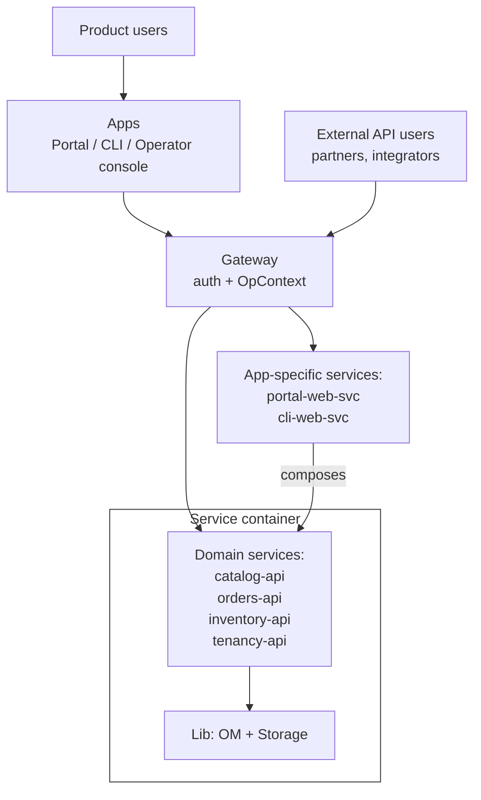
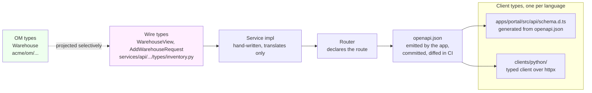
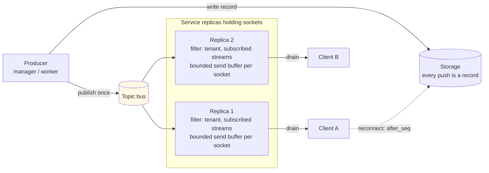
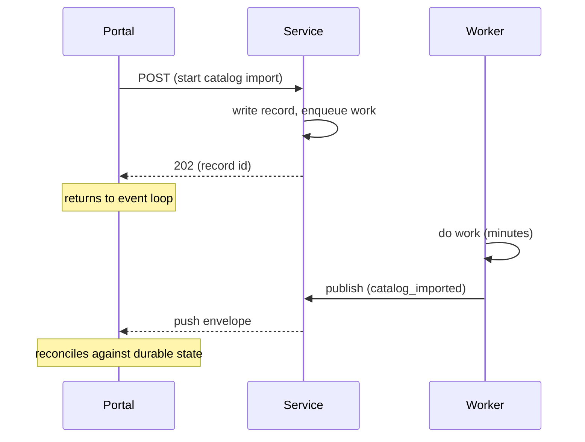
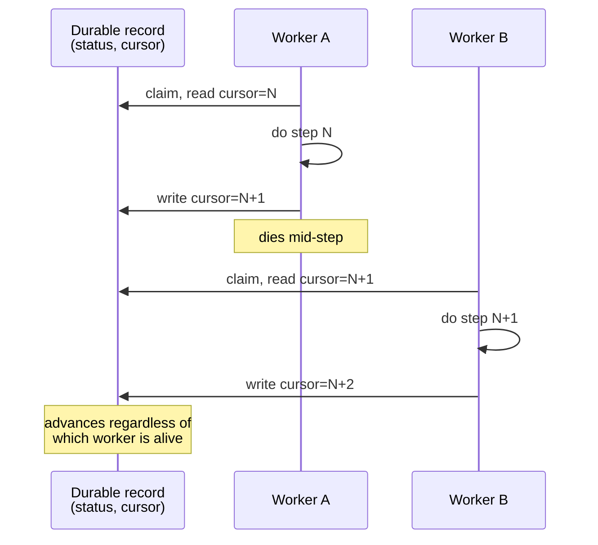
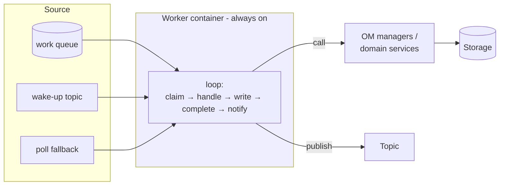
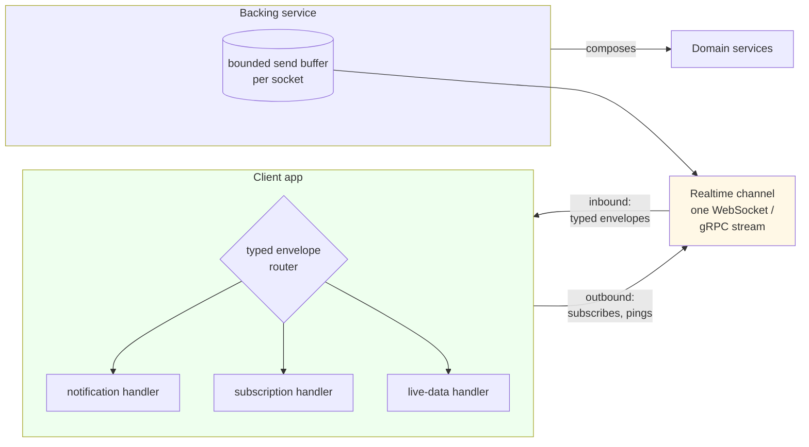

# Software Design and Architecture Guidelines

This document describes how we design and build a multi-tenant,
service-based system in Python, from the object model at the center to
the apps at the edge. It is opinionated on purpose. Every rule below is
one we apply, and every shape below is one we use. Where a rule has a
cheaper first step, the step is named; where it has an exception, the
exception is named too.

The running example is a commerce platform with a catalog, orders, and
inventory. The nouns are illustrative; the shapes are not. One small
project applies the whole document end to end; [Next: An End-to-End
Reference Implementation](#next-an-end-to-end-reference-implementation)
points at it.

The document names technologies as well as shapes: Python and Pydantic,
Postgres and SQLAlchemy, React and Vite, Terraform on AWS. The names
are defaults, chosen for speed and clarity; [Technology Choices and How
to Override Them](#technology-choices-and-how-to-override-them) says
why they are named and how a project substitutes its own.

It is written for a small team that starts with one process and one
database and does not want a rewrite when it grows. Most of the rules
exist so that the next step, when load asks for it, is a deployment
change and not a code change, up to the limits [Scalability by
Design](#scalability-by-design) names. It assumes that an agent writes
most of the code and a person reads it. Several rules, the second impl
of every interface above all, are cheap on that assumption and a tax
without it, and the reference implementation is the price in full: a
to-do app carries the whole shape. That is the audience, and it is
said here so nobody discovers it in the middle.

## Contents

<!-- toc -->
- [The Domain as the Source of Truth](#the-domain-as-the-source-of-truth)
- [Naming Entities](#naming-entities)
  - [Entities, Value Objects, and Read Models](#entities-value-objects-and-read-models)
  - [Immutability](#immutability)
  - [Identifiers](#identifiers)
- [Namespaces as Swimlanes](#namespaces-as-swimlanes)
  - [Pure Rules](#pure-rules)
- [Separation of Layers](#separation-of-layers)
- [Interfaces](#interfaces)
  - [Multiple impls per interface](#multiple-impls-per-interface)
  - [Composition by decoration](#composition-by-decoration)
  - [Injectability](#injectability)
- [OpContext](#opcontext)
  - [Stages](#stages)
  - [Scopes](#scopes)
  - [The Operator Context](#the-operator-context)
- [The Business Layer](#the-business-layer)
  - [Shape of an Operation](#shape-of-an-operation)
  - [Parameters](#parameters)
  - [Cross-Manager Dependencies](#cross-manager-dependencies)
  - [Operations Without a Principal](#operations-without-a-principal)
- [The Storage Layer](#the-storage-layer)
  - [Storage Principles](#storage-principles)
  - [Namespace Shape](#namespace-shape)
  - [Storage Root](#storage-root)
  - [Defining ORM Classes](#defining-orm-classes)
  - [Translation](#translation)
  - [A Storage Impl](#a-storage-impl)
  - [Cross-Storage Dependencies](#cross-storage-dependencies)
  - [Database Roles](#database-roles)
  - [Migrations](#migrations)
- [Infrastructure](#infrastructure)
  - [Infrastructure Principles](#infrastructure-principles)
  - [InfraInterface Root](#infrainterface-root)
  - [Cache](#cache)
  - [Buckets](#buckets)
  - [Topics](#topics)
  - [Queues](#queues)
  - [Secrets](#secrets)
  - [Idempotency](#idempotency)
- [The Network Layer](#the-network-layer)
  - [How It Starts and Where It Goes](#how-it-starts-and-where-it-goes)
  - [Web Services as Scalability Units](#web-services-as-scalability-units)
  - [Domain Services vs App-Specific Services](#domain-services-vs-app-specific-services)
  - [At a Glance](#at-a-glance)
  - [Stateless vs Stateful Services](#stateless-vs-stateful-services)
  - [Service Interfaces and Impls](#service-interfaces-and-impls)
  - [The Gateway](#the-gateway)
  - [Auth: the Gateway Verifies, the Tenancy Domain Owns](#auth-the-gateway-verifies-the-tenancy-domain-owns)
  - [Intra-Service Communication](#intra-service-communication)
  - [Public Types](#public-types)
  - [From OM to Wire](#from-om-to-wire)
  - [Clients Live in One Place](#clients-live-in-one-place)
  - [Direction of Calls](#direction-of-calls)
  - [Idempotency on the Consumer Side](#idempotency-on-the-consumer-side)
  - [Realtime at the Edge](#realtime-at-the-edge)
  - [Wait-for-Response vs Fire-and-Forget](#wait-for-response-vs-fire-and-forget)
  - [Long-Running Orchestrations](#long-running-orchestrations)
- [Worker Roles](#worker-roles)
  - [Workers, Not Web-Service Side Jobs](#workers-not-web-service-side-jobs)
  - [The Work Queue](#the-work-queue)
  - [Shape of a Worker](#shape-of-a-worker)
  - [Shutdown](#shutdown)
  - [Maintenance Without a Scheduler](#maintenance-without-a-scheduler)
  - [Implementation Options](#implementation-options)
- [Apps](#apps)
  - [Apps as Products](#apps-as-products)
  - [Apps Are Dumb](#apps-are-dumb)
  - [Push-First Apps](#push-first-apps)
- [Client App Architecture](#client-app-architecture)
  - [Stack](#stack)
  - [Client Rendering](#client-rendering)
  - [State and Data](#state-and-data)
  - [Views, View-Models, Models](#views-view-models-models)
  - [API Access](#api-access)
  - [Realtime: One Channel per App](#realtime-one-channel-per-app)
  - [The Operator Console](#the-operator-console)
  - [The CLI Is Different](#the-cli-is-different)
- [Deployment](#deployment)
  - [Cloud: AWS](#cloud-aws)
  - [Infrastructure as Code](#infrastructure-as-code)
  - [Local: Docker Compose](#local-docker-compose)
  - [Twins for External Services](#twins-for-external-services)
  - [What a Process Refuses](#what-a-process-refuses)
- [Monorepo Folder Structure](#monorepo-folder-structure)
  - [Layout Conventions](#layout-conventions)
- [Cross-Cutting Conventions](#cross-cutting-conventions)
  - [Exceptions](#exceptions)
  - [Logs](#logs)
  - [Traces and Metrics](#traces-and-metrics)
  - [Error Tracking](#error-tracking)
  - [Configuration](#configuration)
  - [The App Container](#the-app-container)
  - [Records of Decisions](#records-of-decisions)
  - [Tests](#tests)
- [Technology Choices and How to Override Them](#technology-choices-and-how-to-override-them)
  - [Versions](#versions)
  - [Overriding a Choice](#overriding-a-choice)
- [Scalability by Design](#scalability-by-design)
- [What This Document Does Not Cover](#what-this-document-does-not-cover)
- [Next: An End-to-End Reference Implementation](#next-an-end-to-end-reference-implementation)
<!-- /toc -->

## The Domain as the Source of Truth

Good design starts with a clear domain. A domain is the set of nouns we
use to describe the product, and the relationships between them. For a
commerce platform the nouns are `Product`, `Order`, `Shipment`,
`Warehouse`, and `Invoice`. Every layer of the system refers back to
these nouns, so they must be defined in one place. That place is our
single source of truth.

The source of truth is an object model (OM) of our business domain:
handwritten, pure Python classes based on Pydantic. We ship this model
as a standalone Python library, not a web app, a service, or a CLI. Any
application can depend on it and share the same vocabulary. The library
lives in the monorepo with its consumers, so the domain evolves with the
system instead of drifting in a separate repo.

The OM is the source of truth for entities, not the wire format and not
the table layout. The network layer projects entities onto the wire
(see [Public Types](#public-types)) and the storage layer projects
them onto rows (see [Translation](#translation)); neither projection
changes the OM to suit itself.

> **Principle:** The domain has one source of truth: a standalone OM
> library. Every layer depends on it; nothing redefines it.

## Naming Entities

Every entity in the domain is named by a class in the object model.
Before defining entities, we define a small set of mixins that capture
orthogonal traits. Concrete entities compose the mixins they need
through multiple inheritance, in a fixed declaration order so a class
signature reads as a description of the entity.

The base module holds the root class, the mixins, and the two helpers
every entity constructor needs: an id factory and a clock. `acme` in
every path below stands for the product's root package, one that
shadows no standard-library module (see [Layout
Conventions](#layout-conventions)).

``` python
# acme/om/base.py

def new_id() -> UUID:
    """A time-ordered UUID v7 as a standard-library UUID."""
    ...

def utcnow() -> datetime:
    return datetime.now(UTC)

class Platform(BaseModel):
    """Root of the object model. Holds no fields."""

    model_config = ConfigDict(frozen=True, extra="forbid")

class Identifiable(Platform):
    id: UUID  # uuid_v7, from new_id()

class Named(Platform):
    name: str

class Created(Platform):
    created_at: datetime

class Trackable(Created):
    updated_at: datetime
    created_by: UUID  # id of the user who created it
    updated_by: UUID  # id of the user who last changed it

class SoftDeletable(Platform):
    deleted_at: datetime | None = None
    deleted_by: UUID | None = None

PROVENANCE_FIELDS = frozenset({"created_at", "created_by", "deleted_at", "deleted_by"})  # stay as stored on update

EMPTY_UUID = UUID(int=0)
```

A concrete entity composes the mixins it needs, and only those a
manager operation exercises: `Trackable` where an update exists,
`SoftDeletable` where a delete does:

``` python
class Warehouse(Identifiable, Named, Trackable, SoftDeletable):
    address: str
    timezone: str
```

A row the platform writes for its own bookkeeping composes `Created`:
the outbox row, the idempotency marker, the socket ticket. No person
stands behind it, so it carries no `created_by`; the outbox row names
instead the actor, the request, and the app of the write it announces,
the provenance of the [OpContext](#opcontext) that made it, which is
why the relay takes `(org_id, row)` and no context. What the platform
stamps on it later is a field named for what happened, `done_at`,
`redeemed_at`, the outcome, never an `updated_at` that says only that
something did. A work item is `Trackable`, because the person who
enqueued it is its attribution (see [The Work
Queue](#the-work-queue)), and the platform is the actor of its
claims and completions, `EMPTY_UUID`. The two system rows every
namespace touches are declared once, each in the namespace that owns
it (`outbox`, `idempotency`), and every manager takes them from there:

``` python
class OutboxRow(Identifiable, Created):  # written with the core row, in the same statement
    org_id: UUID              # carried on the entity: the relay runs with no context
    kind: str                 # "<namespace>.<entity>.<created|updated|deleted>"
    target_id: UUID
    payload: FrozenMapping = Field(default_factory=dict, validate_default=True)
    actor_id: UUID            # the principal of the write it announces; EMPTY_UUID for the platform
    request_id: UUID          # the request that made the write
    app: AppContext           # the app that made it
    done_at: datetime | None = None

class IdempotencyMarker(Identifiable, Created):  # one per tenant, principal, and key
    user_id: UUID
    key: str
    request_digest: str        # another digest under the same key is refused
    target_id: UUID            # the id the create uses, minted before the marker
    attempt_id: UUID | None    # the attempt that holds it; cleared by a release
    status: int | None = None  # the outcome, None while the request runs
    body: str | None = None
```

Pydantic merges the fields from every base into a single model along the
MRO. The declaration order is house style: identity first, human-facing
label next, lifecycle, then cross-cutting traits. Reading the bases left
to right tells you what the entity promises to be.

Inheritance is used here for abstraction, not code reuse. `Identifiable`
means the entity has an identity. `Created` means it has a birth time
and nothing more. `Trackable` means its lifecycle is recorded, by whom
and when. `SoftDeletable` means it can be hidden without being purged.
`Named` means it carries a human-facing label. An entity opts into a
trait by adding the mixin; it opts out by leaving it off. An append-only
record such as an audit entry or a ledger line is `Identifiable` and
nothing else: it is never updated, so it carries no `updated_at`, and it
is never hidden, so it carries no `deleted_at`.

> **Principle:** Inheritance expresses abstraction, not code reuse. Each
> mixin is a promise about what the entity is.

`extra="forbid"` on the root makes a misspelled field a construction
error instead of a silently ignored key. Every class in the object
model inherits it, including value objects and the context types of
[OpContext](#opcontext).

### Entities, Value Objects, and Read Models

Three kinds of class live on the OM base chain, and the mixins tell
them apart.

An **entity** has an identity and is stored: `Order`, `Product`,
`Warehouse`. It composes `Identifiable` and, unless it is append-only,
`Trackable`.

A **value object** is a typed piece of an entity with no identity of
its own: an `Address`, a `Money` amount, a `ShippingProfile`. It
subclasses `Platform` directly, is frozen like everything else, and is
stored inline with its owner.

A **read model** is a shape a manager returns that is not an entity:
an `OrderTotals`, a `StockLevel` aggregated across warehouses, a
`ShipmentSummary`. It subclasses `Platform`, carries no mixins, and is
never written back as truth. A persisted copy of one (a cache entry, a
reporting mirror, a projection table) is derived and rebuildable, and
nothing reads it as the source of truth.

Typed filter and grouping objects (`OrderFilter`, `StockGroupBy`) are
value objects too. They travel through manager and storage interfaces
unchanged, so an aggregation runs in SQL on one storage impl and in
Python on another while the caller writes the same code.

### Immutability

> **Principle:** OM entities are immutable. Updates happen by
> copy-and-write, never by mutation.

Every OM entity is immutable. Pydantic models in the base chain are
frozen, so a `Warehouse` returned from a read is a snapshot, not a live
handle. Updates happen by copy-and-write: take the entity, produce a
modified copy, and pass the copy to a write method. This keeps shared
references safe across async tasks and means no layer can quietly
rewrite an entity after it was constructed.

> **Python tip:** the copy is one of two calls, and which one is
> decided by what the update carries. A copy whose every value is
> constructed of the field's own type, a timestamp, an id, a status,
> is `entity.model_copy(update={...})`. A copy that carries a dump,
> the caller's fields above all, is rebuilt from a dict,
> `Warehouse.model_validate({**current.model_dump(), **changes})`,
> because `model_copy` does not validate, leaves a dumped value
> object as a plain dict, and `model_validate` hands an instance back
> untouched. A manager that updates an entity sets `updated_at` and
> `updated_by` in the same copy, so the caller gets back the copy that
> was written and nothing else has to remember the timestamp. Fields
> are tuples and frozen models, never `list` or `dict`. A mapping field is `FrozenMapping`, a `Mapping` annotated
> with a validator that wraps the dict pydantic builds in a
> `MappingProxyType` and a serializer that dumps a plain dict, because
> a frozen model with a bare `Mapping` field still holds a mutable
> dict. Pydantic does not validate a default, so the empty case is
> `Field(default_factory=dict, validate_default=True)`, or the default
> is the one dict that escapes the freeze.

The same rule applies to every object built on the OM base chain,
including the sub-objects of `OpContext` (see [OpContext](#opcontext)),
and to the views described in [Public Types](#public-types). The one
deliberate exception is the SQLAlchemy row classes under `tables/`,
which must be mutable so the session can track writes; they never leak
past the storage boundary.

### Identifiers

Every id in the system is `uuid_v7`: 128 bits, globally unique, with a
48-bit millisecond timestamp in front and randomness behind it. Inserts
into a B-tree index on a v7 id land at the tail of the tree; a list of
entities by creation time is a range scan on the id column; and the
ids in a log line sort by creation time, so the order of records reads
from the ids alone. IDs are minted by whoever constructs the entity, always above
the storage layer, with `new_id()`; the database never assigns one and
nothing reads one back after a write.

> **Python tip:** `new_id()` returns `uuid.uuid7()` from the standard
> library, which ships it since Python 3.14; nothing installs a
> package for an id.

`EMPTY_UUID` is the reserved system scope. Cross-tenant reference data
(platform-owned catalogs, schema metadata, global configuration) uses it
as the `org_id` on cache and bucket calls (see
[Infrastructure](#infrastructure)), so system keys and tenant keys live
in disjoint namespaces. The same constant is the value of a required
reference that no tenant and no person owns (`created_by` on a row the
platform itself wrote), which keeps the column `NOT NULL` and the index
simple. Both readings say the same thing: the platform, not a tenant
or a person. A reference that is genuinely optional is `None`, never
`EMPTY_UUID`.

> **Principle:** Every id is `uuid_v7`, minted above storage with
> `new_id()`. Time-ordered inserts, time-ordered scans, and
> time-readable logs fall out of one choice.

## Namespaces as Swimlanes

The object model is split into namespaces that mirror the swimlanes of
the product. A warehouse or a product is a long-lived thing we define
and maintain. An order is something we create, fulfil, observe, and
report on. These concepts interact heavily, but remain separate
first-class domains rather than being buried under one another.

```text
acme.om.catalog.*
acme.om.orders.*
acme.om.inventory.*
```

Each top-level namespace under `om` has the same internal shape:

```text
acme/om/orders/
    __init__.py                # re-exports OrderManagerInterface
    manager.py                 # the manager interface
    types/                     # entity classes, value objects, read models
    impl/                      # manager.py, the manager impl
    storage/                   # storage interface, impls, tables (see The Storage Layer)
    rules.py                   # pure functions, when the namespace has any
```

The manager interface is defined in `manager.py` and re-exported from
the package root, so consumers import it with a short path:
`from acme.om.orders import OrderManagerInterface`. `types/` holds
the classes of [Naming Entities](#naming-entities). `impl/` holds the
concrete manager classes, in `impl/manager.py`.

Names follow the namespace. A manager interface and a storage
interface are named after the namespace in the singular
(`OrderManagerInterface`, `OrderStorageInterface`,
`InventoryStorageInterface`, `InventoryStoragePostgresImpl`); the
storage root has one getter per namespace storage
(`get_inventory_storage()`, `get_order_storage()`); and a namespace
with several aggregates may add one storage interface per aggregate,
named after the aggregate. Operations are named after the entity
(`write_warehouse`, `read_warehouses`). A work handler impl is
`<Kind>HandlerImpl`, the work kind in CamelCase
(`NotifyShipmentHandlerImpl`; see [Shape of a
Worker](#shape-of-a-worker)).

Cross-cutting namespaces are namespaces like any other. Tenancy
(organizations, users, memberships, credentials) and audit (who did
what, when, from which app) are first-class swimlanes with their own
types, managers, and storage, not utilities hanging off the root.

### Pure Rules

A namespace that carries real business logic keeps the pure part of it
in a module of plain functions next to the interface: pricing, window
arithmetic, eligibility checks, aggregation rules. These functions take
values and return values; they read no storage, consult no clock, and
open no settings. That makes them unit-testable without infrastructure
and shareable: when two storage impls must produce the same aggregate,
both call the same function and cannot drift apart. A rule the engine
must evaluate inside a statement, a filter or an ordering, is spelled
once more in that statement, named as such, and the contract case that
runs both impls is what holds the two spellings together; everything a
rule decides before or after the statement calls the function.

> **Principle:** A namespace's rules are pure functions in one module.
> Storage impls and manager impls call them; a rule the engine must
> evaluate inside a statement is spelled there once more, and the
> contract case holds the two spellings together.

## Separation of Layers

The system has three layers:

-   **Network**: receives requests, shapes responses, enforces
    protocols.
-   **Business**: the Object Model. Entities, managers, and operations.
-   **Storage**: persistence. Lives under the Object Model but is
    clearly separated from it.

Each layer has its own language and its own responsibilities. Upper
layers depend on interfaces exposed by lower
layers, never on their internals. Infrastructure capabilities (see
[Infrastructure](#infrastructure)) are injected into any of these layers
and never leak a technology choice across a boundary.

Authorization and tenancy are split across two layers on purpose.
Permissions and visibility are business decisions and live in
managers, where the rule can be read next to the operation it guards.
Tenancy is a data boundary and lives in storage, where every query
carries the tenant and every write checks it. A request that reaches
storage has already been authorized; a query that reaches the database
cannot cross a tenant.

> **Principle:** Three layers: Network, Business, Storage. Upper depends
> on lower through interfaces only. Infrastructure cross-cuts without
> leaking technology. Managers authorize; storage enforces tenancy.

## Interfaces

Every layer of this system is defined by its interfaces. A manager, a
storage, a service: each exposes a `*Interface` that lists the
operations its scope supports. An operation is an async method whose
signature is a contract.

``` python
from abc import ABC, abstractmethod

class InventoryManagerInterface(ABC):
    @abstractmethod
    async def get_warehouses(self, ctx: OpContext) -> list[Warehouse]: ...
    @abstractmethod
    async def get_warehouse(self, ctx: OpContext, warehouse_id: UUID) -> Warehouse: ...
```

The interface describes a capability; the impl decides how it is
delivered. That separation makes impls mockable and injectable, and
lets one `*Interface` back several impls at once.

> **Python tip:** an interface is an `ABC` whose methods are
> `@abstractmethod` with `...` bodies, and an impl subclasses it. The
> interpreter refuses an impl that forgot a method, the type checker
> holds every impl to the signature, and the interface still reads as
> documentation.

### Multiple impls per interface

An interface has at least two impls, a technology impl and an in-memory
impl, and they are interchangeable at wiring time. Callers never know
which one they are holding. Names put the technology last:
`InventoryStoragePostgresImpl`, `InventoryStorageMemoryImpl`.

A manager interface is the exception: it has one impl, because a
manager names no technology of its own, and the pair it runs over is
the storage and the infrastructure under it. That is what lets the
whole business layer run in a test over the memory roots.

The in-memory impl is the default for unit tests and the fast local
gate. It keeps state in an in-process dict and exercises real behavior
without infrastructure. It is a full second implementation: every read,
write, filter, and tenancy rule the relational impl has, the memory
impl has too, and the test suite runs both. The suite proves what it
exercises: the named atomic methods, the compare-and-set, visibility
after a write, and every unique key the schema declares each have a
contract case, so the memory impl refuses what the engine refuses, or
a memory impl passes by being lenient where the engine is strict, and
the pair is then two impls of two contracts.

Technology-specific impls for storage follow the same interface:

-   `InventoryStoragePostgresImpl`
-   `InventoryStorageClickHouseImpl`

Swapping the impl at the storage root moves the system onto a different
engine without any caller changing.

Two impls per interface read as overhead only when a person keeps them
in step. For an agent the pair is cheap: the agent writes the memory
impl alongside the technology impl, and the shape generalizes. A
memory storage impl is a dict keyed by tenant and id plus the same
filters the relational impl applies; the storage layer of the
[reference implementation](#next-an-end-to-end-reference-implementation)
has one per namespace.

An agent also mixes and composes impls far more readily than a person
does, so the duality is a lever rather than a cost. The pair is what
lets a whole application run in-process in a test over the memory
roots ([The App Container](#the-app-container)), lets a backend be
swapped at the [storage root](#storage-root) with no caller changing,
and lets impls wrap one another ([Composition by
decoration](#composition-by-decoration)).

### Composition by decoration

Because an impl depends on an interface, impls compose. Caching is a
common case:

``` python
class KeyValueInterface(ABC):
    @abstractmethod
    async def get(self, key: str) -> bytes | None: ...
    @abstractmethod
    async def set(self, key: str, value: bytes) -> None: ...

class LocalCacheImpl(KeyValueInterface): ...  # in-process

class CloudCacheImpl(KeyValueInterface): ...  # hosted key-value store

class MixedCacheImpl(KeyValueInterface):
    def __init__(self, local: KeyValueInterface, cloud: KeyValueInterface):
        self._local = local
        self._cloud = cloud

    async def get(self, key: str) -> bytes | None:
        value = await self._local.get(key)
        if value is not None:
            return value
        value = await self._cloud.get(key)
        if value is not None:
            await self._local.set(key, value)
        return value
```

`MixedCacheImpl` takes two `KeyValueInterface` values and returns one.
The caller holds a `KeyValueInterface` and cannot tell whether the hit
came from local memory, the cloud, or a two-level composite. The same
pattern fits retry, metrics, and tracing wrappers: each is an impl that
holds an inner impl and forwards selectively. Decoration is an
infrastructure pattern; a manager that needs a cache takes one through
its constructor rather than wrapping its storage.

### Injectability

> **Principle:** Dependencies are injected through constructors and
> typed by interface, never by impl.

Every downstream section (storage, manager, service) follows this rule:
a root class constructs the concrete impls in the right order and wires
them together, which is what makes the swaps and compositions above
cheap.

What a constructor takes is structural and lives as long as the
process. What one operation needs, the actor, the tenant, the request,
the evidence of what has been established, arrives in the context, per
call, and never through a constructor (see [Scopes](#scopes)).

Configuration is injected the same way. A manager that has tunables (a
default page size, a lease length, a threshold) takes a small frozen
options object in its constructor, built once at boot from settings.
Managers never read environment variables.

When two managers genuinely need each other, the cycle is broken above
them, not inside them: extract the shared operation into the lower
namespace, or pass a narrow callable for the one operation the upper
manager needs. Reaching into another impl's private attributes after
construction is not wiring; it is a cycle that has not been resolved.

## OpContext

Every operation takes a context as its first argument. The context
carries the ambient information the operation needs: who is acting, on
behalf of which tenant, with what role and permissions, from which
application, and under which request. `OpContext` (operation context)
is the context of a tenant operation, and it is the one most operations
take: a tenant operation authorizes, scopes to the tenant, attributes
to the actor, and stamps provenance, and that is all of what
`OpContext` carries.

``` python
class SecurityContext(Platform):
    user_id: UUID
    org_id: UUID
    role: Role
    permissions: tuple[Permission, ...]
    teams: tuple[UUID, ...] = ()
    credential_kind: CredentialKind  # api_key, session_token, internal, ...
    credential_id: UUID

class AppContext(Platform):
    type: AppType   # portal, cli, api, worker, ...
    version: str    # e.g. "portal@2.14.0", useful for compatibility checks and telemetry

class RequestContext(Platform):
    request_id: UUID
    app: AppContext
    trace_id: str | None = None

class OpContext(RequestContext):
    security: SecurityContext

    @property
    def org_id(self) -> UUID: ...

    @property
    def user_id(self) -> UUID: ...

    @property
    def credential_kind(self) -> CredentialKind: ...

    @property
    def credential_id(self) -> UUID: ...

    def has(self, permission: Permission) -> bool: ...
    def require(self, permission: Permission) -> None: ...  # raises NotAuthorized (see Exceptions)
    def in_team(self, team_id: UUID) -> bool: ...
```

Permissions are a pure function of role, declared in one table in the
tenancy namespace. A credential never carries a role above its
issuer's, and above means the permission set: a role is at most another
when its permissions are a subset of the other's, and a rank, when one
exists for comparison, is derived from the permission table or held to
it by a unit test. A role reserved for services is not a rung on that
ladder: no credential a person mints carries it, and every operation
that issues a credential refuses it by name, whatever the rank says.
Teams are a second authorization axis inside a tenant: an
entity may be owned by a team, and visibility rules consult
`ctx.in_team`. The context carries ids and facts, never entities: a
manager that needs the user loads it, so a role change is seen on the
next request, and `opcontext.py`, which also declares `Role`,
`Permission`, `CredentialKind`, and `AppType`, imports nothing above
`base.py`.

`request_id` is ambient state exactly like identity: minted or accepted
at the edge, stamped onto the context once, and from there it reaches
every log line, every audit row, and the error envelope without any
layer passing it by hand. `ctx.require(Permission.WRITE)` is one line
at the top of a manager method, which is what keeps authorization in
the business layer.

A context is immutable. Once built, it flows through every downstream
call unchanged. No layer adds, replaces, or mutates its fields
mid-request. If an operation needs a narrower view (an override, a
narrowed permission set), it is passed as an explicit argument, not by
mutating `ctx`. Operations never reach for ambient state through
globals or thread locals; all of it flows through the context, which
keeps operations easy to test with a fake context and easy to reason
about across layers.

The context is not one type. It is one type per stage of what a request
has established, and one view per capability a consumer needs. The two
answer different questions and are kept apart: a stage says what is
proven, a scope says what a consumer sees.

> **Principle:** All ambient state flows through the context. No
> globals, no thread locals, no hidden lookups.

### Stages

A request establishes who is behind it in steps, and each step is a
type:

``` text
RequestContext          a request exists; nobody is known yet
  ├─ IdentityContext    a person is verified by their own sign-in; no tenant is chosen
  │    └─ OperatorContext  the person is on the operator allowlist
  └─ OpContext          a membership is established: one tenant, one user, one role
       └─ ...           what the domain earns next, say a TenantOperatorContext, when
                        operations rely on the role instead of checking it each time
```

``` python
class IdentityContext(RequestContext):
    identity_id: UUID
    email: str
    credential_kind: CredentialKind
    credential_id: UUID

class OperatorContext(IdentityContext):
    """The operator plane. No org_id, on purpose."""
```

Each stage is a frozen type that subclasses the stage it refines. The
subclass relation is the refinement: a function that asks for the
weaker stage accepts the stronger one, and a function that asks for the
stronger one cannot be handed the weaker. `OperatorContext` adds no field
to `IdentityContext`; what it adds is the evidence that the operator
allowlist was consulted. The chain continues below `OpContext` only
when the domain earns it: a stage for a role exists when operations
rely on that role instead of requiring a permission at their first
line, and not before. `OpContext` does not refine `IdentityContext`:
what a tenant operation knows about the person is the user inside the
tenant, not the identity across tenants, and an API key or a worker's
service context has no sign-in behind it at all.

A stage above the request stage is produced only by a transition: an
operation that takes the stage below, consults the evidence, and
returns the stage above or refuses. The evidence is the tenancy
manager's, so a transition is an operation of the tenancy manager, or
one that asks it, as the claim of a worker does.

``` python
class TenancyManagerInterface(ABC):
    @abstractmethod
    async def authenticate_login(self, rctx: RequestContext, credential: str) -> IdentityContext: ...
    @abstractmethod
    async def authenticate(self, rctx: RequestContext, credential: str) -> OpContext: ...
    @abstractmethod
    async def admit_operator(self, ictx: IdentityContext) -> OperatorContext: ...
    # ...
```

Not every path passes through every stage: a session token or an API
key resolves the membership in one transition, and the claim a worker
calls returns an `OpContext` from the request stage the loop minted.
The stages name what is established, not the road taken. The exchange
of a sign-in for a tenant session is not a transition: it takes the
identity stage and issues a session, and that session comes back
through `authenticate` as an `OpContext` on the next request, which is
how a sign-in reaches a tenant without one stage refining the other.

A transition builds a new object from the stage below and the evidence
it consulted; it never copies the stage below with changed fields, and
nothing but a transition constructs a stage above the request stage.
The type is the fence at every call site; at the construction sites it
is a test: a unit test enumerates every site that constructs a stage
above the request stage and fails when a new one appears, the way the
exceptions test enumerates the tenant-less storage methods. A stage is
an ordinary class, and anything can call its constructor; the test is
what makes "only a transition" hold.

The request stage is minted at the edge, once: by the gateway (see [The
Gateway](#the-gateway)) for every request and every socket, by the
worker loop per claim and per sweep pass (see [The Work
Queue](#the-work-queue)), and by the bootstrap command that seeds an
environment, per command. It carries the request id, the app, and the
trace, and nothing that names a person.

A function that takes a stage relies on its invariant and does not
check it again: an operation that takes `IdentityContext` does not
verify the credential, and one that takes `OpContext` does not ask
whether the membership is live. The stage is the proof. That is what
keeps authentication from being reconstructed at every layer, and it is
why the stages are concrete types and not views: a stage is evidence,
produced in one place, and its exact type says who produced it.

A stage lives as long as the request that minted it and no longer: a
request, a claim, a sweep pass, a socket. A socket is a request that
stays open, so it holds the `OpContext` its ticket produced, and that
context outlives its evidence unless the socket is closed when the
evidence goes. So it is: the session's expiry bounds the socket, which
the process closes at that instant whatever the client does, and a
revocation or a membership's end travels on the topic bus like any
other change (see [Realtime at the Edge](#realtime-at-the-edge)), and
every process that holds a socket for that session or that user closes
it on the frame. The expiry covers a frame that was missed. What a
socket carries in the meantime is hints, never a field of an entity,
so the window a missed frame opens is one of metadata and one of
expiry. Work that runs later than the request that asked for it runs
on an authority of its own, which [The Work Queue](#the-work-queue)
names.

The stages fence capabilities without a second registry. An operation
declares the weakest stage that proves what it needs, and a caller that
holds a weaker one cannot call it; the type checker refuses the call. A
sign-in route holds a `RequestContext` and cannot reach a warehouse
manager. An
operator route holds an `OperatorContext` and cannot reach a tenant
manager. There is no bundle of managers per stage: the managers are the
structural graph, built once per process (see [The App
Container](#the-app-container)), and the stage in an operation's
signature decides which operations a holder can call.

> **Principle:** A context stage is evidence. Only a transition
> produces it, its type is the proof, and an operation takes the
> weakest stage that proves what it needs.

### Scopes

Some consumers need less than a stage carries. The helper that stamps
provenance onto an outbox row needs the actor, the request id, and the
app. The rate limiter's subject needs the credential id and nothing
about the tenant, because it also runs on routes where no tenant is
known yet. A realtime subscription needs the tenant and the user. None
of them authorizes, and none of them should see the permissions, the
role, or the whole `OpContext`. Each declares a scope: a small
`Protocol` naming the capability it needs, and nothing else.

``` python
from typing import Protocol

class RequestScope(Protocol):
    @property
    def request_id(self) -> UUID: ...
    @property
    def app(self) -> AppContext: ...

class TenantScope(Protocol):
    @property
    def org_id(self) -> UUID: ...

class ActorScope(TenantScope, Protocol):  # there is no actor without a tenant
    @property
    def user_id(self) -> UUID: ...

class CredentialScope(Protocol):
    @property
    def credential_kind(self) -> CredentialKind: ...
    @property
    def credential_id(self) -> UUID: ...

class ProvenanceScope(ActorScope, RequestScope, Protocol): ...
```

``` python
def outbox_row(ctx: ProvenanceScope, kind: str, target_id: UUID, payload: FrozenMapping) -> OutboxRow: ...
async def subscribe(self, ctx: ActorScope, ...) -> ...: ...  # on the socket handler, not a manager
```

A scope is a `Protocol` and not an `ABC`, on purpose. A stage satisfies
a scope structurally, by carrying the members, so one context object
satisfies every scope it can, with no subclass per combination and no
projection object built per call. An interface is an `ABC` because an
impl is written to implement it (see [Interfaces](#interfaces)); a
scope is a view that a context already satisfies. The members are
read-only properties, so a frozen field and a property both satisfy
them. The consumer declares the scope; the caller passes the stage it
holds; the type checker proves the fit at the call. Every stage
satisfies `RequestScope`; `OpContext` satisfies all of them.

The scope set is derived from consumers, not from a taxonomy. A scope
exists when a consumer declares it, or when another scope is built on
it, as `ActorScope` is built on `TenantScope`. There is no
`AuthorizationScope`, because no consumer needs the permissions without
the tenant and the actor. A manager operation takes `OpContext`, which
is its scope, and says nothing narrower, because it authorizes, and
authorization rests on the live membership that only the stage proves
and no scope can.

Scopes compose. `ProvenanceScope` is `ActorScope` and `RequestScope`
together, and it has a name because provenance is a concept of the
domain: who, under which request, from which app, stamped on every row
a write produces. That is the only reason a combination gets a name. A
consumer that needs two scopes with no concept between them takes the
stage that carries both; no name is minted for the intersection of two
others, and the vocabulary stays small enough to read in one screen.

Provenance is a tenant concept: `ActorScope` names a user inside a
tenant, and `OperatorContext` cannot satisfy it. An operator write is
stamped by the operator managers from the identity id and the request
id their stage carries, through a helper of the operator plane, never
through `outbox_row`.

Stages and scopes are kept apart. A stage is a chain of evidence, and
subclassing is its refinement. A scope is a view, and composition is
its only combinator. A stage may satisfy a scope; a scope never proves
a stage, because anything with the right fields satisfies it, a test
fake included.

Scopes are separate from structural injection, too. A constructor takes
what an impl needs for its lifetime: its storage, its peer managers,
its infrastructure capabilities, its options (see
[Injectability](#injectability)). A context carries what one operation
needs: state, authority, evidence. Nothing crosses. A manager does not
arrive on a context, and a request id does not arrive in a
constructor. When an operation's availability depends on what a request
has established, the stage is in the operation's signature; the manager
does not move onto the context.

> **Principle:** Scopes are typed capability boundaries. A consumer
> declares the narrowest scope it needs, a context satisfies it
> structurally, and no scope carries the object graph.

### The Operator Context

A tenant context always names one organization. The people who operate
the platform itself have questions no tenant context can answer: usage
across every organization, service health, global configuration. That is
a different plane with a different context type, `OperatorContext`, the
operator's context. It is the identity stage refined by one more
transition: `admit_operator` takes an `IdentityContext` and returns an
`OperatorContext` when the identity is on the operator allowlist, and
refuses otherwise (see [Stages](#stages)).

`OperatorContext` has no `org_id`, on purpose. Operator managers take it
and nothing else; tenant managers take `OpContext` and nothing else. The
type system at every call site, and the construction-site test at the
few places a stage is built, keep the two planes apart: an operator
route cannot act inside a tenant, and a tenant route cannot reach the
operator plane. The operator plane is described further in [The
Gateway](#the-gateway) and [The Operator Console](#the-operator-console).

> **Principle:** Tenant operations take `OpContext`; operator operations
> take `OperatorContext`. The two never mix in one signature.

## The Business Layer

The business layer is where the object model comes alive. Managers
expose operations through `*ManagerInterface` (see
[Interfaces](#interfaces)). Each operation takes a context as its
first argument, `OpContext` for a tenant operation (see
[OpContext](#opcontext)), and returns OM entities or
read models (see [Entities, Value Objects, and Read
Models](#entities-value-objects-and-read-models)). A manager impl holds
whatever it needs to do its work: the storage under its namespace, any
peer manager whose operations it composes, and any infrastructure
capability it leans on. All dependencies are injected through the
constructor and typed by interface. A business-layer root wires them
together at boot and hands back one frozen object with a field per
manager.

### Shape of an Operation

Every write follows the same four steps: authorize, verify, copy,
write. Reading it once is enough to read every manager in the system.
The write lands the row and its outbox row in one storage call and
relays the row at once, or leaves the relay to the sweep, the cheaper
first step (see [Database Roles](#database-roles)).

``` python
class InventoryManagerImpl(InventoryManagerInterface):
    def __init__(self, storage: InventoryStorageInterface, relay: OutboxRelayInterface):
        self._storage = storage
        self._relay = relay

    async def update_warehouse(self, ctx: OpContext, warehouse: Warehouse) -> Warehouse:
        ctx.require(Permission.WRITE)
        current = await self.get_warehouse(ctx, warehouse.id)  # existence and tenancy, or NotFound
        updated = Warehouse.model_validate({  # a copy that carries a dump is validated, never model_copy
            **current.model_dump(),
            **warehouse.model_dump(exclude=PROVENANCE_FIELDS),  # the caller's fields, never who made or deleted it
            "updated_at": utcnow(), "updated_by": ctx.user_id,
        })
        row = outbox_row(ctx, "inventory.warehouse.updated", updated.id, updated.model_dump(mode="json"))
        await self._storage.write_warehouse(ctx.org_id, updated, row)  # one atomic method
        await self._relay.relay(ctx.org_id, row)
        return updated
```

The caller that originates an entity constructs it whole, with
`id=new_id()`, `created_at`, `updated_at`, `created_by`, and
`updated_by` set, and hands it to `create_*`. The manager's copy on
create sets what is the manager's to decide, the actor from the
context, the initial status, a position, and leaves the id and the
timestamps as constructed. A create whose id is already written
returns the row as stored: ids are minted above storage, so the only
way to present one twice is a retry, and a retry must not create
twice. The insert reports the existing id and the manager reads the
row back; there is no check before the write and no window between
the two (see [A Storage Impl](#a-storage-impl)).

A create that issues
a secret is the one case where the row as stored is not enough: the
secret is stored as a digest and shown once. Its rerun finds the row,
re-mints the secret on it in the same named atomic write, and returns
a fresh `Issued...View` with the same id. The first secret reached no
one, since the marker never stored an outcome, and the row keeps its
identity. The outcome the marker stores for such a create is the view
with the secret absent, so a replay answers with the row and no
secret, says so in its header, and the secret exists in one place, as
a digest; a client that lost the first response revokes the key and
issues another.

The manager sets `updated_at` and `updated_by` on every
update and `deleted_at` / `deleted_by` on a soft delete, always by
copy. The copy on update starts from the stored row: the caller's
entity supplies the fields a caller may change, and `PROVENANCE_FIELDS`,
a constant beside the mixins naming `created_at`, `created_by`,
`deleted_at`, and `deleted_by`, stay as stored, so no caller rewrites
who made a row or brings a deleted one back by sending an entity. A
partial update is the service impl's translation: it reads the current
entity through the manager's `get_*`, copies the request's set fields
onto it, an absent field meaning unchanged and an explicit null meaning
cleared where the field is optional, and hands the whole entity to the
manager. That policy is the request type's contract, and no manager
decides it.

Mutating methods return the entity that was written, so the caller
holds the same snapshot the storage does. Last writer wins by default;
an entity whose concurrent edits matter carries a `version`, the copy
increments it, and the write is a compare-and-set that raises
`Conflict` when the row moved (optimistic concurrency).

### Parameters

Parameters follow a top-down hierarchy, from the broadest scope to the
narrowest. In a manager signature the tenant and the user are already in
`ctx`, so the visible parameters start at the next level: `(ctx,
customer_id, order_id, line_id)` peels customer, then order, then line.
Optional filters follow the required scoping ids as keyword parameters
with defaults. The same ordering applies in storage interfaces, where
`org_id` and, where relevant, `user_id` appear explicitly at the front,
and in service interfaces, which take `ctx` first like managers.

### Cross-Manager Dependencies

When a manager needs another manager to do its work, the dependency is
injected through the constructor. The interface is untouched; only the
impl gains the parameter.

``` python
# acme/om/orders/impl/manager.py

class OrderManagerImpl(OrderManagerInterface):
    def __init__(
        self,
        storage: OrderStorageInterface,
        inventory_manager: InventoryManagerInterface,
    ):
        self._storage = storage
        self._inventory_manager = inventory_manager
```

The dependency is an implementation detail, not part of
`OrderManagerInterface`. The business-layer root constructs every
manager in the right order and wires dependencies between them. Callers
see only the interfaces.

### Operations Without a Principal

A few operations exist before any principal does, or act across every
tenant: signing in, claiming the next unit of background work, sweeping
expired leases, finding the integration that owns an inbound webhook
token. These take the request stage, `RequestContext`, as their first
argument (see [Stages](#stages)), are documented as transitions, and
*produce* a stronger stage rather than consume one: a sign-in returns
the identity stage, a claim returns the `OpContext` under which the
work runs, and a sweep asks for one service context per live tenant.
There are very few of them, and a test names each one, so a new
operation that takes the request stage is a decision and not a slip.

A sweep has two shapes, and who acts decides which. A sweep that
performs a tenant operation, a purge, a requeue that audits, holds one
service context per live tenant and calls the manager as any caller
would. Bookkeeping with no principal, relaying the outbox, expiring a
lease, reads across tenants in one statement and gets the tenant back
with each row (see [Namespace Shape](#namespace-shape)). A service
context is minted for the tenant, not for a member: it carries the
tenant, the role reserved for services, and the system user
(`EMPTY_UUID`) as its user id, so it costs one read per page of
tenants and a tenant whose members have all left is still swept.

One more kind takes a tenant id in place of a context: the handoff of
a row the tenant's own write already produced. The outbox relay of
[Database Roles](#database-roles) takes `(org_id, row)`, and the
event append it performs takes the same, because the row carries its
tenant, its actor, and its request id from the write that made it,
and the relay runs again from the sweep, where no principal exists.
Both are declared on their interfaces as such and are the only
operations of their kind.

## The Storage Layer

The storage layer persists what the business layer gives it and returns
it on request. It does not orchestrate, it does not decide, and it never
surprises.

### Storage Principles

-   The code never relies on a relationship the database knows about.
    A foreign key may exist for integrity or as an optimization, but no
    manager assumes a cascade, a rejected orphan, or a join the schema
    happens to permit. Relationships the business layer needs are plain
    id columns it reads and writes itself.
-   No transaction outlives a storage call. A transaction that spans
    calls holds locks and a connection across a round trip and pins
    every table it touches to one database, which is exactly what
    stops a role from moving (see [Database Roles](#database-roles)).
    A storage operation is one statement or
    one short, self-contained unit that the impl commits itself;
    nothing spans two storage calls. The one justification for a named
    atomic method is an invariant two rows must hold together: a
    work-queue claim (see [The Work Queue](#the-work-queue)), a
    reservation and its stock level, a unique membership, a core row
    and its outbox row, a ledger that moves money. It is a single named
    interface method, so the interface stays technology-free and the
    exception is visible by name.
-   Joins are avoided but allowed as an implementation detail. They
    never leak into the interface.
-   No trigger functions and no hidden magic. If something happens, it
    happens in our code.
-   Every ID is passed top-down. We do not create an object in the DB
    and read its ID afterwards. IDs originate above storage, with
    `new_id()`.
-   Defaults are set in the object model. Schema-level defaults are
    optional, kept as a convenience for admin and test operations where
    an operator writes plain SQL by hand and schema defaults keep
    those statements short. A default added to backfill a
    new column is removed once the backfill is done.
-   The storage layer must be swappable. Moving from a relational DB to
    a columnar DB on a different technology changes only `impl/`,
    never the interfaces or the entities. The interface keeps the
    signatures; the shared suite that runs every impl (see [Multiple
    impls per interface](#multiple-impls-per-interface)) is what says
    the new engine honors the same filters, orderings, and named
    atomic methods, so a swap is complete when that suite passes, not
    when it compiles.
-   No user-defined functions in the DB. Every query is written
    explicitly in its storage class.
-   Tenancy is enforced on every read and checked on every write. A
    query filters by `org_id`; an upsert refuses to overwrite a row that
    belongs to another tenant. Row-level security is not a second
    fence here: on a pooled connection it needs the tenant set per
    statement, which is the same discipline in a second place, and a
    policy that misfires returns nothing instead of failing loudly.
    The fence is `org_id` in every statement and the test that
    enumerates every exception to it; a project that wants the
    database to hold a second fence records the decision.

### Namespace Shape

Storage follows the same namespace pattern as the rest of the object
model, scoped under its parent entity namespace:

```text
acme/om/inventory/storage/
    __init__.py     # InventoryStorageInterface
    impl/           # postgres.py, memory.py
    tables/         # ORM classes, not exposed
```

The interface exposes read and write operations on domain entities.
Every operation takes `org_id` as a parameter, so tenancy is enforced at
every query:

``` python
class InventoryStorageInterface(ABC):
    @abstractmethod
    async def read_warehouses(self, org_id: UUID) -> list[Warehouse]: ...
    @abstractmethod
    async def read_warehouse(self, org_id: UUID, warehouse_id: UUID) -> Warehouse | None: ...
    @abstractmethod
    async def create_warehouse(
        self, org_id: UUID, warehouse: Warehouse, outbox_row: OutboxRow
    ) -> bool: ...  # False when the id is already written; nothing changes then
    @abstractmethod
    async def write_warehouse(
        self, org_id: UUID, warehouse: Warehouse, outbox_row: OutboxRow
    ) -> None: ...
```

A write on a `core`-role entity takes the outbox row that announces
it, so the two land in one statement and no manager remembers a second
one (see [Database Roles](#database-roles)). A create and an update
are two methods, because they are two primitives: an insert that
reports an existing id without touching it, and an upsert.

Some scopes are strictly user-bound. An order board, where the
column layout and pinned filters are personal to each user, is not just
tenant-scoped; it is user-scoped within a tenant. In those cases the
interface adds `user_id` on top of `org_id` explicitly:

``` python
class OrderBoardStorageInterface(ABC):
    @abstractmethod
    async def read_board(
        self,
        org_id: UUID,
        user_id: UUID,
        board_id: UUID,
    ) -> OrderBoard | None: ...
```

Both keys are passed, and both appear in the `WHERE` clause of every
query in the impl. `org_id` guards tenancy; `user_id` guards personal
scope within the tenant.

The interface never exposes the underlying technology. A session object
or connection pool is injected into the implementation, never referenced
in the interface. A consumer of `InventoryStorageInterface` must not be
able to tell whether it is talking to SQLAlchemy, Postgres, or a
columnar store.

A small number of tables are global by nature: the identities behind
tenant users, platform-owned reference data, a health row per external
provider. Their storage methods take no `org_id`, and the interface
docstring says why. Cross-tenant sweeps (expire every lease that is
past due, in every tenant) return `tuple[UUID, Entity]` so the tenant
travels back with each row. These are the documented exceptions to the
`org_id`-first rule, and a test enumerates them.

### Storage Root

Storage implementations are assembled behind a single root that
implements `StorageInterface` and lives at `acme.om.storage`, with
one impl per engine, `StoragePostgresImpl` and `StorageMemoryImpl`,
named like every other impl:

``` python
class StorageInterface(ABC):
    @abstractmethod
    def get_inventory_storage(self) -> InventoryStorageInterface: ...
    @abstractmethod
    def get_order_storage(self) -> OrderStorageInterface: ...
    # ... one getter per namespace storage

    @abstractmethod
    async def healthcheck(self) -> bool: ...
    @abstractmethod
    async def close(self) -> None: ...
```

Higher layers receive a `StorageInterface` and ask it for the storage
they need, which keeps construction centralized and makes each entity
storage trivially mockable in tests. Two roots exist from day one, one
over the relational engine and one in memory, and each constructs every
namespace impl and wires cross-storage dependencies between them.

`acme.om.storage` also hosts the shared building blocks used by
every concrete storage: common ORM base classes under `tables/`,
translation helpers under `utils/`, and the table-to-role map described
under [Database Roles](#database-roles).

### Defining ORM Classes

Table classes mirror the OM mixins from [Naming
Entities](#naming-entities), so their definitions
stay focused on what is specific to the entity. The common mixins live
at `acme.om.storage.tables`, with one storage-only addition:
`org_id` rides on `IdentifiableMixin`, because every tenant table is
tenant-scoped. A global table composes `GlobalIdentifiableMixin`, which
carries `id` alone.

``` python
# acme/om/storage/tables/base.py

class IdentifiableMixin:
    id: Mapped[UUID] = mapped_column(primary_key=True, sort_order=-1000)
    org_id: Mapped[UUID] = mapped_column(index=True, sort_order=-999)  # storage-only

class FeedIdentifiableMixin:  # a feed table: (org_id, id) is declared compound, so no single index
    id: Mapped[UUID] = mapped_column(primary_key=True, sort_order=-1000)
    org_id: Mapped[UUID] = mapped_column(sort_order=-999)

class GlobalIdentifiableMixin:
    id: Mapped[UUID] = mapped_column(primary_key=True, sort_order=-1000)

class NamedMixin:
    name: Mapped[str] = mapped_column(sort_order=-900)

class CreatedMixin:
    created_at: Mapped[datetime] = mapped_column(sort_order=-800)

class TrackableMixin(CreatedMixin):
    updated_at: Mapped[datetime] = mapped_column(sort_order=-799)
    created_by: Mapped[UUID] = mapped_column(sort_order=-798)
    updated_by: Mapped[UUID] = mapped_column(sort_order=-797)

class SoftDeletableMixin:
    deleted_at: Mapped[datetime | None] = mapped_column(sort_order=-700)
    deleted_by: Mapped[UUID | None] = mapped_column(sort_order=-699)
```

Concrete table classes live in their owning namespace's `tables/` folder
and compose the mixins their entity has, in the same house-style order
as the OM:

``` python
# acme/om/inventory/storage/tables/warehouses.py

class Warehouses(IdentifiableMixin, NamedMixin, TrackableMixin, SoftDeletableMixin, Base):
    __tablename__ = "warehouses"
    address: Mapped[str]
    timezone: Mapped[str]
```

`Warehouses` declares only what is unique to a warehouse. Identity,
tenancy, name, lifecycle timestamps, and soft-delete fields come from
the mixins. Tables carry `org_id` while tenant OM entities do not;
tenancy is a storage concern, populated by the business layer from
`OpContext` at call time. The exception is an entity whose readers have
no tenant: a row an operator reads across every tenant carries `org_id` as
a model field too, so the reader knows whose it is.

Unlike OM entities, table classes are mutable by design. The SQLAlchemy
session tracks in-place changes to produce SQL, so rows must not be
frozen. This is the one deliberate exception to the OM immutability
rule, and it is bounded: rows never leave the storage impl.

Column order is part of the model. Every table opens with its mixin
columns in house-style order and its own columns follow, and a new
column is declared at the end of its class so the physical table and
the class stay in step when the column is appended.

> **Python tip:** SQLAlchemy places mixin columns after the class's own
> columns whatever the base order says. The negative `sort_order` bands
> on the mixins (`-1000` for identity, `-900` for name, and so on) pin
> the header block to the front.

Four index rules cover almost every table:

1.  A feed wants a compound index on `(org_id, id)`. Because ids are
    v7, that index sorts by creation time, and a B-tree scans backwards
    for free, so a descending index is never needed.
2.  A column that already leads a compound index gets no single-column
    index of its own, so a feed table composes `FeedIdentifiableMixin`,
    whose `org_id` carries none, and declares the compound one.
3.  Index what the SQL filters on, not what Python filters afterwards.
    Reach for a compound index when a real query asks for one.
4.  A unique key on a `SoftDeletable` table is unique among the
    living: a partial unique index `WHERE deleted_at IS NULL`, so a
    deleted row frees its key and the same slug, email, or membership
    can be created again. The memory impl refuses only among the
    living too, and a contract case creates, deletes, and creates
    again.

### Translation

Storage translates between the OM entity and the table row. For
`Warehouse` and `Warehouses`, field names match one-to-one, so
translation is mechanical in both directions. Module-level helpers in
`acme.om.storage.utils` cover that case:

``` python
# acme/om/storage/utils/translation.py

def to_row(entity: BaseModel, row_type: type[R], **extra: Any) -> R:
    """Build a row from an entity; `extra` carries storage-only columns such as org_id."""
    ...

def to_model(row: Any, model_type: type[M]) -> M:
    return model_type.model_validate(row, from_attributes=True)

def apply_row(row: Any, entity: BaseModel) -> None:
    """Copy entity values onto an existing row in place, never touching org_id."""
    ...
```

A write of a `Warehouse` becomes `to_row(warehouse, Warehouses,
org_id=org_id)`; a read becomes `to_model(row, Warehouse)`; an update
of an existing row becomes `apply_row(row, warehouse)`. Nested value
objects, enums, and tuples are dumped in JSON mode into JSON columns,
scalars are dumped natively, and the helpers decide which by looking at
the column type, so a namespace with plain shapes writes no translation
code at all.

A value object stored as JSON is a stored shape, and it evolves under
the rule that governs every stored shape: it only gains optional,
defaulted fields. A rename or a removal is a migration that rewrites
the column, in the expand-and-contract shape of
[Migrations](#migrations), before the class changes; `extra="forbid"`
on the value object then makes a row the migration missed a read
error, which is the check that it ran, and never a silently ignored
key.

Custom translation is written only when the row and the entity diverge,
for example when a row carries a computed column or a field is
denormalized. Module-level helpers are preferred over an inheritance
base so that multi-entity storages, which touch more than one
`(entity, row)` pair, can use the same primitives without contortion.

### A Storage Impl

`InventoryStoragePostgresImpl` implements `InventoryStorageInterface`
against a SQLAlchemy session factory. The factory is injected into the
constructor and never surfaced through the interface. A shared base,
`PgStorageBase`, provides the two write primitives every namespace
uses: an insert that reports an existing id and an upsert, both
checking the tenant.

``` python
# acme/om/inventory/storage/impl/postgres.py

class InventoryStoragePostgresImpl(PgStorageBase, InventoryStorageInterface):
    async def read_warehouses(self, org_id: UUID) -> list[Warehouse]:
        stmt = (
            select(Warehouses)
            .where(Warehouses.org_id == org_id, Warehouses.deleted_at.is_(None))
            .order_by(Warehouses.id)
        )
        async with self._session_for(stmt) as session:
            result = await session.execute(stmt)
            return [to_model(row, Warehouse) for row in result.scalars()]

    async def write_warehouse(
        self, org_id: UUID, warehouse: Warehouse, outbox_row: OutboxRow
    ) -> None:
        await self._upsert(Warehouses, org_id, warehouse, outbox_row)
```

`_upsert` reads the existing row by id, raises if the row belongs to
another tenant, applies the entity onto the row or inserts a new one,
inserts the outbox row beside it, and commits the two together. Its
sibling `_insert` is the create primitive: an insert that does nothing
on an existing id and says so, with the outbox row landing only when
the insert won, so a retried create neither overwrites the row nor
announces it twice, and a key collision surfaces as a report and never
as a driver error. Every
query filters by `org_id` and every write checks it, so a bug in a
caller cannot move a row across tenants. Each operation opens its own
short session and commits it; no session outlives the call.

> **Python tip:** when a row must be read and updated atomically by
> exactly one worker (a queue claim), `SELECT ... FOR UPDATE SKIP
> LOCKED` inside that one storage method is the whole solution. A
> compare-and-set on a `version` column is the portable alternative
> when the row is contended but not queued.

### Cross-Storage Dependencies

When a scoped storage impl needs another storage to do its work, the
dependency is injected through the constructor. The interface is
untouched; only the impl gains the parameter.

``` python
# acme/om/orders/storage/impl/postgres.py

class OrderStoragePostgresImpl(PgStorageBase, OrderStorageInterface):
    def __init__(
        self,
        sessions: SessionFactory,
        inventory_storage: InventoryStorageInterface,
    ):
        super().__init__(sessions)
        self._inventory_storage = inventory_storage
```

The dependency is an implementation detail, not part of
`OrderStorageInterface`. The storage root constructs every storage impl
in the right order and wires dependencies between them.

### Database Roles

Not every table has the same shape or the same life. Tenant metadata
is small, relational, and read on every request; event streams are
append-only and read by one parent id; a work queue is hot and tiny.
One undifferentiated schema gives them one pool, one backup, and one
place where an analytical scan competes with a queue claim.

Every table belongs to exactly one **database role** (our word for a
schema with its own pool and migration chain, not a Postgres login
role), and lives in the schema named after it:

| Role       | Holds                                                   |
|------------|---------------------------------------------------------|
| `core`     | the system of record: tenancy, catalog, orders, config  |
| `activity` | append-only streams: events, audit, ledgers             |
| `queue`    | the work queue and the channels that wake workers       |
| `admin`    | the operator plane's own state, global rows             |

A map from table name to role in `acme.om.storage.roles` is the
single source of truth. The ORM base derives each table's schema from
it, each role has its own connection URL that defaults to the shared
one, and the storage root opens one engine and pool per distinct URL.
The default deployment is one database holding every role schema; when
metrics demand it, a role moves to its own database: the schema is
copied under replication or a dual write until the copy is current,
and the cut-over is one URL. The copy has a window and a rehearsal;
the code does not change.

Rules that make the move safe, each checked by a unit test:

-   No cross-role foreign keys and no cross-role statements. A
    statement touches one role; the base class routes it by the table
    it names and refuses one that spans roles.
-   A handoff that follows a core write (an event row, a work item) is
    never a second statement the manager remembers to make. The manager
    writes the core row and an outbox row in one named atomic method in
    the `core` role, then relays the outbox row to its destination at
    once; the sweep of [Maintenance Without a
    Scheduler](#maintenance-without-a-scheduler) relays whatever a crash
    left behind and marks the row done. The relay is idempotent on the
    row's key, so relaying twice is harmless (the transactional outbox
    pattern).
-   The relay has a price, and it is named: after the one commit, the
    event append in `activity`, the publish, and the mark in `core`
    are three more round trips, four per write, six for a creating
    request with the marker's `begin` and `finish` around it. Relaying
    at once pays them in the request path for a push that arrives in
    milliseconds. The cheaper first step is to relay from the sweep
    alone, on an interval of a second or two: one round trip per
    write, a push that arrives within the interval, the same relay
    code, and no second path to test. A system moves the relay into
    the request path when push latency earns it.
-   The topic bus (see [Topics](#topics)), when it is backed by the database,
    connects to the queue role, because the processes that enqueue work
    and the workers they wake must share it.

Analytics across tenants never runs in the request path of any role.
When reporting is needed it reads a mirror fed by change data capture
or a periodic copy, never a role the application writes to.

Every role is backed up on its own schedule, and a restore is
rehearsed, not assumed. A role restored to an earlier point than its
siblings is reconciled from the outbox, not by hand: the rows relayed
since that point are relayed again, harmless because the relay is
idempotent on the row's key, and for an event whose destination role
was restored past it the outbox row is the one trace it existed. That
is why a done outbox row is kept for a retention period and purged by
the sweep, never deleted on done, and why that period outlives the
backup schedule of the roles the outbox feeds. A soft-deleted row is
purged by the maintenance sweep after its entity's retention period;
purge is the one hard delete. Personal data lives in named fields, so
erasing a person is a sweep over a list, not a hunt.

> **Principle:** Every table has one role; the role is its schema, its
> pool, and its migration chain. Nothing crosses a role.

### Migrations

Migrations live with the OM, and the schema timeline is owned by the OM,
not by any single service. A migration is a pair of SQL files, hand
written and schema qualified, with a thin Python wrapper that Alembic
runs:

```text
om/migrations/sql/<role>/YYYYMMDDHHMM_<slug>.up.sql
om/migrations/sql/<role>/YYYYMMDDHHMM_<slug>.down.sql
om/migrations/versions/<role>/YYYYMMDDHHMM_<slug>.py   # run_sql(role, "...up.sql")
```

One revision chain and one version table per role. The minute stamp is
the file's sort key and the revision id, so two authors never negotiate
a counter; two migrations of one role in the same minute collide on the
stamp, and the later one waits a minute or takes a suffix; two
migrations that name the same parent are a real
conflict, and the tool reporting it is the point. A migration file is
never edited once it has been applied anywhere. The runner refuses a
file that names a table of another role, and refuses to migrate one
role when the caller meant all of them. A migration is compatible with
the release before it, because a rollout runs both at once: add and
backfill in one release, switch the code, drop in a later one (expand
and contract).

A check that the ORM metadata and the migrated schema agree, for every
role, is part of the fast test gate. A downgrade-then-upgrade of the
latest revision is part of CI.

## Infrastructure

Managers need more than a place to keep rows: a cache to skip
expensive reads, a bucket to park large blobs, a topic to hand work off
asynchronously, a secret store to resolve a credential. These are
infrastructure capabilities: cross-cutting toolkits, not a layer of
their own. Managers (and service impls, when needed) reach for them the
same way they reach for a storage: as an interface injected through
the constructor.

### Infrastructure Principles

-   Every infra capability is fronted by an interface with swappable
    impls. For example, a cache has a local impl, a cloud impl, and a
    mixed impl; the caller holds a `CacheInterface` and does not know
    which.
-   The OM imports infra interfaces; infra imports nothing from the OM.
-   Tenancy is explicit where it matters as a keying concern. Cache and
    buckets take `org_id` as a first-class parameter so a mistake cannot
    cross tenants at the key level. Topic payloads carry `org_id` so a
    consumer can filter before it acts.
-   Cross-tenant reference data uses `EMPTY_UUID` as the `org_id` on
    cache and bucket calls. The system scope is the zero UUID by value,
    so infra checks against it without importing the OM. Impls treat it
    as a reserved system scope, so system keys and tenant keys live in
    disjoint namespaces and a tenant caller cannot read or write system
    data by mistake.
-   Wire-up happens in the app container at boot (see [The App
    Container](#the-app-container)). Managers and service impls receive
    infra handles through their constructors, never through globals,
    thread locals, or a context, whichever stage or scope it is.
-   Observability is used through its vendor API directly (see [Traces
    and Metrics](#traces-and-metrics) and [Error
    Tracking](#error-tracking)), and so is a feature flag SDK on the
    rare day one is needed (see [Configuration](#configuration)).
-   Every impl can `describe()` itself in one line, and the container
    logs the chosen backends once at start, so an operator reading a
    boot log knows exactly what a process is talking to.

### InfraInterface Root

Infrastructure lives under `acme.infra` and is fronted by a single
root so consumers can ask for what they need:

``` python
class InfraInterface(ABC):
    @abstractmethod
    def get_cache(self, scope: CacheScope) -> CacheInterface: ...
    @abstractmethod
    def get_buckets(self) -> BucketsInterface: ...
    @abstractmethod
    def get_topics(self) -> TopicsInterface: ...
    @abstractmethod
    def get_queues(self) -> QueuesInterface: ...
    @abstractmethod
    def get_secrets(self) -> SecretsInterface: ...
    # ... one getter per capability

    @abstractmethod
    async def start(self) -> None: ...
    @abstractmethod
    async def close(self) -> None: ...
```

Each getter returns an interface; the impl behind it is chosen by the
app container from settings and can differ across environments without
any manager changing. The root has a lifecycle because some
capabilities do: a topic listener holds a connection and a queue holds
a client, opened at start and closed at shutdown.

### Cache

Cache is for fast reads against data that is expensive to fetch or
compute. A cache is scoped so that unrelated consumers do not step on
each other's keys:

``` python
class CacheScope(str, Enum):
    NETWORK_RESPONSE = "network_response"
    CATALOG_INDEX = "catalog_index"
    RATE_LIMIT = "rate_limit"
    WORKER_LIVENESS = "worker_liveness"

class CacheInterface(ABC):
    @abstractmethod
    async def get(self, org_id: UUID, key: str) -> bytes | None: ...
    @abstractmethod
    async def put(self, org_id: UUID, key: str, value: bytes, ttl: timedelta) -> None: ...
    @abstractmethod
    async def invalidate(self, org_id: UUID, key: str) -> None: ...
    @abstractmethod
    async def increment(self, org_id: UUID, key: str, ttl: timedelta) -> tuple[int, timedelta]: ...
```

A manager takes the cache it needs through its constructor, already
scoped:

``` python
class CatalogManagerImpl(CatalogManagerInterface):
    def __init__(
        self,
        storage: CatalogStorageInterface,
        cache: CacheInterface,  # scoped at wire-up time
    ):
        self._storage = storage
        self._cache = cache
```

`org_id` is passed explicitly on every call, so keys from different
tenants cannot collide. A value that is personal to a user carries the
user id inside the key.

`increment` is the one atomic primitive, and it exists for two things:
rate limits (see [The Gateway](#the-gateway)) and generations. A cache
backend cannot enumerate a tenant's keys cheaply, so a read cache is a
**projection** with a generation: every entry's key carries the tenant's
generation number, a write bumps the number with one `increment`, and
every older entry is orphaned at once and expires by TTL. The TTL is a
backstop, never the primary invalidation, and it is the bound on
staleness: a bump that fails after the write, or a generation key
evicted before the entries that carry it, leaves the old entries
readable until they expire, and that bound is what a manager accepts
when it caches a read.

A cache fails open. A miss is always an acceptable answer, and a
backend that cannot be reached is a miss, not an error. Nothing that
must be correct is kept only in a cache.

Caching is a business-layer concern: a storage impl talks to its
database and nothing else, and caching decisions live in managers,
where the cost of a stale read is understood.

### Buckets

Buckets are for large blobs: generated documents, user uploads,
exports. The shape is S3-like and deliberately simple:

``` python
class Buckets(str, Enum):
    ORDER_DOCUMENTS = "order-documents"
    USER_FILE_UPLOADS = "user-file-uploads"
    PRODUCT_IMAGES = "product-images"

class BucketsInterface(ABC):
    @abstractmethod
    async def put(self, org_id: UUID, bucket: Buckets, key: str, data: bytes, content_type: str) -> None: ...
    @abstractmethod
    async def get(self, org_id: UUID, bucket: Buckets, key: str) -> bytes: ...
    @abstractmethod
    async def exists(self, org_id: UUID, bucket: Buckets, key: str) -> bool: ...
    @abstractmethod
    async def list(self, org_id: UUID, bucket: Buckets, prefix: str) -> list[str]: ...
    @abstractmethod
    async def delete(self, org_id: UUID, bucket: Buckets, key: str) -> None: ...
    @abstractmethod
    async def presign_get(self, org_id: UUID, bucket: Buckets, key: str, ttl: timedelta) -> str | None: ...
    @abstractmethod
    async def presign_put(self, org_id: UUID, bucket: Buckets, key: str, content_type: str, ttl: timedelta) -> str | None: ...
```

Keys are plain strings, but nothing prevents a manager from laying them
out as nested paths when that helps:

```text
orders/<order_id>/invoices/<invoice_id>.pdf
orders/<order_id>/packing-slips/<shipment_id>.pdf
products/<product_id>/images/<image_id>.webp
```

Every call takes `org_id`, and the impl prefixes storage keys with it
so one tenant's blobs cannot be read or listed by another. Presigned
URLs let a browser or a remote process move bytes directly to and from
the store with a short expiry; the service never proxies a large upload
through its own memory. A local filesystem impl with the same layout
serves development and tests.

### Topics

Topics are for wake-ups and live updates: a producer publishes an
event; every interested process reacts to it. Topic names are fixed by
enum; payload types are fixed by a payload map; every payload extends
one frozen base that infra declares:

``` python
class TopicPayload(BaseModel):
    model_config = ConfigDict(frozen=True, extra="ignore")  # a tolerant reader

    idempotency_key: UUID  # uuid_v7, set by the producer
    produced_at: datetime
    org_id: UUID

class Topics(str, Enum):
    ORDER_PLACED = "order_placed"
    SHIPMENT_UPDATED = "shipment_updated"
    CATALOG_IMPORTED = "catalog_imported"
    WORK_AVAILABLE = "work_available"
    ENTITY_CHANGED = "entity_changed"  # kind, target_id, seq: the realtime producer

TOPIC_PAYLOADS: dict[Topics, type[TopicPayload]] = {
    Topics.ORDER_PLACED: OrderPlacedPayload,
    Topics.SHIPMENT_UPDATED: ShipmentUpdatedPayload,
    Topics.CATALOG_IMPORTED: CatalogImportedPayload,
    Topics.WORK_AVAILABLE: WorkAvailablePayload,
    Topics.ENTITY_CHANGED: EntityChangedPayload,
}

class TopicsInterface(ABC):
    @abstractmethod
    async def publish(self, topic: Topics, payload: TopicPayload) -> None: ...
    @abstractmethod
    def subscribe(
        self,
        topic: Topics,
        consumer: str,
        handler: Callable[[TopicPayload], Awaitable[None]],
    ) -> Callable[[], None]: ...  # returns an unsubscribe
```

A topic is best effort: a published event reaches every process that
was subscribed at the time, at most once, and a bus hiccup may lose it.
That contract is what makes the bus cheap: a database's `LISTEN/NOTIFY`,
a pub/sub channel on the cache, or an in-process dispatcher for tests
all satisfy it. Durable work never rides a topic. It is a row in the
work queue (see [The Work Queue](#the-work-queue)); the topic is a
wake-up that only says "there is work", and a missed notification
degrades to polling latency, never to lost work.

`consumer` names the subscriber for logs and metrics. `subscribe`
returns an unsubscribe callable, because the most common subscriber is
a socket handler that lives exactly as long as one connection.

Because the producer sets `idempotency_key` at construction time, it
is the observable id throughout the pipeline: producers and consumers
both log it. That is why `publish()` returns `None`; a broker-assigned
id carries no durable meaning across retries and replays, and
surfacing it would leak technology through the interface.

> **Python tip:** a database-backed bus caps the payload size (about
> 8 KB on Postgres). The impl trims a payload that would not fit,
> marks it `truncated`, and the consumer re-reads the record from
> storage (a claim check). Consumers written that way work unchanged on
> a bus with no cap.

### Queues

A queue is for work whose producer is outside the platform and cannot be
told to wait: inbound webhooks, partner deliveries, bulk uploads. This
is the inbound queue for outside producers; durable internal work is the
work table of [The Work Queue](#the-work-queue). The shape is that of a
hosted queue service, so the cloud impl is thin and the in-process impl
is a faithful twin (see [Twins for External
Services](#twins-for-external-services)):

``` python
class Queues(str, Enum):
    WEBHOOKS = "webhooks"
    BULK_UPLOADS = "bulk_uploads"
    # ...

class QueuesInterface(ABC):
    @abstractmethod
    async def send(self, queue: Queues, body: bytes, *, dedup_id: str | None = None) -> str: ...
    @abstractmethod
    async def receive(self, queue: Queues, max_messages: int, wait: timedelta, visibility: timedelta) -> list[QueueMessage]: ...
    @abstractmethod
    async def delete(self, queue: Queues, receipt: str) -> None: ...
    @abstractmethod
    async def change_visibility(self, queue: Queues, receipt: str, visibility: timedelta) -> None: ...
    @abstractmethod
    async def depth(self, queue: Queues) -> QueueDepth: ...  # visible, in flight, dead-lettered
```

A queue delivers at least once and does not deduplicate; the durable
"processed exactly once" guarantee belongs to the consumer (see
[Idempotency on the Consumer Side](#idempotency-on-the-consumer-side)).
Dead letters are visible, not silent: a message that fails its last
attempt lands in a dead-letter queue, an audit entry names it, and a
metric counts it.

### Secrets

Secrets are a capability, not a domain. A secret store holds values;
the object model holds only **references** to them:

``` python
class SecretsInterface(ABC):
    @abstractmethod
    async def get(self, name: str) -> str: ...  # raises SecretNotFound
    @abstractmethod
    async def has(self, name: str) -> bool: ...
    @abstractmethod
    async def put(self, name: str, value: str) -> None: ...
    @abstractmethod
    async def delete(self, name: str) -> None: ...
```

A `CarrierIntegration` entity carries `credential_ref: str`, the name
of a secret, never the value. The value is resolved at the point of
use, for exactly one operation, and discarded; it never enters an
entity, a log line, an audit payload, an error message, or the
environment of a subprocess. Error messages name the secret and the
store it was looked up in, never the value.

The local impl reads environment variables and an owner-only file; the
cloud impl talks to the managed secret manager. A process that names
itself staging or production and finds the file backend configured
refuses to start.

### Idempotency

Every topic payload, every queued message, and every work item carries
a producer-set `idempotency_key` by construction, so every handler has
something to dedupe on without thinking. [Idempotency on the Consumer
Side](#idempotency-on-the-consumer-side) states the handler rule once,
for every kind of queue.

## The Network Layer

### How It Starts and Where It Goes

A system starts as one API process. It hosts one router module and one
wire-types module per OM namespace behind one gateway, plus the realtime
channel (see [Realtime at the Edge](#realtime-at-the-edge)), and it runs
next to a small number of worker processes (see [Worker
Roles](#worker-roles)). That is the right first shape: the operational
boundaries that matter at the start are between interactive traffic and
background work, not between namespaces, and one process is the cheapest
thing to deploy, observe, and debug.

Growth is mechanical because the namespace boundary is a module
boundary from day one: splitting a namespace out into its own service
moves a router module and a types module into a new container and
changes nothing a manager sees. The rest of this section describes
that target.

### Web Services as Scalability Units

Web services are the network layer's scalability units, and the unit
is a process, not a codebase. Each major OM namespace gets its own
service: `catalog` has `catalog-api`, `orders` has `orders-api`, and
so on. The first form of a split is the API process's own image with
a `namespaces` setting naming the routers it mounts, so `catalog-api`
is that image serving the `catalog` routers and nothing else, and the
split is a deployment change. A service earns an image of its own
when its code diverges, which is what an app-specific service with
logic of its own is. Splitting along namespace lines lets each
service be scaled, rolled out, and exposed independently, and lets
products mix which services they expose. The independence is of the
process, not of the data: every service runs the same OM against the
same database roles, and the schema timeline stays with the OM (see
[Layout Conventions](#layout-conventions)), so the data tier splits by
role, never by service. The other rules that make
scaling out a matter of adding processes are collected in [Scalability
by Design](#scalability-by-design).

A service runs in its own container with the whole OM library
available to it and calls managers and storages in-process, and that
holds across a split: a call from the orders routers into the
inventory namespace is a manager call inside the orders process,
before the split and after it, because the process holds the code and
the roles the callee needs. The remote impl of a service interface is
for the process that does not: an image that drops a namespace's
code, a database role a service is not granted, a system outside the
platform. A wire hop between two processes that share the OM and the
database buys an unknown outcome and nothing else, so it is a
recorded decision, never the shape a split takes by itself (see
[Direction of Calls](#direction-of-calls)).

### Domain Services vs App-Specific Services

Two kinds of web services exist, and they share the same structural
pattern:

-   **Domain services** wrap one OM namespace each and expose its
    operations to any caller. `catalog-api`, `orders-api`, `tenancy-api`.
    External API users call them directly; the platform's apps reach
    them through their backing service.
-   **App-specific services** exist for the needs of a single client
    app: `portal-web-svc`, `cli-web-svc`. Each composes domain services
    to serve the exact shape its client needs, and holds any logic that
    is only meaningful for that app (session shape, client-specific
    aggregations, per-app rate limits).

App-specific services are thin: they exist so client apps can stay
dumb, and an app talks only to its own backing service. In the
single-process start, an app-specific service is a router module and
its service impl, which composes managers on behalf of one app, and
every request carries an app type on its context so app-aware branches
stay explicit.

### At a Glance



### Stateless vs Stateful Services

Services scale horizontally only while they are ephemeral: kill one,
start a fresh one elsewhere, and the system keeps running. The test is
reconstitutability. If a process's in-memory content can be rebuilt
from durable sources (storage, cache, queues), it is ephemeral whatever
it holds in RAM; if the process is the only place a piece of
information exists, horizontal scaling breaks.

Domain services are always stateless. They read from storage, write to
storage, publish events, and return. A warm cache, a preloaded index, a
per-process rollup of an expensive computation are all fine; they
rebuild at boot. What a domain service must never do is hold
information that exists nowhere else.

App-specific services may be lightly stateful, but only when a client
opens a long-lived transport. A WebSocket or a gRPC stream is bound to
one process by its nature, and that is the one thing a service
unavoidably holds that the rest of the system does not. The rule is
narrow: a lightly stateful service keeps the open connection, the
subscriptions the client asked for on it, and a bounded buffer of
frames waiting to be written. Session data, preferences, and
accumulated context are recovered on demand from storage or cache
(see [Realtime at the Edge](#realtime-at-the-edge)).

> **Principle:** Domain services are always stateless. App-specific
> services hold only the open socket, its subscriptions, and a
> bounded buffer; never session data or user context.

### Service Interfaces and Impls

The network layer follows the same interface/impl pattern as managers
and storages. Each service declares its network operations through a
`*ServiceInterface`; the impl translates between the wire and the
managers. A `ServicesInterface` plays the role of the network-layer
root:

``` python
class InventoryServiceInterface(ABC):
    @abstractmethod
    async def get_warehouses(self, ctx: OpContext) -> list[WarehouseView]: ...
    @abstractmethod
    async def get_warehouse(self, ctx: OpContext, warehouse_id: UUID) -> WarehouseView: ...

class ServicesInterface(ABC):
    @abstractmethod
    def get_inventory_service(self) -> InventoryServiceInterface: ...
    @abstractmethod
    def get_order_service(self) -> OrderServiceInterface: ...
    # ... one getter per service
```

A router declares the route: the path, the verb, the status, and the
dependencies that mint the context and the idempotency key. It calls
one operation of its service impl with the context and the request
type and returns what the impl returns. The service impl translates:
it builds the entity or the arguments from the request, calls one
manager, and projects the result onto a view. The router calls through
the service interface from the first day, so the split is a wiring
change and not a rewrite of the routers. When a router starts deciding
something, the decision moves into a manager.

### The Gateway

A gateway sits in front of the services and is the only layer that
talks to the public internet. It mints the request stage, runs the
transitions that authenticate it into `OpContext` (see
[Stages](#stages)), and routes to the right service; services never
construct a context from raw headers or tokens. In the single-process
start the gateway is a package of middleware and request dependencies
inside the API process, with the same responsibilities.

The gateway owns a short list of edge concerns, each done once:

-   **Credentials.** Every credential kind has a distinct prefix (an
    API key, a session token, a login credential, a single-use socket
    ticket, an invitation link), and the prefix decides which
    dependency will accept it. An agent presents an API key
    that is membership-scoped, expiring, and role-capped at its
    issuer's role. A person signs in with a credential that carries no
    tenant and exchanges it for a tenant-scoped session token, so the
    same person in two tenants is one identity with two memberships.
-   **Sockets.** A long-lived connection is opened with a single-use,
    short-lived ticket minted by an authenticated request, never with a
    long-lived credential in a URL. Redeeming the ticket re-checks the
    credential behind it.
-   **Origins.** Cross-origin requests are accepted only from the
    browser apps' origins, a list read from settings; every other
    origin is refused.
-   **Request id.** The gateway accepts an inbound `x-request-id` or
    mints one, stamps it on the context, echoes it in the response
    header, and attaches it to the log context and the trace span.
-   **Error envelope.** One handler translates `PlatformException`
    (see [Exceptions](#exceptions)) into `{"error": {"code", "message",
    "request_id"}}` with the status the exception names; one catch-all
    turns anything else into a 500 with the same shape. Routers never
    set error status codes.
-   **Rate limits.** A per-route dependency counts in the shared cache
    (`CacheInterface.increment`) so every replica shares one budget.
    The subject is the credential id; an unauthenticated route keys on
    the client address; an inbound-webhook route keys on a digest of
    its path token. A rejection is `429` with `Retry-After` and the
    error envelope. The limits fail open: they guard against runaway
    clients and are not a security boundary.
-   **Edge idempotency.** A creating `POST` accepts an
    `Idempotency-Key` header, and the `IdempotencyMarker` of [Naming
    Entities](#naming-entities) owns the retry. `begin` writes it
    pending per tenant and principal under the key, carrying a digest
    of the request, the id the create will use, minted before the
    marker, and an attempt token; `finish` stores the outcome on it,
    and a retry replays the outcome, using the same storage primitive
    the queue handlers use. A key presented with another digest is
    refused. Only an outcome the client cannot change by retrying is
    stored: a refusal (a `4xx`) is replayed; a failure (a `5xx`)
    releases the marker, keeping its digest and its id and clearing
    only the attempt, so the retry reruns on the same id and finds the
    row a failed attempt left instead of creating a second one. The
    table after this list is the whole protocol.
-   **Health.** `/healthz` answers liveness with the version and no
    I/O; `/readyz` awaits the storage healthcheck; `/metrics` exposes
    counters and histograms. All three sit outside the versioned API.
    The load balancer answers `/metrics` with a 404; only the collector
    beside the process reads it.
-   **Versioning.** The API prefix (`/v1`) is applied once, where
    routers are mounted. Routers declare only their own sub-paths.

The marker moves through four states, and every move is one
conditional write whose guard is in the statement itself:

| Marker            | Event                                   | Guard                          | Then                                              |
|-------------------|-----------------------------------------|--------------------------------|---------------------------------------------------|
| none              | `begin`                                 |                                | pending under attempt A, id minted; the request runs |
| pending           | `finish` by A with a `2xx` or a `4xx`   | the attempt is A               | finished; the outcome stored                      |
| pending           | a `5xx` in A                            | the attempt is A               | released; digest and id kept, no attempt          |
| pending           | `finish` or release by an attempt not A | the attempt is not the caller's | unchanged; the caller is refused                  |
| pending, lease out| a retry's `begin`                       | key and digest match           | pending under attempt B, same id; the request reruns |
| released          | a retry's `begin`                       | key and digest match           | pending under attempt B, same id; the request reruns |
| finished          | a retry's `begin`                       | the digest matches             | finished; the outcome replayed, the header says so |
| any               | `begin` under another digest            |                                | unchanged; refused                                |

The pending lease is an option of the idempotency manager: a marker
older than it was abandoned by a crash between the marker and its
outcome, or belongs to an attempt still running past its lease, and
the next retry takes it over. Because a create whose id is already
written returns the row as stored, a rerun on the marker's id cannot
duplicate what an earlier attempt left behind; and because `finish`
and the release are conditional on the attempt token, the attempt
that lost the marker can neither finish it with its own outcome nor
release the marker the retry now holds. It is refused, like a worker
whose lease has passed, and whatever it wrote is the row the retry
found.

The operator plane has its own gate. It authenticates the bearer into
the identity stage, which admits only the person's own sign-in (never
an API key, never a session minted from an invitation someone else
issued), and asks the tenancy manager to admit that identity as an
operator, which produces an `OperatorContext` when the identity is on the
operator allowlist (see [The Operator
Context](#the-operator-context)). Operator routes
live under `/v1/admin/*`, are served by the same process, and cannot
reach a tenant manager because no `OpContext` exists on that path.

### Auth: the Gateway Verifies, the Tenancy Domain Owns

The gateway verifies credentials. The tenancy namespace owns the
identity model (organizations, identities, users, memberships, teams,
credentials, sessions, invitations) and issues tokens, as a regular
namespace with its own OM types, manager, and storage, and in a split
deployment a regular domain service. Auth has business logic (signup,
invite, role management, key rotation, session refresh) that belongs in
the OM like any other domain; the gateway asks the tenancy manager for
the principal behind a credential and owns nothing else.

An external identity provider is one more credential kind. The
gateway's dependency accepts the provider's token, verifies it against
the provider's published keys, and hands the tenancy manager the
issuer and the subject; the manager's transition finds or creates the
identity keyed on that pair and produces the same `IdentityContext` a
sign-in does, so the exchange into a tenant session, the memberships,
and the sessions are the ones every person has. The provider is an
integration: an interface with a real client and a twin in the
`integrations/` distribution (see [Monorepo Folder
Structure](#monorepo-folder-structure) and [Twins for External
Services](#twins-for-external-services)), wired at boot by the
container like a backend of the infra root, and nothing below the
gateway knows which provider spoke.

Nothing the tenancy namespace stores can be presented as a credential.
A password is stored as a memory-hard hash (scrypt or argon2) under a
salt of its own. An API key, a session token, and a socket ticket are
stored as their SHA-256 digest and shown once, in the `Issued...View`
that minted them (see [Public Types](#public-types)); a lookup hashes
the presented value and reads the row by the digest, and the secret's
entropy is the defense.

### Intra-Service Communication

All services run in the same local or virtual network.
Service-to-service calls never cross the public internet, and TLS is
not required for intra-service traffic. Managed backends that accept
only TLS are configured with it; that is a connection string, not an
architectural concern. That rests on the network being private:
services and workers sit in private subnets, security groups admit
only the platform's own processes, and only the gateway has a public
address, all declared in Terraform; a runtime that offers mutual TLS
between tasks at no cost turns it on. The rule is where the trust
boundary is, not that traffic inside it is plain.

A service-to-service
call carries a short-lived internal credential minted by the calling
process: a token that names the principal, the tenant, the request id,
and an expiry a few minutes out, signed with a key every process reads
from the secret store (see [Secrets](#secrets)) and verified by the
callee against the same key; the callee's gateway rebuilds `OpContext`
from it like any other credential kind, and no service trusts a bare
header.

One key is one trust domain: every process that reads it can
mint a credential naming any principal in any tenant, so the fence
around that key is the private network and the secret store's access
list, and a compromised process is a compromised platform, not a
compromised service. That is a decision, made for a platform whose
processes are all its own and deployed together. A system that runs a
process it trusts less, a plugin, a partner's code, a component with a
wider surface, gives each issuing process a key of its own and
verifies by name, so the callee knows not only that a trusted process
signed but which one; turning on TLS answers a different question and
does not narrow who may sign.

Outbound TLS verification uses the operating system's trust store, in
every process, so a corporate proxy or a private certificate authority
works without per-component configuration.

### Public Types

The OM is the source of truth for entities. What a service exposes on
the wire is a selective projection of those entities: a curated view
that decides which fields are public, which are renamed, and which are
omitted. The OM never changes to match the wire format.

Wire types are hand-written Pydantic classes in the service's `types/`
module, one module per namespace, on two bases:

``` python
class View(BaseModel):
    model_config = ConfigDict(frozen=True, from_attributes=True)

class RequestBody(BaseModel):
    model_config = ConfigDict(extra="forbid")

class WarehouseView(View):       # wire shape; curated, not auto-derived from Warehouse
    id: UUID
    name: str
    address: str

class AddWarehouseRequest(RequestBody):  # input shape; no id or timestamps, the server assigns them
    name: str
    address: str
    timezone: str

class ErrorResponse(View):
    error: ErrorBody  # code, message, request_id
```

Views are immutable, like OM entities: wire snapshots, not live
objects, handed to many callers. Requests forbid unknown fields, so a
client that sends a misspelled key learns about it at once.

Naming is fixed: `...View` for anything returned, `...Request` for
anything accepted, `Issued...View` for the one response that carries a
freshly minted secret in the clear. Lists return a bare list with a
server-clamped `limit`; a list that can outgrow the clamp returns a
page envelope (`items` and `next_cursor`) and pages by an opaque
cursor over the list's own order, which is the id when that order is
the creation order, since a v7 id sorts by time; an append-only
stream pages by a monotonic sequence number (`after_seq`); nothing
pages by an offset.

Inside `/v1` a view only gains fields and a
request only gains optional ones; a removal or a rename is a new
prefix. Tolerance runs one way, and the deployment order covers the
other. A reader ignores a field it does not know, which lets an old
reader take a new writer's output; the reverse, a new reader in front
of an old writer, holds only when the new field is optional with a
default the reader applies when it is absent. So a topic payload, a
work item payload, and a realtime envelope only gain optional,
defaulted fields: a row written before the deploy has no such field,
a producer still on the old build sends none, and the two roll out in
either order because the consumer tolerates both. A request forbids
what it does not know, so the service that accepts a new optional
field rolls out before the app that sends it, and an app that reads a
new field of a view tolerates its absence until every replica serves
it: a service rolls out before its apps.

> **Python tip:** `from_attributes=True` makes
> `WarehouseView.model_validate(warehouse)` the whole translation when
> field names line up. A module-private `_view()` helper in the
> service impl covers the cases where they do not.

### From OM to Wire

`Warehouse` lives in the OM; the view decides what the wire looks
like; the service impl translates between them and the router binds
the route to it; the OpenAPI document is emitted from the running app
and is the contract every client builds against.



The OpenAPI document is generated by the app and committed. CI
regenerates it and fails on a diff, so a pull request that changes the
API surface shows the change in the document.

### Clients Live in One Place

> **Principle:** One client per language per service. Every consumer
> imports it; nobody builds their own.

A TypeScript app generates its types from the committed OpenAPI
document into one file, re-exports the names it uses through a curated
facade so feature code never imports generated paths, and wraps
transport in one small hand-written client that knows the error
envelope and the request id. A Python consumer imports one typed client
package built the same way. When the document changes, every consumer
picks up the new shapes on the next build; the import path is the
version. Every outbound call carries a timeout: the transport client
reads one from settings, one per client, and no call goes out without
one, so a deadline a team sets later has a place to land and a
downstream that hangs cannot hold a replica's whole pool. The gateway
bounds a request the same way, with a deadline from settings, and a
work handler is bounded by its lease; nothing runs unbounded.

### Direction of Calls

Calls flow downward through the layers, never upward:

-   A **domain service impl** can call other domain services (through
    their `ServiceInterface`) and its own OM managers (through their
    `ManagerInterface`). It cannot call app-specific services; apps are
    consumers of the domain, not dependencies of it.
-   An **app-specific service impl** can call domain services, but not
    other app-specific services. Each app-specific service is bounded to
    one app; siblings stay independent so one app's needs never leak
    into another. If two apps need the same logic, it belongs in a
    domain service or in the OM.
-   An **OM manager** can call other managers and storages, but cannot
    reach back up to a `ServiceInterface`. `services.*` exists only in
    the network layer.
-   A **storage impl** can call other storages (see [Cross-Storage
    Dependencies](#cross-storage-dependencies)) but cannot reach up to
    managers or services.

Cross-service orchestration therefore lives in the service impl, not
in the OM, and it composes; it never decides. Placing an order needs
reserved stock, and reserving stock is an operation of the inventory
namespace (`InventoryManagerInterface.reserve`) that `inventory-api`
exposes. `InventoryServiceInterface` has two impls like every
interface: the in-process one calls the manager the container wired
and exists from the start, since every router calls through it; the
remote one is the typed client of [Clients Live in One
Place](#clients-live-in-one-place), written when a process stops
holding what the callee needs; and the swap at wiring time is the
whole of that change. The orders service impl orchestrates:

``` python
# services/orders-api/src/acme/services/orders_api/impl/orders.py (network layer)

class OrderServiceImpl(OrderServiceInterface):
    def __init__(
        self,
        inventory_service: InventoryServiceInterface,
        order_manager: OrderManagerInterface,
    ):
        self._inventory_service = inventory_service
        self._order_manager = order_manager

    async def place_order(
        self, ctx: OpContext, order_id: UUID, req: PlaceOrderRequest
    ) -> OrderView:
        reservation = await self._inventory_service.reserve(ctx, order_id, req.lines)
        order = await self._order_manager.place_order(ctx, order_id, req.customer_id, reservation)
        return OrderView.model_validate(order)
```

The service impl holds both a service-level dependency
(`InventoryServiceInterface`) and a manager-level dependency
(`OrderManagerInterface`), both injected through the constructor. The
OM order manager receives `reservation` as a plain argument; it has no
knowledge that a service was called to produce it.

`order_id` is the
id the gateway minted before the idempotency marker (see [The
Gateway](#the-gateway)), and it travels into the reservation as its
idempotency key: inventory dedupes on it, so the retry that follows a
lost response, or a crash before the order row exists, finds the
reservation it already made instead of making a second one, with no
order row to find it by. A reservation is a record with an expiry, so
a failed second step leaks nothing past it, and the order carries the
reservation id.

The retry is owned at the edge: the client retries
under the same `Idempotency-Key`, the marker reruns the request with
the same `order_id`, and a retry wrapper on the remote client (see
[Composition by decoration](#composition-by-decoration)) repeats one
call under the same key. That is what makes the two impls of
`InventoryServiceInterface` interchangeable in behavior and not only
in signature: the remote one adds an unknown outcome to every call,
and the key is what makes a rerun safe, so the signature carries it
before the split, not after. A chain that must survive a crash
between steps is a durable record advanced by a worker (see
[Long-Running Orchestrations](#long-running-orchestrations)), the
irreversible step last and a compensating step for each one before it
(a saga).

> **Principle:** Calls flow downward: services to services and managers;
> managers to managers and storage; storage to storage. Nothing reaches
> up.

### Idempotency on the Consumer Side

> **Principle:** Every queue is at-least-once. Every handler must be
> idempotent, keyed on a producer-generated idempotency key.

Delivery is at-least-once in practice, regardless of whether a queue is
backed by a broker topic, a hosted queue, or a database table. A client
may retry a request after a flaky disconnect and produce a duplicate; a
handler may do its work and then crash before marking the message
processed, so the next run sees the same input again; an operator may
replay a backlog to recover from a bad deploy. Message handlers must be
safe to run more than once with the same payload.

The recipe is independent of the implementation: every message carries a
producer-generated idempotency key (a `uuid_v7` is natural, an outside
system's delivery id when the message came from outside), and the
handler dedupes before doing work, through a unique index on the key or
a storage-level upsert keyed on it. Each pipeline stage forwards the key
and applies the same check. [Topics](#topics) shows this on
`TopicPayload`; the
same pattern fits a work item, a queued webhook delivery, and the
`Idempotency-Key` header at the HTTP edge. The key lives on the row the
effect produces, or marker and effect are one named atomic write; a
marker written before its effect turns a crash into work that never
happens (the idempotent consumer pattern).

### Realtime at the Edge

Pushes travel on the topic bus. Every process that holds sockets
subscribes its handlers to the topics its clients care about; a
producer publishes once; every replica receives the event and each
socket handler filters by tenant and by the streams its client
subscribed, never by kind within a stream, so a subscribed stream
arrives whole. No process needs to know which replica holds which
user. Fan-out to replicas that hold no interested socket is the price,
and it is the right price for a handful of replicas; past that, a
routing store mapping user to instance replaces the broadcast without
any producer changing.

Per socket, the process keeps one bounded send buffer in memory and
a drainer task that writes it to the wire. When the buffer is full, the
oldest frame is dropped and the drop is logged. That is safe because
every push is also a record, and a client that reconnects asks for
everything after the last sequence number it saw. The client keeps the
last contiguous sequence, so a gap (42 arriving without 41) is a replay
from 40, never a skip.

Contiguity is per tenant, so the stream travels
whole: the topic that carries it delivers every event of the tenant to
a subscriber, and a client that cares about some kinds filters after
it has ordered, never before.

That is safe because the stream is a
stream of hints: a frame and a replayed record carry the identity of
the change (`seq`, `kind`, `target_id`, the actor) and no field of the
entity; a client reads the entity through the authorized read, which
applies the visibility rules of [OpContext](#opcontext), so a user
learns that some id changed and nothing else. That is a decision, and
it is named: the hint is metadata every member of the tenant may see,
that a record exists, who touched it, and when. A product where the
existence of a record is itself restricted keeps one stream per
visibility scope, with a cursor per stream. An entity's snapshot lives
in the record for audit and never on the wire.

Replay from
storage is the durability mechanism; the socket is a hint that
something changed. The record is an `Event` in the `activity` role:
`Identifiable` plus `org_id`, `seq`, `kind`, `target_id`, `actor_id`
(the principal of the write, `EMPTY_UUID` for the platform), and a
typed payload, appended by one named atomic storage method that assigns
`seq`, a per-tenant, gapless sequence and the one number storage
assigns, because only the database can order commits. Gapless is a
decision: a client treats a gap as a loss and replays, so a number
that was skipped would cost a replay on every socket of the tenant.

The append takes the next number from a cursor row per tenant in the
same role, `UPDATE cursors SET head = head + 1 WHERE org_id = ...
RETURNING head`, inside the append's own transaction: two appends to
one tenant queue on that row's lock and each leaves with the next
number, and a rollback returns the number with it. The cursor is also
the tenant's head `seq`, the number the first frame and every pong
carry (below), read from one row. The append never computes
`MAX(seq) + 1` under a unique index and retries on the collision; on
a busy tenant that loop is a `Conflict` generator in the request path.

`seq` orders the events, not the core writes: it is assigned when the
relay appends the event, after the core row committed, so two
concurrent writes to one target can carry seqs in the other order. A
consumer that needs the record's state reads it and never rebuilds it
from events. A manager records one event per write through the outbox
of [Database Roles](#database-roles); an audit entry is the same shape
plus the request id and the app.



Inbound traffic on the socket is small by design: subscribe,
unsubscribe, ping. The first frame and every pong carry the tenant's
head `seq`, so a client whose last push was the one dropped learns of
the gap on the next keepalive rather than on the next event, and a
socket that stays quiet cannot hide a loss. Commands travel over plain
REST, where they get the error envelope, the rate limit, and the
idempotency key for free.

### Wait-for-Response vs Fire-and-Forget

The choice between waiting and not waiting is made per operation at the
client, and the server produces responses and notifications the same
way in both cases.

A CLI running a short command calls the REST endpoint and waits for
the response. A command that submits longer work gets an id back at
once and, when the caller asked to wait, follows the record to
completion and turns its outcome into an exit code.

A long-running operation submitted from a portal is fire-and-forget:
the app submits the request, receives an acknowledgement, returns to
its event loop, and trusts a push on the realtime channel to arrive
when the work completes, even if the user closes the app and reopens
it later.



### Long-Running Orchestrations

Work that takes minutes or hours is not process state; it is a durable
record advanced by stateless workers. A twenty-minute catalog import
lives as a row with a status and a cursor; a worker claims it, does a
step, updates the row, hands off. If the worker dies, another picks up
at the persisted position.

The claim is a separate row from the record it advances (the work item
of [The Work Queue](#the-work-queue)), so one record can carry several
kinds of work over its life and the queue can live in its own database
role.



A record has three kinds of outcome. It succeeds, it fails, or it
**parks**: it stops with a reason and, where one is known, a time to
resume, and it keeps everything it has achieved. A dependency that is
unavailable right now, a limit an operator can raise, an input a person
must supply: none of those mean the work did not work. A parked record
is woken by the event that clears its reason, by a sweep when its
resume time passes, or by a person.

> **Principle:** A guard parks, a bound fails. A safety check leaves the
> work resumable; only a real limit terminates it.

## Worker Roles

A distributed system is not just web services. Anything that runs on its
own schedule, or drains a queue without a caller waiting on the other
end, is a worker role: a process that claims a unit of work, does it,
writes a result, and optionally notifies someone. Workers sit next to
web services, not inside them.

### Workers, Not Web-Service Side Jobs

> **Principle:** Web services do not spawn background jobs or schedule
> recurring tasks. Every such need is an explicit worker role.

Every such need becomes an explicit worker role with its own container,
its own deployment, and its own place in the service catalog. A
stateless domain service that fires off a background job is not
stateless: the job outlives the request, and the process is now the
only place that remembers it is running. Pulling background work out
keeps the network tier honest and makes the work itself observable,
restartable, and scalable on its own terms.

A topic subscriber that only forwards events to the sockets its own
process holds is part of the network tier, not a job: it holds nothing
the process does not already hold. Anything that writes, retries, or
outlives a connection is a worker.

### The Work Queue

Durable background work is a row. A work item names what to do and
for which record, carries the producer's idempotency key, and records
its own claim:

``` python
class WorkItem(Identifiable, Trackable):
    kind: WorkKind             # what to do
    target_id: UUID            # the record it advances
    idempotency_key: UUID      # unique
    payload: FrozenMapping = Field(default_factory=dict, validate_default=True)
    lane: str = "default"      # routing: "default", "region:<id>", ...
    status: WorkStatus         # queued | claimed | done | failed
    available_at: datetime     # not before
    claimed_by: str | None = None    # the worker's name, for an operator; never a fence
    claim_token: UUID | None = None  # the fence every write to the row conditions on
    lease_expires_at: datetime | None = None
    attempts: int = 0
    max_attempts: int = 3
    last_error: str | None = None
```

The queue lives in the `queue` database role (see [Database
Roles](#database-roles)). Enqueue is a create, the insert that reports
an existing id without touching it, so a retried enqueue never resets
a claim, and a duplicate idempotency key is a conflict; the manager's
copy stamps the actor from the context, the status, and the attempts,
clears every claim field, and leaves the id and the timestamps as
constructed, whatever the caller sent. Enqueue then publishes
`WORK_AVAILABLE` on the topic bus. Payload shapes are fixed per
`WorkKind` by a payload map, `WORK_PAYLOADS`, as `TOPIC_PAYLOADS`
fixes them per topic; the row stores the dump.

Claim is one storage method that selects the oldest available row in
the named lane, skipping locked ones (competing consumers), and stamps
the claim and the lease in the same statement. Completion marks the
row done, requeues it with a growing delay, or fails it when attempts
run out; a failed item is a dead letter, named by an audit entry and
counted by a metric. A worker that finds an item is not its to run
hands it back without spending an attempt. The lane on the row is the
routing: one table serves a shared pool and any number of dedicated
lanes.

Because the row carries `created_by`, the worker rebuilds the
enqueuer's principal under the `Role` reserved for services when it
claims the item: the loop mints a `RequestContext` per claim, and the
claim returns the `OpContext` the work runs under (see
[Stages](#stages)). The context the work runs under names the person who
asked for it, so attribution and audit survive the asynchronous hop.
Sweeps that act on every tenant ask the tenancy manager for one service
context per live tenant.

Authority and attribution are two fields of that context, and they
answer two questions. The person authorized the work once, at
enqueue, under their own stage, and that is the last time the system
asks whether they may: the work runs on the service role's authority,
`user_id` is the attribution, and a person whose membership ends
while their work waits does not stop it. A kind of work that must stop
when the person's permission does says so in its handler, which reads
the live membership by name before its sensitive step; that is the one
place an operation holding an `OpContext` asks again, and it is a
decision of that kind of work, recorded.

### Shape of a Worker

A worker is a small loop: claim from the queue when a slot is free,
do the work by calling OM managers and other services through their
interfaces, write the result to storage, and if relevant produce a
notification onto a topic. Handlers are idempotent by the rule from
[Idempotency on the Consumer Side](#idempotency-on-the-consumer-side),
so replays and at-least-once delivery stay safe.

``` python
class WorkHandlerInterface(ABC):
    @abstractmethod
    async def handle(self, ctx: OpContext, item: WorkItem) -> None: ...

class NotifyShipmentHandlerImpl(WorkHandlerInterface):  # handles WorkKind.NOTIFY_SHIPMENT
    def __init__(
        self,
        order_manager: OrderManagerInterface,
        topics: TopicsInterface,
    ):
        self._order_manager = order_manager
        self._topics = topics

    async def handle(self, ctx: OpContext, item: WorkItem) -> None:
        # the unique index on idempotency_key deduped the enqueue; the claim is exclusive by lease
        summary = await self._order_manager.get_shipment_summary(ctx, item.target_id)
        await self._topics.publish(Topics.SHIPMENT_UPDATED, summary.to_payload(item.idempotency_key))
```

The worker container runs the loop; the handler reads like a
domain-service impl and leans on the same managers and services a web
service would.



A worker runs several items at once, each as its own task, up to a
capacity it advertises. Two fences hold one completion per item, and
a third thing they do not hold is named with them:

| Fence           | Where it is checked                   | What it refuses                                                                                                                                     |
|-----------------|---------------------------------------|-----------------------------------------------------------------------------------------------------------------------------------------------------|
| the lease       | in the worker, on the renewal timer   | a task whose renewal was refused with `Conflict`, cancelled at once; a task whose lease could not be renewed for half its length, cancelled before it expires |
| the claim token | in the statement, on the queue row    | a completion, release, deferral, or renewal from a holder whose token the row no longer carries: `Conflict`, the item handed back, no attempt spent  |
| neither         |                                       | a stale worker's write to the record: the record lives in another role, so no statement can check both                                             |

Each running item renews its lease on a timer. A renewal refused with
`Conflict`, because another worker holds the item now, is definitive
and cancels the task at once; a renewal that fails for any other
reason, a timeout, an engine out of reach, is retried, and a lease
that could not be renewed for half its length cancels its own task
before the lease expires. Every claim mints a claim token the claim
returns, and completion, release, deferral, and renewal carry it and
condition on it in the statement itself, the token on the queue row
and not the worker's name, since one worker can hold one item twice
across a requeue.

What the fences do not hold is covered elsewhere: a worker that stalls
after reading the record can still write it before the new holder
does. So a handler is idempotent on the item's key ([Idempotency on
the Consumer Side](#idempotency-on-the-consumer-side)); a record whose
concurrent edits matter carries a `version` and is written by
compare-and-set ([Shape of an Operation](#shape-of-an-operation)),
which refuses the stale write once the new holder has written and not
before; and an external side effect is keyed by the item or reconciled
afterwards, never assumed exclusive. The worker heartbeats its own
liveness (a key with a TTL under the system scope and the
`WORKER_LIVENESS` cache scope, written and read back on every beat);
when heartbeats fail repeatedly it stops claiming new work but
finishes what it holds.

### Shutdown

On a stop signal the worker drains first and goes offline last: every
in-flight task is cancelled, each returns its record to the queue with
a note, then the heartbeat stops, then the worker marks itself
offline. Read from the outside, the worker is alive until its work is
safely back in the queue. A rollout never runs more workers than
desired at once, because a worker holds leases.

### Maintenance Without a Scheduler

Recurring housekeeping (requeue items whose lease expired, expire
leases, resume records whose park time has passed, roll periods, relay
what a crash left in the outbox, purge done outbox rows and
soft-deleted rows past retention) is a sweep that every worker runs on
its own timer. The sweep is idempotent and serialized by the database,
so it needs no leader, no lock, and no scheduler component. Resumes
are staggered by a small delay so a recovered dependency is not met by
every parked record at once.

### Implementation Options

Worker roles run as always-on containers: the same shape as web
services, minus a public network surface, so deployment, observability,
pooling, and local development are the same for both. A worker that
needs more compute (a bulk import, a report render) is placed on a
bigger box; its shape does not change.

## Apps

### Apps as Products

Apps are products that consume the system. The web portal, the CLI,
the operator console, and other user-facing clients are all apps. An
app sits at the outermost layer. It reaches the platform through the
gateway and the web services.

### Apps Are Dumb

> **Principle:** Apps are intentionally dumb. Only UI, input, and
> browser- or terminal-specific behavior live in the app. Business logic and
> orchestration belong on the server.

An app renders UI, reads input, and hands requests off to its backing
service (see [Domain Services vs App-Specific
Services](#domain-services-vs-app-specific-services)); the service
composes across the domain and the
app shows the result. Business logic and cross-service orchestration do
not belong in the app.

When a piece of logic is only meaningful for one app, it moves to that
app's app-specific web service, not into the app itself. When it is
meaningful for more than one app, it moves to a domain service or to the
OM. Either way, the client app stays thin, cheap to rewrite, and easy to
replace.

### Push-First Apps

> **Principle:** Polling is a workaround for the absence of push. The
> moment any single corner of an app wants a push, the app earns a
> realtime channel.

A realtime channel is one persistent, bidirectional connection (a
WebSocket, or a gRPC stream) that the client opens at startup, holds
for the session, and reads continuously. Every piece of client-bound
data flows over it.

One channel carries many message types. Push notifications,
subscription updates, and live data changes all travel as typed
envelopes on the same connection; the client inspects the envelope type
and routes each message to the right handler. Polling collapses into
"subscribe once, read forever". Another message type on an existing
channel costs nothing, while a second transport is a whole new
operational surface.

A realtime channel makes the backing service lightly stateful, and
that is accepted deliberately: the service holds the open socket, its
subscriptions, and a bounded buffer (see [Realtime at the
Edge](#realtime-at-the-edge)) and nothing else.

One channel per app, not per feature. It is tempting to open a
dedicated socket for order events, another for notifications, another
for stock levels. Resist. Every feature piggybacks on the single
channel, which keeps connection count low and leaves reconnect logic as
one thing to get right.

The channel degrades, it does not disappear. The client reconnects
with exponential backoff; after more than one failed cycle it shows a
banner and polls at a slow, fixed cadence until the socket is back. The
client's ping interval and the load balancer's idle timeout are pinned
in one shared file that both a server test and a client test assert
against, so the two cannot drift apart in separate pull requests.

> **Principle:** One realtime channel per app, not per feature. Every
> push rides the same connection as a typed envelope.



## Client App Architecture

### Stack

The client stack is React + TypeScript on Vite. The portal builds to a
static SPA whose files are served through CloudFront (see [Cloud:
AWS](#cloud-aws)) and whose calls to the platform are served behind [the
gateway](#the-gateway); the operator console is a second application on
the same stack; the CLI is Python and lives outside this stack. Vite
builds a static bundle and nothing else, which keeps the [Apps Are
Dumb](#apps-are-dumb) rule enforced by construction: there is no place
in the app to put backend logic. Vite is chosen over a server-rendering
framework because [Client Rendering](#client-rendering) rules
server-side rendering out, so the simpler tool wins.

> **Principle:** One React + TypeScript stack for every browser app.
> The CLI stays Python.

### Client Rendering

Rendering happens in the client only. The deployed artifact is a
static bundle that talks to backing services, the realtime channel,
the object store through a presigned URL it was handed (see
[Buckets](#buckets)), and the error tracker when one is configured
(see [Error Tracking](#error-tracking)), and nothing else.

> **Principle:** The app is a static bundle that talks to backing
> services, the realtime channel, a presigned URL it was handed, and
> the error tracker when one is configured.

### State and Data

State splits along server-state vs client-state. Server state, the
things the backing services own, lives in TanStack Query: queries,
mutations, caching, invalidation, optimistic updates, retries. Query
keys come from one key factory per domain so invalidation is spelled
the same way everywhere. Client state, the things only the UI knows
about, lives in Zustand: selection, modal flags, transient view
configuration, anything that does not need to be persisted by a
service. The two together are the entire state stack.

Realtime envelopes push into the query cache: a status update becomes
an invalidation or a direct cache write in TanStack Query, so the UI
reacts as it would to a fresh fetch. A purely UI-side push (a transient
banner, a connection state) becomes a store entry. The envelope router
dispatches into these handlers, never directly into components.

> **Principle:** Zustand for client state, TanStack Query for server
> state. Realtime writes into the query cache.

### Views, View-Models, Models

Component code follows a hook-based MVVM split with a third, pure
layer. The **Model** is a plain TypeScript module per screen: row
builders, URL codecs, formatting, gating predicates. Pure functions,
unit-tested, no React. The **View-Model** is a custom hook per screen
that combines queries, mutations, store reads, and the model into one
ergonomic surface. The **View** is a functional React component that
consumes the hook and renders JSX, with no fetches, mutations, or
business decisions inside a component file.

> **Principle:** Components render. View-model hooks decide. Model
> modules compute. Stores and queries hold.

### API Access

Types are generated from the committed OpenAPI document into one file.
A curated facade module re-exports the names feature code uses, so no
feature imports a generated path. One small hand-written client owns
transport: it attaches the bearer and the app header, parses the error
envelope into a typed error that carries the request id, and clears
authentication on a 401. Feature code never calls `fetch`. The bearer
lives in memory and in the tab's session storage, so a reload survives
and a closed tab forgets; never in local storage, which every tab and
every later visit reads. The distribution sends a
`Content-Security-Policy` that names the app's own origin, the API,
the error tracker's origin when one is configured, and the object
store's origin when the app moves bytes through presigned URLs, and
nothing else, so a script the app did not ship does not run; the
header is declared beside the distribution in Terraform, with the
other security headers.

### Realtime: One Channel per App

The push-first rule from [Push-First Apps](#push-first-apps) holds for
the portal. One provider
component owns the socket for the whole app; envelopes are parsed by a
discriminated union on their `type` and routed into the query cache,
never into components.

> **Principle:** One realtime channel per app. A new kind of push is an
> envelope type, not a separate channel.

### The Operator Console

The operator console is a separate application that shares the portal's
stack, design tokens, component kit, sign-in flow, and API client, and
never its security context. It has its own origin (`admin.` under the
environment's base domain, see [Cloud: AWS](#cloud-aws)), its own
bundle, and its own routes under `/v1/admin/*`. It holds no realtime
socket. Its authority comes from the operator allowlist and the
credential-provenance check of [The Gateway](#the-gateway), not from a
tenant role and not from a flag in the portal.

> **Principle:** The operator console shares the portal's stack and
> design, never its security context.

### The CLI Is Different

The CLI is a Python app. Its UI is the terminal and its state lives in
the process. It talks REST to its backing service with an API key,
attaches an idempotency key to every creating call, turns the outcome
of a followed operation into an exit code, and trusts the operating
system's certificate store. What applies from this section: dumb
client, business logic on the backend, short commands wait,
long-running operations submit and follow.

## Deployment

### Cloud: AWS

Cloud deployments target AWS. Services and workers run on the same
container runtime. Every environment has the same module graph, and
everything that differs between two environments is a variable, so a
service that runs in the smaller environment runs in production with
nothing more than scale changes. The smaller environment is staging,
and it is `main`: every merge to `main` deploys it, with no approval,
so staging is always the tip of the default branch and a merge is the
deployment.

Production is the `release` branch: it moves only by a
fast-forward from `main`, never by a commit of its own, so its history
is a prefix of `main`'s and a release is a `main` commit that has run
on staging; a push to `release` plans production, waits for a person's
approval on that plan, and applies it. Production does not rebuild: it
promotes what staging already ran, service and worker images by the
digest staging built for that commit, browser bundles by build id, and
a release commit that staging never built is refused. These are the
rules that hold the branches: nobody pushes to `release` but the
fast-forward, and a deploy of production checks that `release` is an
ancestor of `main` before it plans.

A browser app is a static bundle (see [Client
Rendering](#client-rendering)), and it ships from a private S3 bucket
served through CloudFront, one bucket and one distribution per app per
environment. The bucket blocks public access and only its distribution
reads it. Both are declared in Terraform next to the services, so an
environment that serves the API serves its browser apps too. The
distribution serves files only; every call the app makes to the
platform still goes through [the gateway](#the-gateway).

The bundle is built once. What differs between environments (the API
origin, the error-tracking DSN, the environment name) is read at start
from a `config.json` that each environment's deploy writes next to the
bundle, so production receives the files the smaller environment
already served.

Every environment has one base domain, a variable like any other.
Production's base domain is the product's own domain, `<domain>`; a
smaller environment's is a subdomain of it, such as `staging.<domain>`.
Under the base domain, `api.` is the gateway, sockets included, `app.`
is the portal, and `admin.` is the operator console, so each browser
app is its own origin and the API is another. In production the bare
`<domain>` is the company website, which is not part of the platform.

> **Principle:** Services and workers run on the container runtime.
> Browser apps ship from a private S3 bucket through CloudFront, built
> once and promoted. `api.`, `app.`, and `admin.` sit under each
> environment's base domain.

Every environment collects what its processes emit; an endpoint
nothing reads is not observability. Logs leave through the container
runtime's log driver into one log group per process, with retention
set. Metrics and traces leave through an OpenTelemetry collector
running beside each task: it scrapes `/metrics` and receives spans
over localhost, forwards both to CloudWatch and X-Ray, and adds only
the service and the environment as dimensions, because every distinct
dimension value is billed as its own series. The collector is marked
non-essential, so its failure never stops the application. Error
events go straight to the tracker (see [Error
Tracking](#error-tracking)).

### Infrastructure as Code

Every cloud resource is defined in Terraform: networks, services,
databases, topics, buckets, IAM. Terraform lives in the same monorepo as
the application code, so an environment change is a pull request and a
new environment is a fresh parameter set. Formatting and validation of
every environment are part of CI.

> **Principle:** Every cloud resource is declared in Terraform. No
> clicks in the console, no untracked state.

### Local: Docker Compose

Local development and tests run entirely on the developer's machine.
Every technology piece the platform depends on (Postgres, Valkey as
the cache, the object store, the queue) runs as a local container
through a single `docker-compose` stack, using the cloud's images where
possible or a wire-compatible stand-in where not, each at the version
[Versions](#versions) sets. Application processes run on the host,
started by one script, so a code change is a restart and a
debugger attaches without ceremony; a second compose file runs the
application in containers too, for the case that asks for it, and is
never the default.

Developer dashboards live in an optional compose profile named `devx`,
started only when a developer asks for it and never by CI. The profile
holds one browser per backing service the stack runs (pgweb for
Postgres, Valkey Admin for the cache, the console of the object store
or the queue where its local image ships one, Jaeger for traces,
GlitchTip for errors) and the metrics view, each on a host port read
from the same `.env` as the rest of the stack.

The repository's `README.md` lists every local URL a developer opens:
each dashboard, the interactive API docs of each service, and each
browser app. A developer inspecting data, trying an operation, or
debugging a flow reaches the right page without reading the compose
file or the start script.

A freshly migrated local database is seeded with one command,
`make seed`, which runs the service's `bootstrap` subcommand (see
[Layout Conventions](#layout-conventions)) with a development org and
its owner read from `.env`: an owner address on the reserved `.example`
domain, such as `owner@acme.example`, and a development password, such
as `pswd_1234`. Running it again changes nothing. The `README.md`
lists the command and the seeded sign-in next to the local URLs, so a
developer goes from a clone to a signed-in session without creating an
account by hand.

Four shortcuts cover the whole stack. `make up` starts every
dependency and the `devx` profile in containers and the application on
the host through the one start script, migrates, seeds, and prints the
local URLs; `make down` stops the containers and the host processes
and keeps the data for the next `make up`; `make reset` wipes every
local container and volume and runs `make up` again; `make urls`
prints the local URLs, read from the same `.env` as the ports.

> **Principle:** Every dependency runs in a local container. The
> application runs on the host.

### Twins for External Services

A hosted service the platform depends on (an identity provider, a
payment processor, a shipping carrier, a tax service) has one interface
and at least two impls: the real client and a deterministic twin that
speaks the same wire shapes, signs its own synthetic deliveries, and
runs in-process or on disk. Tests, the local stack, and CI run against
the twin; the real client is proven against recorded fixtures and, on
a separate non-gating workflow, against a sandbox account. A twin
refuses to run outside a local environment, and every record produced
through one names its provenance.

Twins are a strong suggestion, and the exceptions are named: a service
that cannot be twinned faithfully gets a shared development tenant on
the real service, and that list stays short.

### What a Process Refuses

Settings that are only safe locally are refused by the process, not by
a checklist: a production-named environment on the file secrets
backend, a twin selected off a loopback origin, a worker registered
under the wrong tenant, the development seed against a database that
is not local. Each refusal is a one-line check at boot that
exits naming the setting. A boot that succeeds logs one line naming
every backend it chose.

## Monorepo Folder Structure

The monorepo root groups code by role: libraries, services, workers,
apps, clients, deployment, and tooling. The tree below is the target
shape; a system that starts as one API process has one entry under
`services/` and grows the rest as [How It Starts and Where It
Goes](#how-it-starts-and-where-it-goes) describes.

```text
[root]/
├── pyproject.toml                      # uv workspace root
├── package.json                        # pnpm workspace root
├── pnpm-workspace.yaml
├── ruff.toml                           # shared Python lint and format config
├── pyrightconfig.json
├── .python-version
├── .nvmrc
├── Makefile                            # setup, infra-up, migrate, check, test-*, openapi, up, down, reset, urls, seed
├── README.md
│
├── specs/
│   └── architecture.md                 # the guideline pin, substitutions, deviations
├── docs/
│   ├── architecture.md                 # what is implemented, as built
│   ├── adr/                            # architecture decision records
│   └── runbooks/
│
├── om/                                 # acme-om distribution
│   ├── pyproject.toml
│   ├── src/
│   │   └── acme/
│   │       └── om/
│   │           ├── base.py             # Platform + mixins, new_id, utcnow
│   │           ├── opcontext.py        # the context stages and the scopes
│   │           ├── exceptions.py       # PlatformException root
│   │           ├── root.py             # build_managers
│   │           ├── catalog/
│   │           │   ├── manager.py
│   │           │   ├── types/
│   │           │   ├── impl/
│   │           │   ├── rules.py
│   │           │   └── storage/
│   │           │       ├── impl/
│   │           │       └── tables/
│   │           ├── orders/
│   │           ├── inventory/
│   │           ├── tenancy/
│   │           ├── events/
│   │           ├── audit/
│   │           ├── outbox/             # OutboxRow, the relay
│   │           ├── idempotency/        # IdempotencyMarker
│   │           ├── work/               # WorkItem, the work queue
│   │           └── storage/            # storage root, roles, shared base classes
│   ├── tests/
│   │   ├── contracts/                  # storage cases both suites run
│   │   ├── unit/
│   │   ├── integration/
│   │   └── conftest.py
│   └── migrations/                     # alembic; one chain per database role
│       ├── alembic.ini
│       ├── env.py
│       ├── sql/<role>/
│       └── versions/<role>/
│
├── infra/                              # acme-infra distribution
│   ├── pyproject.toml
│   ├── src/
│   │   └── acme/
│   │       └── infra/
│   │           ├── cache/
│   │           ├── buckets/
│   │           ├── topics/
│   │           ├── queues/
│   │           ├── secrets/
│   │           ├── observability.py    # logging, tracing setup
│   │           └── impl/               # settings and the configured root
│   └── tests/
│
├── integrations/                       # third-party providers: interface, real client, twin
│   ├── pyproject.toml
│   ├── src/acme/integrations/
│   └── tests/
│
├── services/
│   ├── api/                            # the one API process; splits into <ns>-api later
│   │   ├── pyproject.toml
│   │   ├── src/
│   │   │   └── acme/
│   │   │       └── services/
│   │   │           └── api/
│   │   │               ├── app.py      # create_app: settings, middleware, routers
│   │   │               ├── container.py
│   │   │               ├── gateway/    # auth, errors, ratelimit, observability
│   │   │               ├── routers/    # one module per namespace
│   │   │               ├── services/   # service interfaces, one module per namespace
│   │   │               ├── impl/       # service impls, one module per namespace
│   │   │               ├── types/      # one module per namespace: views and requests
│   │   │               └── main.py     # serve | migrate | bootstrap | openapi
│   │   ├── tests/
│   │   └── README.md
│   └── portal-web-svc/                 # same project shape
│
├── workers/
│   ├── shipment-notifier/              # same project shape, no routers or types
│   └── catalog-importer/
│
├── apps/
│   ├── cli/                            # Python CLI
│   │   ├── pyproject.toml
│   │   ├── src/acme/apps/cli/
│   │   └── tests/
│   ├── portal/                         # React + TypeScript + Vite
│   │   ├── package.json                # @acme/portal
│   │   ├── openapi.json                # committed, regenerated by `make openapi`
│   │   ├── src/
│   │   │   ├── api/                    # schema.d.ts (generated), types.ts, client.ts
│   │   │   ├── realtime/               # provider, envelopes, router
│   │   │   ├── queries/                # TanStack Query hooks and key factory
│   │   │   └── features/               # one folder per screen
│   │   └── tests/
│   └── admin/                          # the operator console, same stack
│
├── clients/
│   └── python/                         # one typed client package per service
│
├── deployment/
│   ├── terraform/
│   │   ├── modules/
│   │   └── environments/
│   │       ├── staging/
│   │       └── prod/
│   ├── local/
│   │   ├── docker-compose.yml          # postgres, cache, queue, object store
│   │   └── docker-compose.full.yml     # plus the application containers
│   └── docker/                         # one Dockerfile per image, shared entrypoint
│
├── scripts/                            # runnable entry points: dev.sh, connect_*.py
│
└── .github/
    └── workflows/
        ├── ci.yml
        ├── deploy-staging.yml              # every push to main
        ├── deploy-production.yml           # every push to release, behind the approval
        └── release.yml                     # fast-forwards release to main on dispatch
```

### Layout Conventions

Every Python distribution uses the `src/acme/...` layout. Tests
live in a `tests/` sibling, not inside the package, so the test runner
exercises the installed package and surfaces packaging bugs before
deploy.

The OM is one distribution, `acme-om`, covering every namespace;
cross-namespace dependencies move together anyway.

> **Principle:** The OM is one distribution. Namespaces are folders
> inside it, not separate packages.

Migrations live with the OM at `om/migrations/`. Tables live in
`acme.om.<ns>.storage.tables`, and the schema timeline is owned by
the OM, not by any single service.

Workers and services share the same project shape: `pyproject.toml`,
`src/`, `tests/`, a `main.py` behind a console entry point declared in
`pyproject.toml`. Workers have no `routers/` or `types/`; services do.
A service binary is also its own operations CLI: `serve`, `migrate`,
`bootstrap`, `openapi` are subcommands of the same entry point, so the
container image and the operator's laptop run the same code paths.

Dockerfiles live together under `deployment/docker/`, one per image,
sharing an entrypoint. Every image builds in two stages, installs one
workspace package with locked dependencies, runs as a non-root user,
and declares a healthcheck against `/healthz`.

Workspace tooling lives at the repo root: a single `pyproject.toml`
declares the uv workspace members, a single `package.json` plus
`pnpm-workspace.yaml` declares the TypeScript members, and lint,
format, and type-check config sit next to them. `.python-version` and
`.nvmrc` pin the runtimes at the releases [Versions](#versions) sets.
`make check` is the fast local gate (lint, format, types, unit tests)
and CI runs it plus the integration, migration, image, and
infrastructure jobs.

> **Python tip:** a top-level package named `platform` shadows the
> standard-library module of the same name. Pick a product-specific
> root package name; the layout is what matters, not the word.

## Cross-Cutting Conventions

A short set of conventions that apply across the whole system.

### Exceptions

Every exception raised inside the platform is rooted at
`PlatformException`. The root carries the two things a boundary needs
to present it: a status and a stable machine-readable code. Infra
imports nothing from the OM, so it has a root of its own,
`InfraException`, with the same two fields, and the gateway and the
worker loop present both alike; a boundary that must translate one
into the other does it by those fields, never by catching a name from
the other side. A small
set of shape exceptions covers almost every case, and a namespace that
needs its own family multiply-inherits a shape so the status comes
along:

``` python
class PlatformException(Exception):
    """Root of every exception raised inside the platform."""

    http_status: int = 500
    code: str = "platform_error"

class NotFound(PlatformException):
    http_status = 404
    code = "not_found"

class Conflict(PlatformException):
    http_status = 409
    code = "conflict"

class ValidationFailed(PlatformException):
    http_status = 422
    code = "validation_failed"

class NotAuthenticated(PlatformException):
    http_status = 401
    code = "not_authenticated"

class NotAuthorized(PlatformException):
    http_status = 403
    code = "not_authorized"

class OrdersException(PlatformException): ...

class OrderAlreadyShipped(OrdersException, Conflict): ...
```

The shape has two uses. A caller at a boundary (gateway handler, worker
loop, test harness) catches `PlatformException` and knows the failure is
domain-originated and not a runtime crash. Translation to an HTTP
response happens at that boundary, in one handler, using the status
and code the exception carries. Managers raise domain exceptions and
never format HTTP.

### Logs

Logging uses Python's standard `logging` module. It is the
platform-wide paradigm; every library in our stack either uses it or
integrates with it. We do not bring in a competing library.

> **Python tip:** a `contextvars.ContextVar` set by the gateway
> middleware and read by a `logging.Filter` is the whole mechanism.
> The authoritative request id is still `request_id` on the request
> stage, which every stage inherits; the context variable exists only
> so log lines get it for free.

Every module gets its logger with `logging.getLogger(__name__)`, so
the logger hierarchy mirrors the OM namespace tree. Formatting, level,
and sink are configured once at the app container's boot and never
overridden per module. Logs are JSON in cloud environments and
human-readable locally, switched by an env flag. The request id is
attached through a logging filter that reads a context variable set at
the entry point that builds the context, so operations never need to
remember to include it.

> **Principle:** Python's `logging` is the platform logger. Every module
> uses it; no module replaces it.

### Traces and Metrics

Traces use OpenTelemetry directly. A span is a span whatever backend
receives it, and swapping backends is an exporter config change. The
tracer provider is configured at boot only when an endpoint is
set; otherwise the no-op tracer runs and the code paths stay identical.

Metrics are counters and histograms exposed on `/metrics` in the
Prometheus exposition format, again through the client library
directly. Every request counts once with its route template and
status; every queue, cache, and rate limit has a counter with an
outcome label. Label values are bounded: a template, a status, an
outcome, never an id.

Every process serves `/metrics`, workers included. A worker has no
API, so it serves `/metrics` and `/healthz` alone on a small port of
its own.

> **Principle:** OpenTelemetry for traces, a Prometheus endpoint for
> metrics, both used directly. The backend is a config detail.

### Error Tracking

Errors are reported through the Sentry SDK, used directly, to any
tracker that speaks its protocol. The SDK is initialized at boot in
every process: each web service, each worker, and each browser app.
An unhandled exception and an `ERROR` log record each become an event
tagged with the service, the release, and the request id, so an event
leads to its log lines and its trace.

Reporting is off until a DSN is set, and an empty value or `off`
means unset, so a missing tracker never stops a boot. Locally the
`devx` profile runs GlitchTip seeded with a fixed project key, so the
DSN in `.env` works without a visit to its UI.

A browser app reports from each route's error element and from the
React root's error callbacks. The router catches a render error before
a single top-level boundary sees it, so one boundary alone reports
nothing.

> **Principle:** Every process reports errors, the browser app
> included. Reporting turns on when a DSN is set and never blocks a
> boot.

### Configuration

Every process reads its configuration into one settings object at
boot, from environment variables under one product prefix, with an
optional `.env` file for local development and a committed
`.env.example` that documents every knob. Backends are selected here
and nowhere else: which cache, which topic bus, which secret store,
which identity provider, real or twin. A manager or a service impl
receives the resulting handles and options through its constructor
and never reads an environment variable itself.

A browser app reads its settings the same way, once at start, from
the `config.json` deployed next to its bundle (see [Cloud:
AWS](#cloud-aws)). Nothing that differs between environments is
compiled into the bundle.

Runtime variation that belongs to the product (which tenant may do
what, which plan allows which limit) is a modelled entity with a
manager and a storage. A feature flag, on the rare day one is needed,
is a vendor SDK used directly with its client injected at boot.

> **Principle:** One settings object per process, read once at boot.
> Backends are chosen there; nothing below reads the environment.

### The App Container

Every process, service or worker, boots the same way. Settings are
read. Logging, error reporting, the trust store, and tracing are
configured. Storage is built, then infra, then the managers, in that
order, and handed to whatever runs on top: routers resolve them per
request from one container object; a worker loop holds them directly. The container has
`start()` and `close()`, called from the process lifespan, and
`close()` unwinds in reverse order. A test constructs the same
container over the in-memory storage root and the local infra root and
runs the whole application in-process, with every backend a twin.

The roots are built whole, once per process. The [storage
root](#storage-root) constructs every namespace impl, the [infra
root](#infrainterface-root) every capability impl, and `build_managers`
every manager, in dependency order, whether or not the process ever
calls them. This costs nothing worth saving: a constructor holds
references and opens nothing (a connection opens at `start()`, or from
a pool on first use, never in a constructor), so building every root
takes microseconds, and the one real cost of a root, its imports, is
paid once per process at module load before any constructor runs.
Nothing is built per request: a router resolves the one object the
container already holds.

A root that builds a member on first use is refused. It saves nothing
measurable and moves a wiring error from boot, where the process exits
and readiness never reports ready, to the first request that needs the
missing piece, where readiness already reports ready. The [reference
implementation](#next-an-end-to-end-reference-implementation) measures
this: a boot benchmark, and a test that the managers build once for
any number of requests.

### Records of Decisions

A decision that constrains future work is recorded as an architecture
decision record under `docs/adr/`: the context, the decision, and the
consequences, in that order, dated and numbered. Code and comments
cite the ADR by number, so the reason stays attached to the line.
`docs/architecture.md` describes the system as built and links to the
ADRs; this document describes how we build.

The rules in this document that a program can check are checked: a
unit test asserts that every table has a role and no key crosses one,
that every storage method takes `org_id` first except the enumerated
exceptions, that no manager imports a service and nothing under infra
imports the OM, that every `*Interface` is an `ABC` whose public
methods are abstract, that only a transition constructs a stage above
the request stage, that every root is built whole at boot, and that
the migration chain has one head per role. The scaffold writes these
tests into a new tree, and an existing tree copies them from one. A
rule that is only written down drifts. A rule that fails the build
holds.

A decision this document makes for every system is named as one where
it is made, with the reason it rests on and what would end it, so a
reader who disagrees knows what to argue with; the alternatives it
turned down are not listed, because a list of what we do not do is
never complete and never current.

### Tests

Unit tests run over the memory roots and the pure rules with no
infrastructure. The storage contract cases are plain modules
parameterized by a storage fixture: the fast gate runs them over
memory, the integration job runs the same cases over Postgres on the
compose stack. End-to-end tests build the container over the memory
storage root and the local infra root, every backend a twin, and drive
the app in-process. Markers `integration`, `e2e`, and `slow` decide
which gate runs what; the checks of [Records of
Decisions](#records-of-decisions) live in the unit suite. A run
against a deployed environment checks what no in-process test can:
the gateway in front, the credentials, the network, the worker
processes beside the app. It is a smoke test of the deployment, in
addition to the in-process suite and never in its place, and it is
small: a sign-in, a write, a push. The named atomic methods are raced,
not only called: a contract case runs two callers at once against a
claim, a take-over, a ticket redemption, and asserts that exactly one
wins, over memory and over the engine, because a statement whose whole
purpose is a race is not proven by a sequence.

## Technology Choices and How to Override Them

This document names technologies, not only shapes. The object model is
Python on Pydantic; web services are FastAPI on uvicorn, httpx is the
HTTP client, and the CLI app is Typer; storage is SQLAlchemy and
Alembic over Postgres; infrastructure impls target Valkey as the cache,
an S3-like object store, and SQS as the hosted queue; browser apps are
React and TypeScript on Vite with TanStack Query and Zustand;
workspaces are uv and pnpm; the local stack is Docker Compose; the
cloud is AWS, declared in Terraform, with services and workers on ECS
Fargate and browser apps on S3 and CloudFront; traces are
OpenTelemetry, metrics are Prometheus, and errors go through the
Sentry SDK.

The names are a choice, and a practical one. Python carries most
backend work and TypeScript most front-end work, so both stacks have
the libraries, the people, and the tooling a small team needs. A
guideline that says "a relational database" leaves a decision open at
every step; one that says "Postgres" closes it, and closes it the same
way for every reader, person or agent. Naming is what makes the
shapes concrete enough to check and the scaffolds concrete enough to
run.

Once the core is settled, the smaller choices follow from it and are
named for the same reason. Vite over a server-rendering framework,
because rendering happens in the client and the simpler tool wins.
Alembic as a runner only, because migrations are hand-written SQL.
Python's own `logging`, because every library in the stack already
speaks it. Each of these is stated where it applies; none of them is a
shape.

> **Principle:** Named technologies are defaults. The shapes are the
> guideline; the names make the shapes concrete.

### Versions

Every dependency runs on its latest stable release: the language
runtimes (Python, Node), the workspace and package tools (uv, pnpm),
the container engine (Docker), the backing services (Postgres, the
cache, the queue), and the libraries every workspace member installs.

Where a technology publishes a long-term support line, the version is
the current active LTS release, not a newer line that has not entered
it. Where a technology publishes no such line, the version is the
newest stable release its maintainers recommend. Pre-releases, release
candidates, and lines past their end of life are not used. A release
is adopted at the next scheduled bump, once a patch release sits
behind it, never the day it ships.

The version is stated where the tool reads it: `.python-version` and
`requires-python` for Python, `.nvmrc` for Node, the `packageManager`
field of `package.json` for pnpm, the base image of every Dockerfile,
the image tags of the [local compose stack](#local-docker-compose), the
runtime steps of CI, and the engine versions declared in Terraform.
The lock files hold the libraries at the versions those declarations
resolve.

> **Principle:** Every dependency runs on its latest stable release:
> the current active LTS line where one exists, the newest stable
> release otherwise.

### Overriding a Choice

A project that substitutes an equivalent (another relational engine
for Postgres, another cloud for AWS, another infrastructure-as-code
tool for Terraform, another view library for React) keeps every rule
that does not name the technology and records every substitution in
one architecture decision record under `docs/adr/` (see [Records of
Decisions](#records-of-decisions)), written when the project adopts
this document. The record lists, per substitution, the choice as named
here, the substitute, the reason, and the rules of this document the
substitute must still satisfy: a queue claim still needs a select that
skips locked rows or a compare-and-set, a cache still needs an atomic
increment, a topic bus still reaches every subscribed process. The
project's pointer to this document, the file in its own specification
folder, links the record, so a reader finds the substitutions next to
the deviations.

A substitution keeps a shape; a deviation changes one. Replacing the
relational store with one that cannot express the queue claim is a
deviation from [The Work Queue](#the-work-queue), not a substitution,
and is recorded as a deviation, rule by rule. Reviews treat a recorded
substitute as the named technology wherever a rule mentions it.

The record lives with the project because the choices belong to the
project: this document stays pinned and upgradable, the reasons stay
next to the project's other decisions, and nothing is forked to change
a name.

> **Principle:** A substitution is recorded once, in the project's own
> ADR, with the rules the substitute must still satisfy. A change of
> shape is a deviation, not a substitution.

## Scalability by Design

Horizontal scalability is not one section's concern. It is what most
of the rules in this document add up to, each stated where the work
happens, so that scaling out is a deployment decision and never a code
change. The rules that make it so:

-   [Domain services are stateless](#stateless-vs-stateful-services)
    and an app-specific service holds only its open sockets, so any
    replica serves any request and any replica can be killed.
-   [Web services are the scalability
    units](#web-services-as-scalability-units), one per namespace, so
    each scales, rolls out, and deploys on its own.
-   Every storage method takes `org_id` first ([Storage
    Principles](#storage-principles)), so every query is tenant-scoped,
    which is what a later partition by tenant needs and nothing else
    supplies.
-   [Database roles](#database-roles) give each load profile its own
    pool, and its own engine when metrics demand it, by changing one
    URL.
-   [Workers](#workers-not-web-service-side-jobs) run outside the web
    services and claim from [the work queue](#the-work-queue), a table
    with competing consumers, leases, and fencing, so a lane scales by
    adding processes to it.
-   The transactional outbox of [Database Roles](#database-roles) and
    the [idempotent consumer](#idempotency-on-the-consumer-side) make a
    repeated delivery harmless, so scaling out never duplicates or
    loses work.
-   [Cache](#cache) keys carry a scope and a tenant, so caches grow
    with the tenants that fill them and never collide.
-   [Topics](#topics) fan out to every replica and [one realtime
    channel per app](#realtime-one-channel-per-app) terminates at the
    edge ([Realtime at the Edge](#realtime-at-the-edge)), so
    connections scale independently of the domain.
-   [Immutable entities](#immutability) and [pure rules](#pure-rules)
    depend on no process's memory, so a computation runs anywhere.
-   [The app container](#the-app-container) boots every process the
    same way, so any number of identical processes start alike.

Scaling out is adding processes: another replica of a service, another
worker on a lane, another engine under a role. Nothing in the code
changes when it happens, inside the assumptions the rules rest on: one
engine per role, tenants of comparable size, and a pool per process
that the engine can multiply by the replica count. What ends an
assumption is named here, so it is met as a trigger and not as an
outage:

-   A tenant hot enough to serialize on its gapless event `seq`, or to
    invalidate a whole cache scope with every write, is the first
    change that is not a deployment change: a routing key under the
    role that sends that tenant to an engine of its own. That isolates
    the neighbours and hands the tenant a whole engine; it does not
    lift the tenant's own ceiling, which is the one sequence. Lifting
    it means more than one stream per tenant, and that changes the
    cursor every client keeps.
-   A tenant whose bulk work starves its neighbours gets a lane of its
    own; the lane is a column on the row, so that is a settings change.
-   A replica count that exhausts the pool of a role puts a pooler in
    front of that role; that is a URL.

## What This Document Does Not Cover

This is a document about the shape of a system: which layer owns what,
where a rule lives, and how the system grows by adding processes. Some
concerns are real and are not here on purpose. They are commitments a
team makes per system, once the shape holds and the numbers are known,
and a rule that fit every system would say nothing: a threat model and
the rotation of secrets and keys; service objectives, alerting, and
the on-call posture behind them; the tuning of deadlines and retry
budgets, and admission under overload; disaster recovery beyond the
backup and rehearsed restore of each role, and multi-region; tenant
export and offboarding; load testing; the deprecation of an API
version; and supply-chain rules such as dependency scanning.

The shape
is what makes each of them tractable when its time comes: one settings
object to carry a deadline, one gateway to admit or refuse, one role to
restore, one `org_id` to export by. Where the shape already holds a
piece of one, the text says so where the mechanism lives: the marker
at the edge owns the retry of a create, the lease bounds a claim, and
the outbox replays a role restored behind its siblings; the numbers a
team puts on each are the team's. When one of them earns a rule that
holds across systems, it lands beside the rules it touches.

## Next: An End-to-End Reference Implementation

This document describes a system one layer at a time, with a commerce
platform as the running example. The next step is to apply it whole:
one small, scoped project, fun to build, that follows every section
end to end, from the object model at the center to the apps at the
edge, in the shapes and the technologies named here, and that records
each place it does not yet as a deviation, in the shape of [Records of
Decisions](#records-of-decisions), so the distance between the text
and the code is always written down.

That project is Tadas, a to-do app for teams, used by people and by
agents alike. Its repository is <https://github.com/baristaze/tadas>.
A reader who wants to see a shape in running code rather than in a
snippet starts there.
