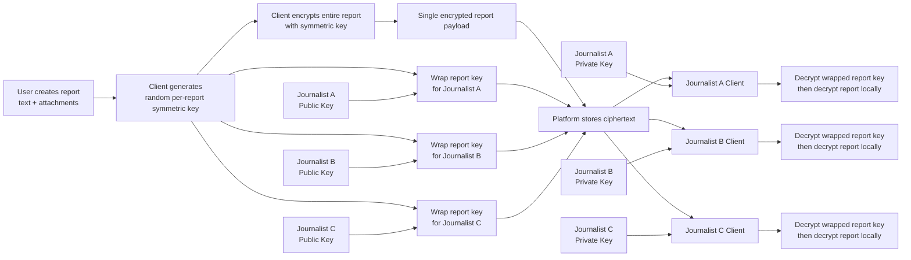

# Independent Journalism Platform

A platform for directly supporting independent journalists and giving communities a safe channel to bring them information that might otherwise go unreported. Readers can follow journalists, financially support their work, receive updates, and act as local volunteer correspondents by submitting tips, evidence, observations, or additional information about ongoing stories.

The core relationship is between a **Journalist** and their **Community**. A community member can simply follow a journalist, become a **Patron** by providing recurring or one-time financial support, or privately act as a **Source** by submitting information. These roles are independent: supporting a journalist should never be required to submit information, and submitting sensitive information should not require revealing a person's public identity.

## Core Features

- **Journalist Profiles**
  - Bio, location/coverage areas, topics and tags
  - Published links and current investigations
  - Follow / Support / Submit Information actions
  - Verification badge for platform-verified journalists

- **Follow & Community**
  - Follow journalists for free
  - Journalists publish short updates to followers
  - Email/push notifications for important updates
  - Patron badge while recurring support is active

- **Support Journalists**
  - One-time support
  - Monthly recurring support
  - Suggested amounts + custom amount
  - Stripe checkout
  - Stripe Connect onboarding and payouts for journalists
  - Platform fee configurable separately from payment-processing fees
  - Payment history, receipts, cancellation and refund handling

- **Tips / Local Reports**
  - Send information directly to one or more journalists
  - `subject`
  - `description`
  - `attachments`: photos, videos, audio and documents
  - `tags`
  - optional approximate location and event date/time
  - anonymous submission allowed
  - journalist-side states: `new`, `reviewing`, `follow-up`, `useful`, `archived`
  - secure source/journalist follow-up without exposing the source publicly
  - strip unnecessary attachment metadata such as photo EXIF where appropriate

- **Journalist Inbox**
  - Unified inbox for submitted reports
  - Search/filter by tag, location, date and status
  - Internal notes
  - Request additional information from a source
  - Link multiple submissions to the same investigation/story

## Identity & Access

Use WorkOS AuthKit for registered users:

- Email one-time code
- Google
- Apple
- GitHub
- Microsoft

Registered accounts should support both reader and journalist capabilities. Becoming a journalist requires an additional verification/onboarding process.

Anonymous sources should be able to submit reports **without creating an account**. Their identity, contact method and public community identity should be treated as separate concepts.

## Notifications

Start with:

- Email for follows, journalist updates, support receipts and source replies
- Optional SMS for explicitly opted-in high-priority notifications
- In-app notification center

Use providers such as Postmark/Resend for transactional email and Twilio for SMS rather than coupling notification delivery directly to application logic.

## Safety, Trust & Moderation

Because submissions may contain sensitive or legally risky material, trust and safety are core product functionality rather than an admin afterthought.

- Journalist identity verification
- Spam/rate limiting
- Abuse and threat reporting
- Attachment malware scanning
- Encryption at rest (encrypted storage) and in transit (TLS/HTTPS)
- Strict access controls around source material
- Minimal logging of anonymous-source activity
- Configurable retention/deletion of sensitive submissions
- Block/report controls
- Audit trail for journalist-side access to sensitive reports

The platform should explicitly distinguish **published community activity** from **private source communication**. A tip submitted to a journalist is private by default and never becomes public without an explicit editorial action.

### Envelope Encryption

Client-side envelope encryption + per-recipient key wrapping will be used:

### Security model

- Every submission gets a new random symmetric encryption key.
- The complete report, including subject, description and attachments, is encrypted once on the sender's device.
- The user may select multiple journalists as recipients.
- Each journalist has an independent public/private key pair.
- The report key is encrypted separately for every selected journalist using that journalist's public key.
- The platform stores one encrypted report plus one independently wrapped report key per recipient.
- A journalist decrypts only their own wrapped key using their private key.
- Decryption of report contents happens only on the journalist's client.
- One journalist's private key cannot decrypt another journalist's wrapped key.
- The platform never needs access to journalist private keys or plaintext report contents.

Conceptually:

`EncryptedReport + Enc(PubKey_A, ReportKey) + Enc(PubKey_B, ReportKey) + Enc(PubKey_C, ReportKey)`

## Initial MVP

The first release only needs to prove three things:

1. People will **follow and financially support** journalists directly.
2. People will **send useful local information** to journalists.
3. Journalists will regularly **use the inbox and communicate back** with those communities.

Everything else, including public discussions, comments, journalist collaborations, newsroom organizations, recommendation feeds, story publishing, mobile apps and advanced secure-source infrastructure, can grow from those three loops, and won't be included in the first MVP version.
